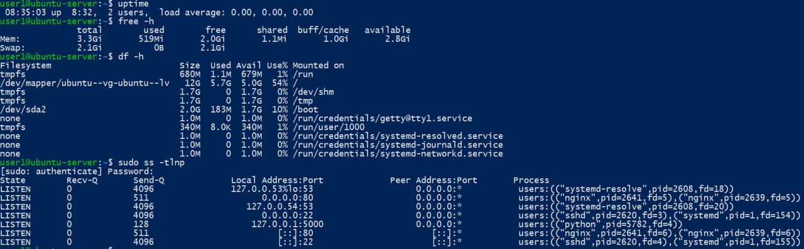
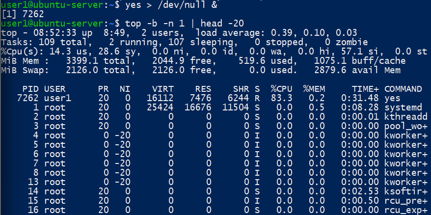
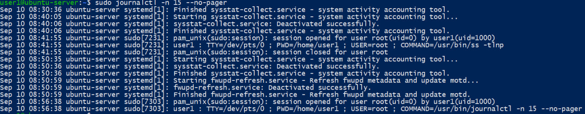
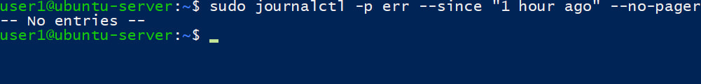
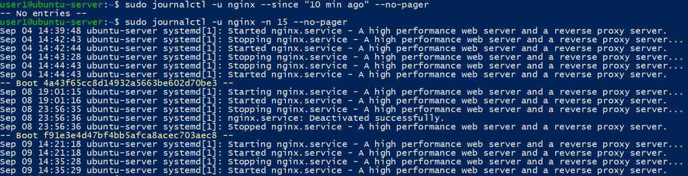
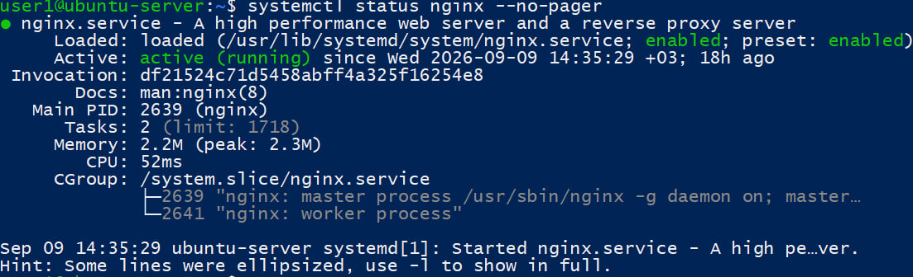
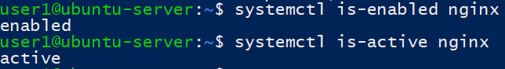
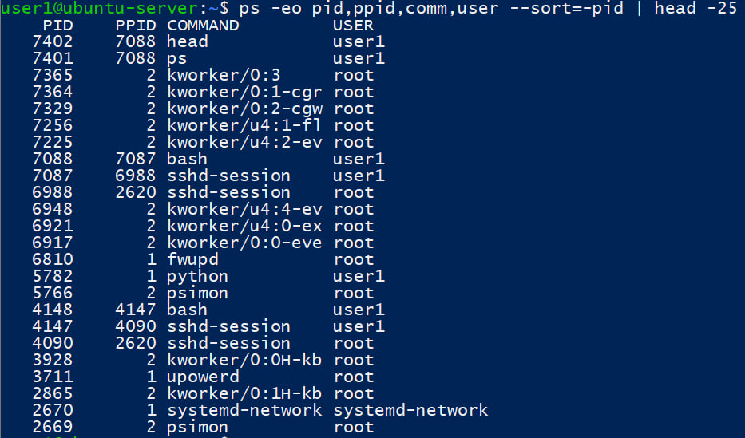
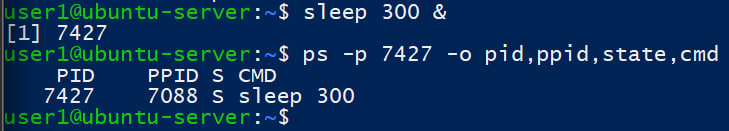

### 1. Мониторинг ресурсов и диагностика «проблемы»
1. **Снимок «нормального» состояния.** Выполните и сохраните вывод команд: uptime, free -h, df -h, ss -tlnp (или netstat -tlnp). Кратко поясните, что показывает каждая команда и на что обращать внимание при проблемах (высокий load, нехватка памяти, заполненный диск, слушающие порты).
2. **Симуляция нагрузки.** Запустите в фоне процесс, нагружающий CPU (например, yes > /dev/null & или цикл в bash на несколько секунд). Пока нагрузка идёт, выполните top -b -n 1 | head -20 или htop и сохраните вывод. Определите по выводу, какой процесс потребляет CPU. После выполнения остановите тестовый процесс (kill или закрытие терминала).
3. **Итог.** Напишите 2–3 предложения: как по выводу uptime и top понять, что «система под нагрузкой» и какой процесс виноват. Свяжите с типовыми проблемами серверов из теории (нехватка ресурсов).
### 2. Логи и journalctl
1. Выведите последние 15 записей системного журнала (journal): journalctl -n 15 --no-pager. Кратко опишите, что видно в строках (уровень, сервис, сообщение).
2. Выведите только сообщения уровня «ошибка» за последний час: journalctl -p err --since "1 hour ago" --no-pager. Если есть записи — приложите фрагмент и поясните, о чём они. Если записей нет — так и укажите и напишите, в каких ситуациях здесь обычно появляются ошибки.
3. Если в системе есть сервис с известным именем (например, nginx, sshd, systemd-logind), выведите его логи за последние 10 минут: journalctl -u nginx --since "10 min ago" --no-pager (подставьте нужный unit). Поясните, зачем смотреть логи конкретного сервиса при его сбое.
### 3. systemd: управление сервисом и свой unit
1. **Управление существующим сервисом.** Выберите один из установленных сервисов (например, nginx, sshd, cron). Выполните и сохраните вывод:
- systemctl status <имя> — поясните значения «active», «enabled», фрагмент вывода;
- systemctl is-enabled <имя> и systemctl is-active <имя> — что означают команды.
Не перезапускайте критичные для работы системы сервисы без необходимости; достаточно показать команды на одном сервисе.
### 4. Процессы: просмотр и управление
1. Выведите список процессов в формате: PID, PPID, имя команды, пользователь. Команда: ps -eo pid,ppid,comm,user --sort=-pid | head -25. Поясните, что такое PID и PPID; найдите один дочерний процесс и укажите его родителя по PPID.
2. Запустите в фоне команду sleep 300. С помощью ps или pgrep найдите её PID. Выведите информацию о процессе (например, ps -p <PID> -o pid,ppid,state,cmd). Поясните, в каком состоянии (state) находится процесс. Остановите процесс с помощью kill <PID> и проверьте, что он завершился.
3. Кратко (2–3 предложения): чем с точки зрения администрирования отличается «процесс» от «потока» и когда это важно при просмотре нагрузки (top, ps).
## Формат сдачи
- Один файл (документ или markdown) с:
- перечислением заданий и подзаданий;
- командами (и при необходимости полным текстом конфигов/unit-файлов);
- краткими пояснениями;
- скриншоты или вставка вывода команд (по указанию преподавателя);

Решение:
### 1
1. uptime показывает время работы системы, количество активных пользовательских сессий и среднюю нагрузку за 1, 5 и 15 минут. При диагностике высокие значения load average могут свидетельствовать о нехватке вычислительных ресурсов или большом количестве ожидающих выполнения процессов.
free -h показывает использование оперативной памяти и swap. При диагностике следует обращать внимание на низкое значение available и интенсивное использование swap, что может свидетельствовать о нехватке оперативной памяти.
df -h показывает использование дискового пространства файловых систем в удобном для чтения формате. При диагностике необходимо обращать внимание на разделы с высоким Use%, особенно на /.
ss -tlnp показывает TCP-порты, находящиеся в состоянии LISTEN, и процессы, которым они принадлежат. При диагностике команда позволяет проверить, запущен ли нужный сервис, слушает ли он ожидаемый порт и на каком сетевом интерфейсе он доступен.

2. PID 7262 — наш тестовый процесс, R означает Running, а %CPU = 83.3 показывает высокое потребление процессора. Памяти он почти не использует — всего 0.2%

3. По uptime нагрузку системы можно оценить по значениям load average: до теста они составляли 0.00, 0.00, 0.00, а после запуска нагрузки начали расти. В top видно, что процесс yes с PID 7262 находится в состоянии Running и потребляет 83.3% CPU. Такая ситуация имитирует типичную проблему сервера, когда один процесс интенсивно использует вычислительные ресурсы.
### 2
1. journalctl -n 15 --no-pager выводит последние 15 записей системного журнала. В строках видны дата и время, имя хоста, источник сообщения или сервис и текст события. В данном выводе видны успешные запуски и завершения системных сервисов, а также использование sudo пользователем user1.

2. Команда journalctl -p err --since "1 hour ago" --no-pager показывает сообщения уровня ошибки и более критичные за последний час. За проверенный период таких записей не обнаружено (No entries). Подобные ошибки могут появляться, например, при неудачном запуске сервиса, проблемах с оборудованием, файловой системой, сетью или некорректной конфигурации службы.

3. Команда journalctl -u nginx --since "10 min ago" --no-pager выводит журнал только выбранного systemd-сервиса. За последние 10 минут записей nginx не было. С помощью journalctl -u nginx журнал был отфильтрован по unit nginx.service. В журнале видны события запуска, остановки и успешной деактивации nginx. При сбое конкретного сервиса такой фильтр позволяет быстро найти относящиеся к нему сообщения, не просматривая весь системный журнал.

### 3
1. 
- systemctl status nginx показывает текущее состояние сервиса. Nginx загружен, находится в состоянии active (running) и включён в автозапуск (enabled). Главный процесс nginx имеет PID 2639.

- systemctl is-enabled nginx проверяет, включён ли сервис в автозапуск, а systemctl is-active nginx проверяет его текущее состояние. Nginx имеет состояния enabled и active, то есть запускается автоматически и в данный момент работает.

### 4
1. PID — уникальный идентификатор процесса, а PPID — идентификатор его родительского процесса. Например, процесс ps с PID 7401 имеет PPID 7088. Процесс с PID 7088 — bash, следовательно, команда ps была запущена из данного shell и является его дочерним процессом.

2. Был запущен фоновый процесс sleep 300 с PID 7427. Команда ps показала состояние S (sleeping), поскольку процесс ожидает завершения таймера и в этот момент не выполняет активных вычислений. Его родительским процессом является bash с PID 7088.

3. Процесс — это экземпляр запущенной программы со своим PID, адресным пространством и выделенными ресурсами. Поток — это отдельная последовательность выполнения внутри процесса; несколько потоков одного процесса используют общую память и ресурсы. При диагностике нагрузки это важно, потому что высокая загрузка CPU процесса может создаваться одним или несколькими его потоками, поэтому иногда необходимо анализировать не только процессы, но и отдельные потоки.