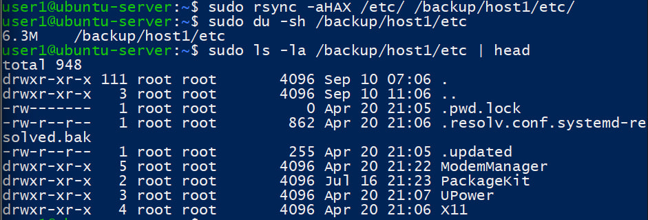
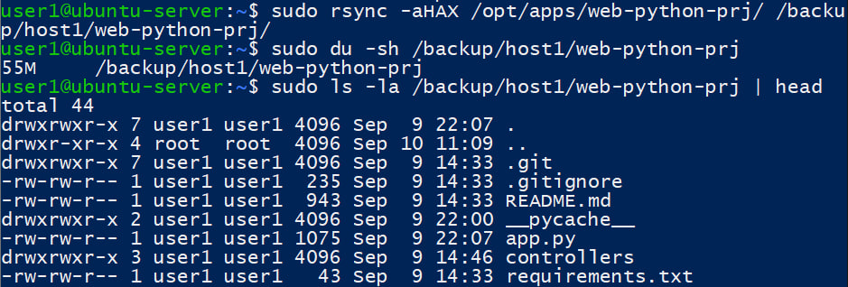
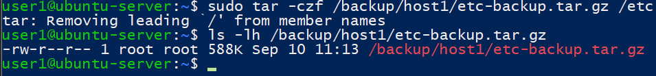
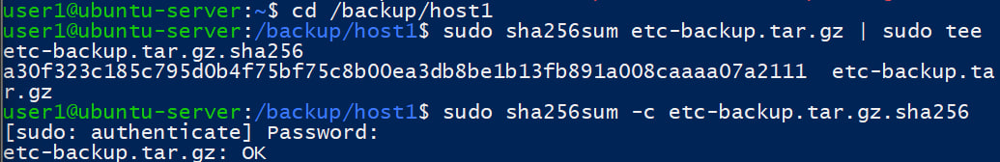
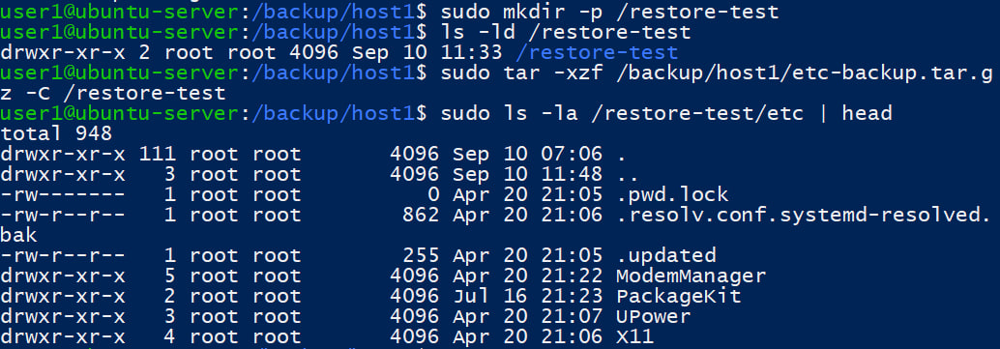
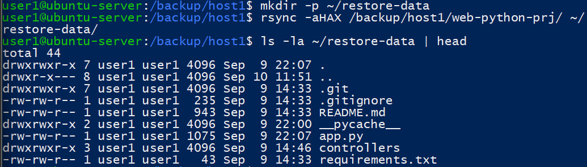
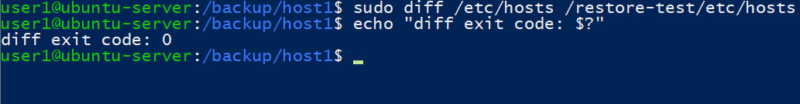
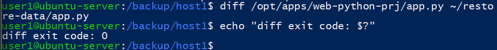

# Домашняя работа: Резервное копирование и восстановление 
Домашнее задание по теме занятия: стратегия backup/restore, автоматизация, контроль целостности и тест восстановления. 
### 1. Мини-стратегия резервного копирования
Составьте краткий документ (5-10 пунктов): 
1. Какие данные вы считаете критичными на учебном сервере. 
2. Что будете копировать ежедневно, что еженедельно. 
3. Где будут храниться копии (локально/удаленно). 
4. Ваши целевые RPO и RTO (в простых значениях, например: RPO 24h, RTO 2h). 
### 2. Практика: backup конфигов и данных 
1. Сделайте копию /etc и выбранной рабочей директории (~/project-data или аналог) в /backup/host1 через rsync. 
2. Создайте архив tar.gz для /etc. 
3. Для архива создайте и проверьте checksum (sha256sum). 
4. Сохраните вывод команд и коротко опишите, что получилось. 
### 3. Restore-тест 
1. Восстановите архив /etc в /restore-test (не в боевую /etc). 
2. Восстановите рабочую директорию в отдельный путь (например, ~/restore-data). 
3. Сравните 1-2 файла с оригиналом (diff, cat, ls -la). 
4. Напишите короткий вывод: восстановление успешно/неуспешно и почему. 

## Формат сдачи 
- Один markdown-файл или документ с: 
- командами; 
- выводом ключевых проверок; 
- конфигами (backup.sh, unit-файлы, при наличии logrotate); 
- краткими пояснениями. 
- Скриншоты или вставка вывода команд по требованиям преподавателя. 

## Шпаргалка по параметрам команд 
rsync: 
- -a — архивный режим; 
- -HAX — hardlinks, ACL, xattrs; 
- --delete — удалять в копии то, что удалено в источнике; 
- --dry-run — тестовый запуск без изменений. 
tar: 
- -c — создать архив; 
- -x — распаковать архив; 
- -t — показать содержимое; 
- -z — gzip-сжатие; 
- -f — имя файла архива; 
- -C — каталог назначения. 
sha256sum: 
- без опций — вычисление хеша; 
- -c — проверка по файлу checksum.

Решение:
### 1.
1. К критичным данным учебного сервера относятся системные конфигурации /etc, конфигурации systemd, nginx и файлы учебного приложения.
2. Файлы приложения и важные конфигурации необходимо резервировать ежедневно.
3. Полную копию /etc следует создавать еженедельно.
4. Ежедневные копии можно хранить локально в /backup/host1.
5. Для защиты от поломки или потери самого сервера дополнительную копию желательно хранить на удалённом сервере или другом физическом носителе.
6. Для архивов необходимо контролировать целостность с помощью SHA-256.
7. Резервная копия считается рабочей только после успешного тестового восстановления.
8. Целевой RPO — 24 часа: допустима потеря максимум данных за последние сутки.
9. Целевой RTO — 2 часа: сервер должен быть восстановлен примерно за два часа.
### 2.
1. С помощью rsync -aHAX содержимое /etc было скопировано в /backup/host1/etc. Архивный режим сохранил структуру каталогов, права доступа и владельцев. Размер полученной копии составил около 6.3 МБ.

Рабочая директория приложения /opt/apps/web-python-prj была скопирована через rsync -aHAX в /backup/host1/web-python-prj. Размер резервной копии составил около 55 МБ.

2. Создан gzip-сжатый архив системной директории /etc — /backup/host1/etc-backup.tar.gz. Сообщение Removing leading '/' является информационным: tar сохраняет пути внутри архива без начального /, что позволяет безопасно распаковать архив в отдельный каталог.

3. Для архива /etc была рассчитана контрольная сумма SHA-256 и сохранена в отдельный файл. Проверка командой sha256sum -c завершилась результатом OK, что подтверждает целостность резервной копии.

### 3.
1. Восстановление /etc в тестовый каталог

2. восстановление рабочей директории.

3. Восстановленный файл /restore-test/etc/hosts был сравнен с оригинальным /etc/hosts командой diff. Команда не вывела различий, а код завершения 0 подтвердил, что файлы идентичны.

4. Восстановление прошло успешно. Архив /etc был распакован в отдельный каталог /restore-test, а рабочая директория приложения восстановлена в ~/restore-data. Сравнение файлов /etc/hosts и app.py командой diff завершилось с кодом 0, поэтому восстановленные данные совпадают с оригиналами.