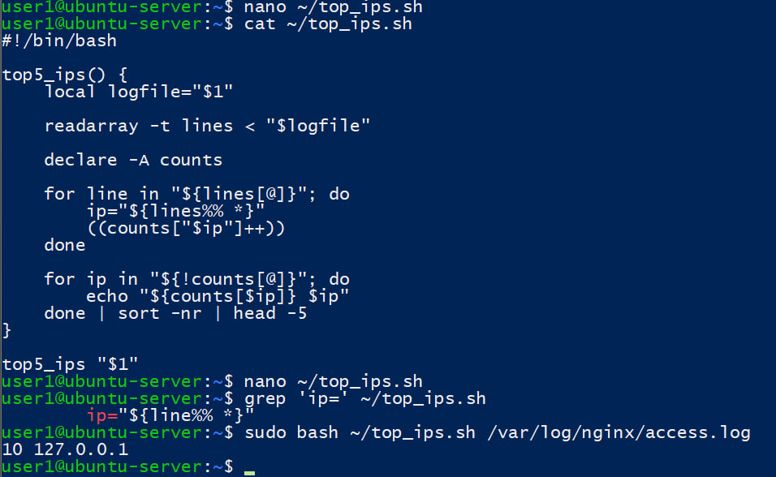
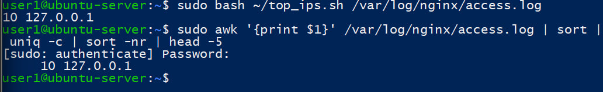

**Задание:** 
В Bash прочитать одну строку error.log и присвоить переменным: время, уровень (error), текст сообщения до «client:», client IP. Использовать параметрическое расширение строк или sed/awk. 
# ДЗ 
Напишите одну функцию на Bash, которая принимает путь к access.log и выводит топ-5 IP по числу запросов. Используйте внутри цикл по массиву строк (прочитайте файл в массив через readarray) и ассоциативный массив для подсчёта. Сравните результат с однострочником из задачек, что эффективней и почему как думаешь стоит ли мне выполнять все задачки или только дз?

Решение
Скрипт прочитал access.log в массив строк через readarray, затем прошёл по массиву циклом, извлёк IP из каждой строки и посчитал количество запросов в ассоциативном массиве

Оба способа дали одинаковый результат. Однако однострочник с awk, sort и uniq обычно эффективнее на больших логах, потому что обрабатывает данные потоково. Вариант с readarray сначала загружает весь файл в память Bash, а затем обрабатывает каждую строку циклом, что требует больше памяти и обычно работает медленнее.
