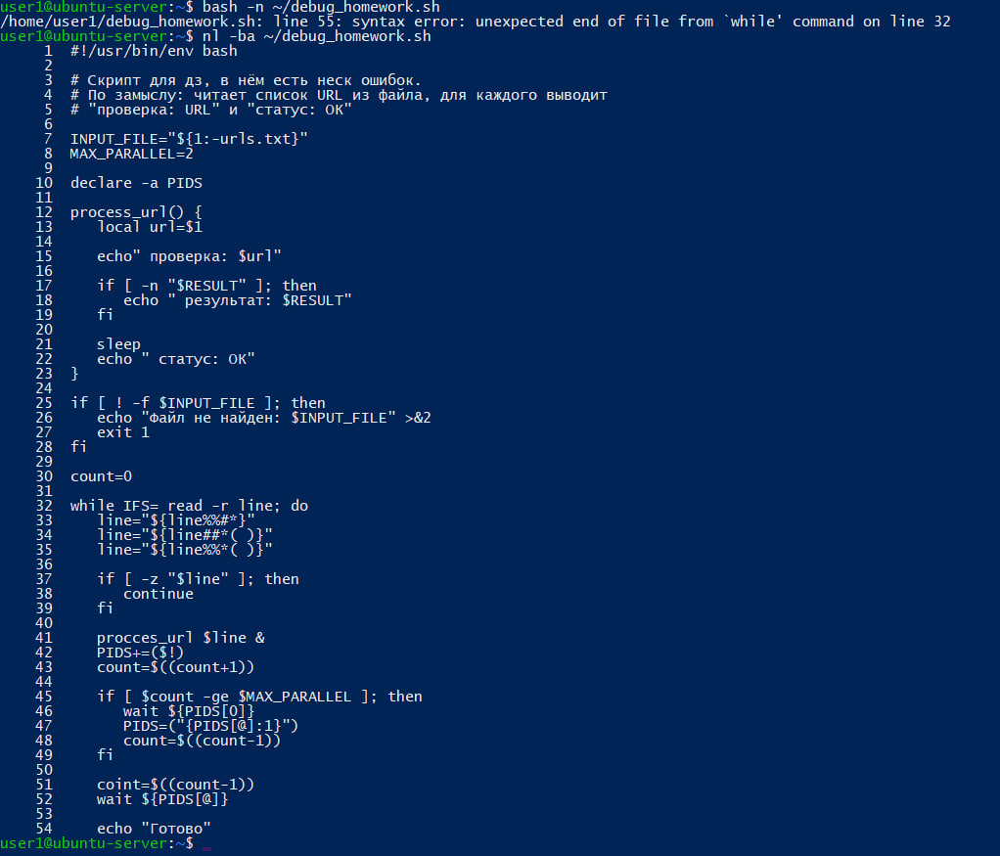
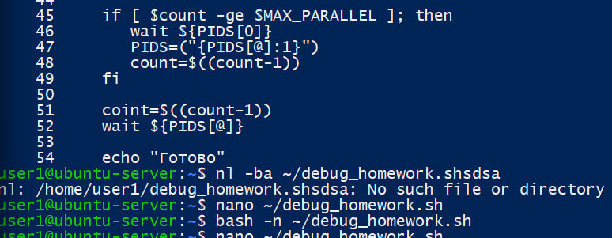

Задания: 1. 
Повторить шаги, указанные в приведенной статье: https://andreyex.ru/linux/kak-otlazhivat-stsenarij-bash/. 
#!/usr/bin/env bash 
# Скрипт для домашнего задания в нём есть несколько ошибок. 
# Скрипт по замыслу: читает список URL из файла, для каждого выводит 
# «проверка: URL» и «статус: OK» (имитация проверки). 
INPUT_FILE="${1:-urls.txt}"
MAX_PARALLEL=2

declare -a PIDS

process_url() {
   local url=$1

   echo " проверка: $url"

   if [ -n "$RESULT" ]; then
      echo " результат: $RESULT"
   fi

   sleep 1
   echo " статус: ОК"
}

if [ ! -f "$INPUT_FILE" ]; then
   echo "Файл не найден: $INPUT_FILE" >&2
   exit 1
fi

count=0

while IFS= read -r line; do
   line="${line%%#*}"
   line="${line##*( )}"
   line="${line%%*( )}"

   if [ -z "$line" ]; then
      continue
   fi

   process_url "$line" &
   PIDS+=("$!")
   count=$((count+1))

   if [ "$count" -ge "$MAX_PARALLEL" ]; then
      wait "${PIDS[0]}"
      PIDS=("${PIDS[@]:1}")
      count=$((count-1))
   fi
count=$((count-1))
wait ${PIDS[@]}
echo "Готово"

Решение
bash -n проверяет только синтаксис. Скрипт может быть синтаксически правильным, но всё ещё содержать ошибки выполнения и логики.
Данная команда показала мне синтаксические ошибки, которые я допустил

и потом исправил

user1@ubuntu-server:~$ bash -x ~/debug_homework.sh ~/urls.txt
+ INPUT_FILE=/home/user1/urls.txt
+ MAX_PARALLEL=2
+ declare -a PIDS
+ '[' '!' -f /home/user1/urls.txt ']'
+ count=0
+ IFS=
+ read -r line
+ line=https://example.com
+ line=https://example.com
+ line=https://example.com
+ '[' -z https://example.com ']'
+ PIDS+=($!)
+ count=1
+ '[' 1 -ge 2 ']'
+ coint=0
+ wait 2066
+ process_url https://example.com
+ local url=https://example.com
+ 'echo проверка: https://example.com'
/home/user1/debug_homework.sh: line 15: echo проверка: https://example.com: No such file or directory
+ '[' -n '' ']'
+ sleep
sleep: missing operand
Try 'sleep --help' for more information.
+ echo ' статус: ОК'
 статус: ОК
+ echo Готово
Готово
+ IFS=
+ read -r line
+ line=https://google.com
+ line=https://google.com
+ line=https://google.com
+ '[' -z https://google.com ']'
+ PIDS+=($!)
+ process_url https://google.com
+ local url=https://google.com
+ 'echo проверка: https://google.com'
+ count=2
+ '[' 2 -ge 2 ']'
+ wait 2066
+ PIDS=("{PIDS[@]:1}")
+ count=1
+ coint=0
+ wait '{PIDS[@]:1}'
/home/user1/debug_homework.sh: line 15: echo проверка: https://google.com: No such file or directory
/home/user1/debug_homework.sh: line 52: wait: `{PIDS[@]:1}': not a pid or valid job spec
+ echo Готово
Готово
+ IFS=
+ read -r line
+ line=https://github.com
+ line=https://github.com
+ line=https://github.com
+ '[' -z https://github.com ']'
+ PIDS+=($!)
+ count=2
+ '[' 2 -ge 2 ']'
+ wait '{PIDS[@]:1}'
/home/user1/debug_homework.sh: line 46: wait: `{PIDS[@]:1}': not a pid or valid job spec
+ PIDS=("{PIDS[@]:1}")
+ count=1
+ coint=0
+ wait '{PIDS[@]:1}'
/home/user1/debug_homework.sh: line 52: wait: `{PIDS[@]:1}': not a pid or valid job spec
+ echo Готово
Готово
+ IFS=
+ read -r line
+ process_url https://github.com
+ '[' -n '' ']'
+ sleep
+ local url=https://github.com
+ 'echo проверка: https://github.com'
/home/user1/debug_homework.sh: line 15: echo проверка: https://github.com: No such file or directory
+ '[' -n '' ']'
+ sleep
sleep: missing operand
Try 'sleep --help' for more information.
+ echo ' статус: ОК'
 статус: ОК

 bash -x показал, что из-за отсутствующего пробела Bash пытался выполнить строку как отдельную команду. Он также показывал типичную ошибку времени выполнения — команда синтаксически допустима, но запущена без обязательного аргумента. (sleep 1)

 user1@ubuntu-server:~$ bash -n ~/debug_homework.sh
user1@ubuntu-server:~$ bash -x ~/debug_homework.sh ~/urls.txt
+ INPUT_FILE=/home/user1/urls.txt
+ MAX_PARALLEL=2
+ declare -a PIDS
+ '[' '!' -f /home/user1/urls.txt ']'
+ count=0
+ shopt -s extglob
+ IFS=
+ read -r line
+ line=https://example.com
+ line=https://example.com
+ line=https://example.com
+ '[' -z https://example.com ']'
+ PIDS+=("$!")
+ count=1
+ '[' 1 -ge 2 ']'
+ IFS=
+ read -r line
+ line=https://google.com
+ line=https://google.com
+ line=https://google.com
+ '[' -z https://google.com ']'
+ process_url https://example.com
+ process_url https://google.com
+ PIDS+=("$!")
+ count=2
+ '[' 2 -ge 2 ']'
+ wait 2265
+ local url=https://example.com
+ echo ' проверка: https://example.com'
 проверка: https://example.com
+ '[' -n '' ']'
+ sleep 1
+ local url=https://google.com
+ echo ' проверка: https://google.com'
 проверка: https://google.com
+ '[' -n '' ']'
+ sleep 1
+ echo ' статус: ОК'
 статус: ОК
+ PIDS=("${PIDS[@]:1}")
+ count=1
+ IFS=
+ read -r line
+ line=https://github.com
+ line=https://github.com
+ line=https://github.com
+ '[' -z https://github.com ']'
+ PIDS+=("$!")
+ echo ' статус: ОК'
 статус: ОК
+ process_url https://github.com
+ local url=https://github.com
+ echo ' проверка: https://github.com'
 проверка: https://github.com
+ '[' -n '' ']'
+ sleep 1
+ count=2
+ '[' 2 -ge 2 ']'
+ wait 2266
+ PIDS=("${PIDS[@]:1}")
+ count=1
+ IFS=
+ read -r line
+ wait 2269
+ echo ' статус: ОК'
 статус: ОК
+ echo Готово
Готово

Сначала я использовал bash -n для проверки синтаксиса. После исправления синтаксических ошибок применил bash -x, чтобы увидеть реальный порядок выполнения команд и значения переменных. С помощью трассировки были найдены ошибки в имени функции, вызове echo, команде sleep, работе массива PIDS и логике ожидания фоновых процессов.

user1@ubuntu-server:~$ bash -v ~/debug_homework.sh ~/urls.txt
#!/usr/bin/env bash

# Скрипт для дз, в нём есть неск ошибок.
# По замыслу: читает список URL из файла, для каждого выводит
# "проверка: URL" и "статус: ОК"

INPUT_FILE="${1:-urls.txt}"
MAX_PARALLEL=2

declare -a PIDS

process_url() {
   local url=$1

   echo " проверка: $url"

   if [ -n "$RESULT" ]; then
      echo " результат: $RESULT"
   fi

   sleep 1
   echo " статус: ОК"
}

if [ ! -f "$INPUT_FILE" ]; then
   echo "Файл не найден: $INPUT_FILE" >&2
   exit 1
fi

count=0
shopt -s extglob

while IFS= read -r line; do
   line="${line%%#*}"
   line="${line##*( )}"
   line="${line%%*( )}"

   if [ -z "$line" ]; then
      continue
   fi

   process_url "$line" &
   PIDS+=("$!")
   count=$((count+1))

   if [ "$count" -ge "$MAX_PARALLEL" ]; then
      wait "${PIDS[0]}"
      PIDS=("${PIDS[@]:1}")
      count=$((count-1))
   fi

done < "$INPUT_FILE"
 проверка: https://example.com
 проверка: https://google.com
 статус: ОК
 проверка: https://github.com
 статус: ОК

wait ${PIDS[@]}
 статус: ОК
echo "Готово"
Готово

bash -v показывает строки скрипта по мере их чтения, а bash -x показывает команды в момент выполнения с уже подставленными значениями переменных. bash -n проверяет только синтаксис и не выполняет скрипт.