# Домашняя работа
**Сдача (рекомендуемый формат):** один документ (Markdown), скриншотами/логами по запросу и **текстом конфигов** (без закрытых ключей в открытом виде — ключи в отчёт не класть; достаточно путей и прав `chmod`).
## HTTP: nginx и статический сайт
1. Установите **nginx** (дистрибутив по выбору).
2. Создайте виртуальный хост для имени **`hw-<ваш_логин>.local`** (или согласованное с преподавателем имя), например `hw-ivan.local`.
3. Корень сайта: каталог вида `/var/www/hw-<логин>/html` с файлом **`index.html`**, в котором видны **ФИО** и **дата**.
4. В **`/etc/hosts`** на той же машине (или на клиенте в LAN) добавьте запись, чтобы имя указывало на IP сервера.
5. Проверка: `curl -v http://hw-<логин>.local/` — в отчёт: фрагмент вывода с кодом ответа и заголовком `Server`.
6. Запроксируйте обращение к ранее настроенному приложению, для которого писали unit-файл, проверьте что работает. Сделайте так, что бы Ваш фронт обращался на Ваш бэк.
## OpenSSL: просмотр «чужого» и своего сертификата
1. Командами из подключитесь к **любому публичному HTTPS-сайту** (например `google.com:443`) и выпишите в отчёт:
- `subject` и `issuer` (из `openssl x509 -noout ...`);
- даты `notBefore` / `notAfter`.
2. Объясните назначение **`-servername`** в `s_client` (связь с **SNI**).
3. *(По желанию)* Сохраните **первый** PEM-блок сертификата в файл и покажите фрагмент `openssl x509 -in ... -text -noout` с секцией **Subject Alternative Name** (или отметьте, что SAN нет, если так вышло).
## HTTPS на nginx
Выполните **один** из вариантов (пометьте в отчёте, какой выбрали).
### Вариант 1 — свой корневой CA и сертификат сайта (рекомендуется для домашней сети)
1. Выпустите **корневой** `root.crt` / `root.key` и **серверный** сертификат с **SAN** на ваше имя хоста.
2. Подключите **`ssl_certificate`** и **`ssl_certificate_key`** в nginx; редирект **HTTP → HTTPS** (как в лабе).
3. Добавьте **`root.crt`** в доверенные **на клиенте** (Linux: `update-ca-certificates` / `update-ca-trust` / `trust` ).
4. В отчёт: `curl -v https://hw-<логин>.local/` **без** `-k` с успешной проверкой; отдельно — вывод `openssl s_client -connect ... -CAfile root.crt` (достаточно строк про `Verify return code` и цепочку).

Решение:
## HTTP: nginx и статический сайт
1. nginx был установлен до этого дз
2. был создал вирт хост hw-user1.local
3. создал файл /var/www/hw-user1/html/index.html
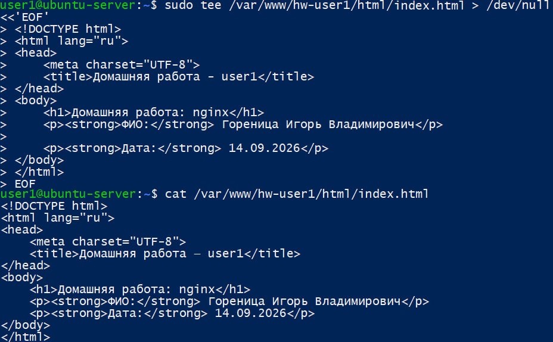
а также конфиг вирт. хоста 
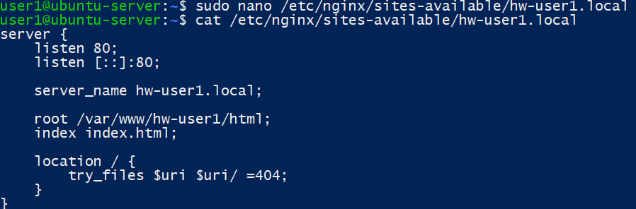
4. Для локального разрешения имени hw-user1.local в /etc/hosts была добавлена запись: 192.168.1.105 hw-user1.local
5. Имя hw-user1.local разрешается в 192.168.1.105 через /etc/hosts. При обращении curl -v http://hw-user1.local/ сервер nginx возвращает HTTP/1.1 200 OK и заголовок Server: nginx/1.28.3 (Ubuntu). В теле ответа отображается созданная статическая страница.
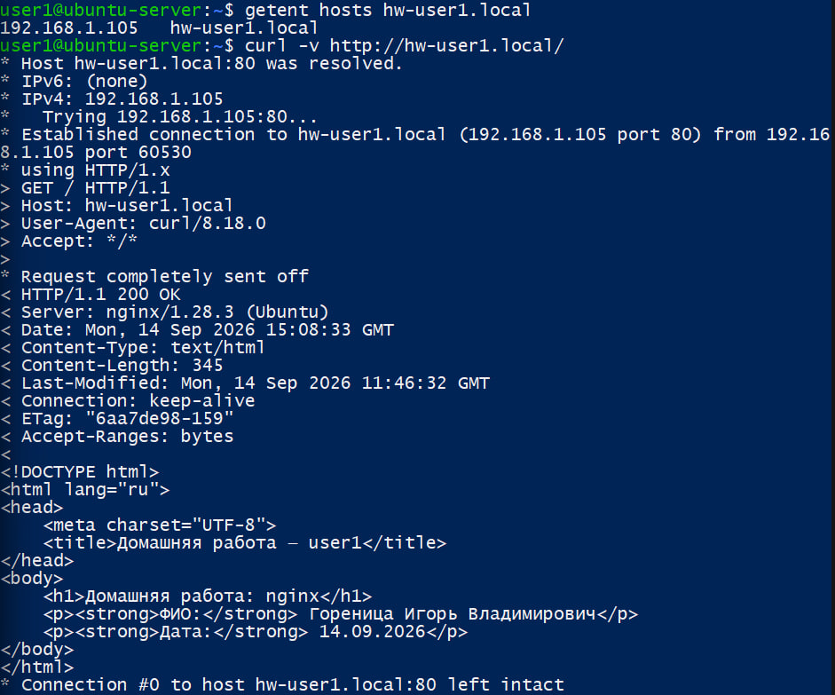
6. Проверка reverse proxy nginx к Flask-приложению, backend успешно возвращает результат сложения
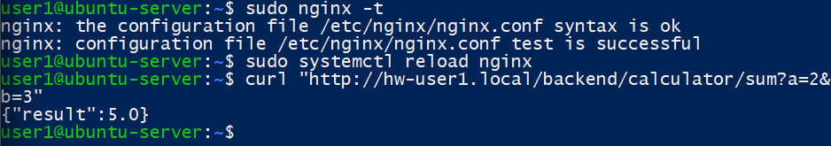
Статическая страница загружается с hw-user1.local. JavaScript выполняет запрос к /backend/calculator/sum, nginx проксирует его на Flask-приложение 127.0.0.1:5000, после чего полученный результат отображается на странице.
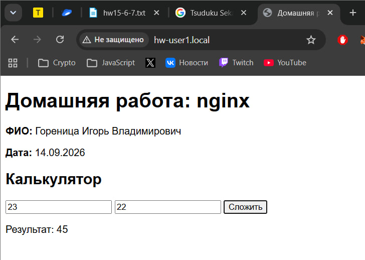
## OpenSSL: просмотр «чужого» и своего сертификата
1. С помощью openssl s_client выполнено TLS-подключение с передачей имени сервера через SNI, а openssl x509 использован для вывода владельца сертификата (subject), центра сертификации (issuer) и срока действия (notBefore / notAfter).
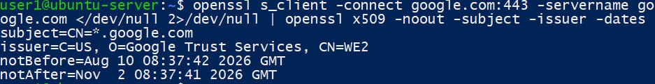
2. -servername google.com передаёт имя сервера в процессе TLS handshake с использованием механизма SNI (Server Name Indication).
SNI необходим, когда на одном IP-адресе размещено несколько HTTPS-сайтов. Клиент сообщает серверу имя требуемого сайта ещё при установлении TLS-соединения, благодаря чему сервер может выбрать правильный TLS-сертификат.
## HTTPS на nginx
### Вариант 1 — свой корневой CA и сертификат сайта (рекомендуется для домашней сети)
1. Для сертификатов был создан каталог: sudo mkdir -p /etc/nginx/ssl/hw-user1. Права доступа 600, владелец root:root.
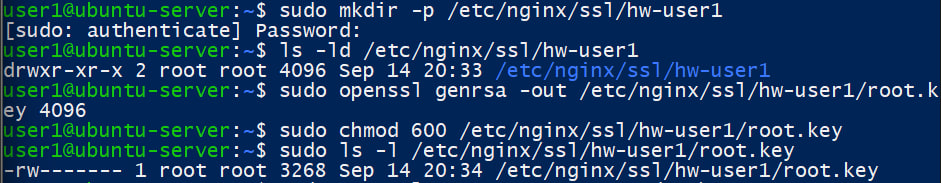
Затем был создан самоподписанный сертификат Root CA
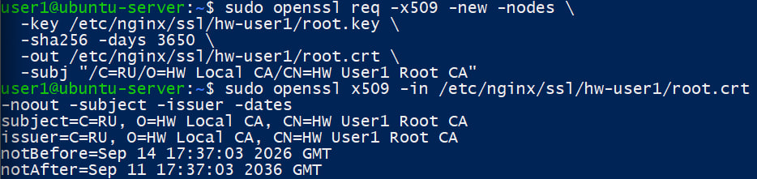
Был создан отдельный закрытый ключ сервера:
sudo openssl genrsa \
  -out /etc/nginx/ssl/hw-user1/server.key 2048
sudo chmod 600 /etc/nginx/ssl/hw-user1/server.key
После этого был создан CSR:
sudo openssl req -new \
  -key /etc/nginx/ssl/hw-user1/server.key \
  -out /etc/nginx/ssl/hw-user1/server.csr \
  -subj "/C=RU/O=HW Site/CN=hw-user1.local"
Для сертификата сайта был создан файл расширений: /etc/nginx/ssl/hw-user1/server.ext
Содержимое: subjectAltName = DNS:hw-user1.local
basicConstraints = CA:FALSE
keyUsage = digitalSignature, keyEncipherment
extendedKeyUsage = serverAuth
2. CSR был подписан созданным Root CA:
sudo openssl x509 -req \
-in /etc/nginx/ssl/hw-user1/server.csr \
-CA /etc/nginx/ssl/hw-user1/root.crt \
-CAkey /etc/nginx/ssl/hw-user1/root.key \
-CAcreateserial \
-out /etc/nginx/ssl/hw-user1/server.crt \
-days 825 -sha256 \
-extfile /etc/nginx/ssl/hw-user1/server.ext
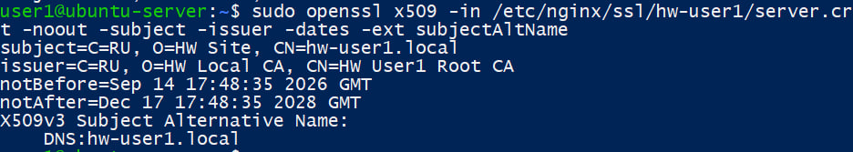
Итоговая конфигурация виртуального хоста:
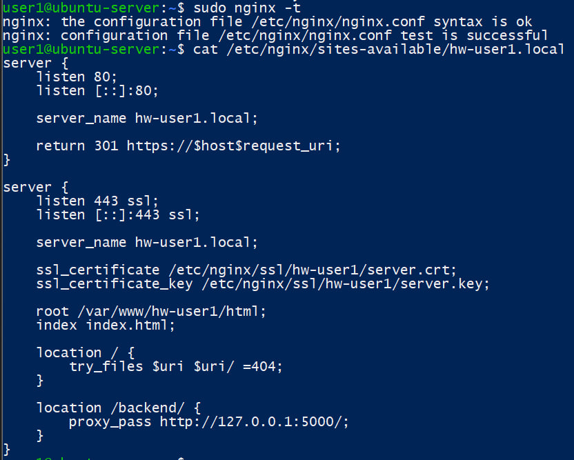
После подключения сертификата nginx слушает 80/tcp для HTTP и 443/tcp для HTTPS
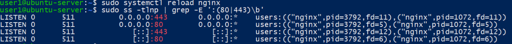
Код 301 Moved Permanently и заголовок Location подтверждают автоматическое перенаправление HTTP-запросов на HTTPS
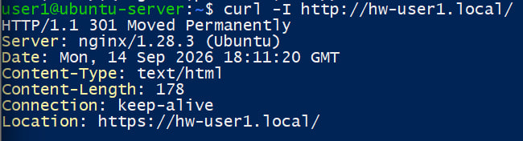
3. До добавления собственного Root CA в системное хранилище была выполнена команда: curl -v https://hw-user1.local/
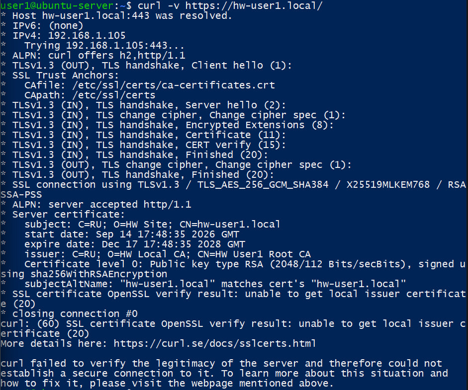
После копирования root.crt в /usr/local/share/ca-certificates/ выполнена команда update-ca-certificates; добавлен 1 новый доверенный сертификат
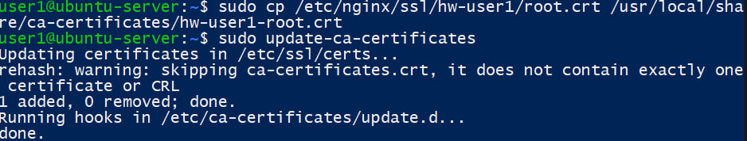
4. После добавления Root CA была повторно выполнена команда: curl -v https://hw-user1.local/
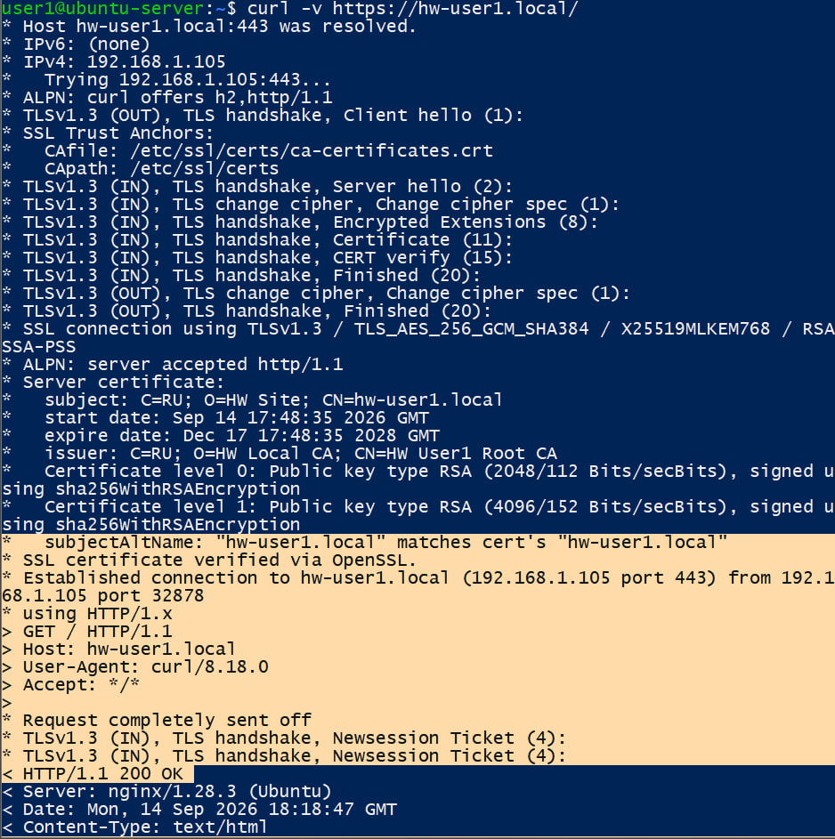
Cертификат сайта hw-user1.local успешно проверяется с помощью собственного корневого сертификата HW User1 Root CA. Цепочка доверия корректна, Verify return code: 0 (ok).
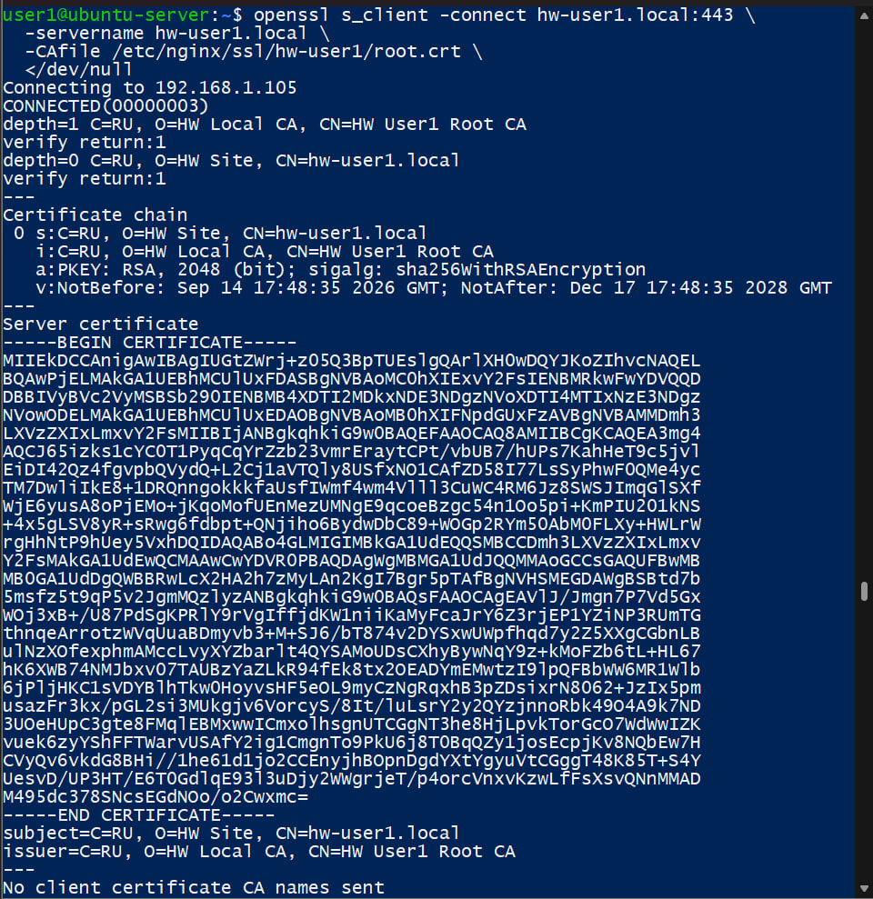
Запрос к https://hw-user1.local/backend/calculator/sum?a=2&b=3 проходит через nginx по HTTPS, проксируется на Flask-приложение и возвращает JSON-ответ {"result":5.0}
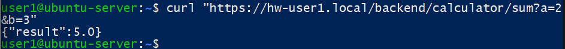