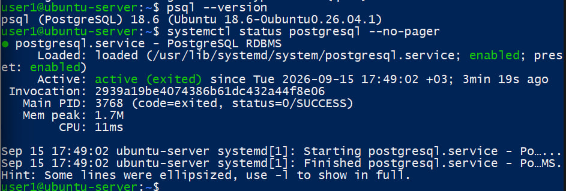
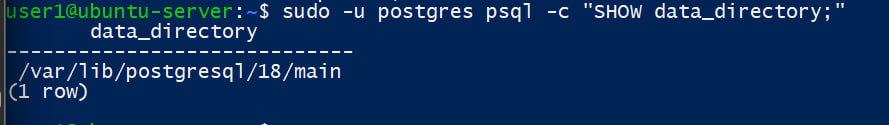
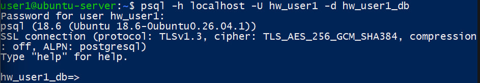
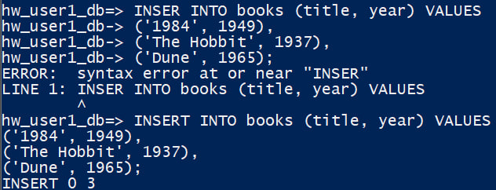
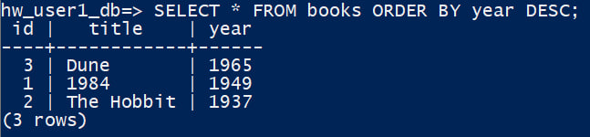
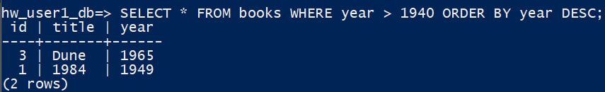
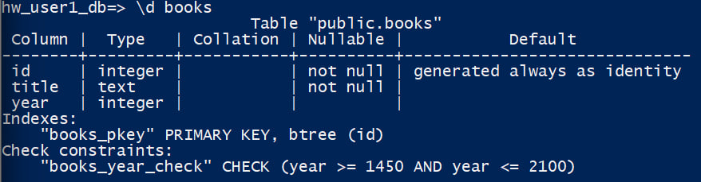
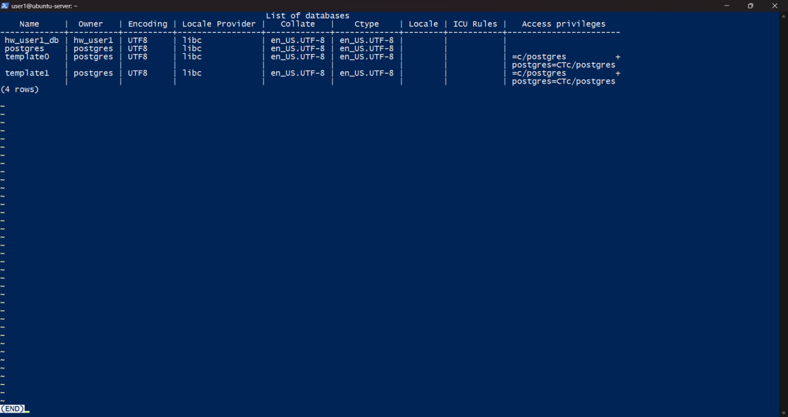
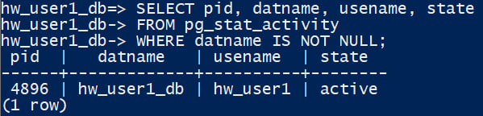
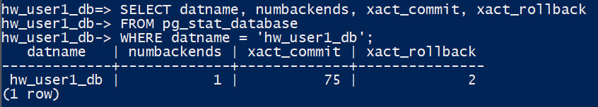

## 1. Установка и доступ
1. Убедитесь, что **PostgreSQL** установлен и служба **активна** (`systemctl` или эквивалент).
2. Выполните `SHOW data_directory;` (через `sudo -u postgres psql`), выпишите путь в отчёт.
3. Создайте **роль** с `LOGIN` (имя вида `hw_<ваш_логин>`) и **отдельную базу** в вашей владении.
4. Подключитесь к этой базе с хоста: `psql -h localhost -U ... -d ...` (если требуется — настройте `pg_hba.conf` только в безопасной конфигурации для localhost).
---
## 2. таблица и запросы
В своей БД создайте таблицу **`books`** минимум с полями: `id` (авто ПК), `title` (текст, не пустой), `year` (год издания, ограничьте разумным диапазоном через `CHECK` или типом).
Выполните и приложите в отчёт:
1. **`INSERT`** — не менее **3** книг.
2. **`SELECT`** — все книги, отсортированные по году **по убыванию**.
3. **`SELECT`** с **`WHERE`** — только книги после заданного года (год выберите сами).
4. Скрин или текст вывода **`\d books`**.
---
## 4. Служебные базы и мониторинг сессий
1. Выполните **`\l`** (или `SELECT datname FROM pg_database ORDER BY 1;`) и **своими словами** опишите назначение баз **`postgres`**, **`template1`**, **`template0`** (по одному предложению на базу).
2. Выполните запрос к **`pg_stat_activity`** (можно взять пример из методички или упростить до `SELECT pid, datname, usename, state FROM pg_stat_activity WHERE datname IS NOT NULL;`). В отчёт приложите **результат** и поясните, **какая строка** соответствует **вашему** текущему подключению **`psql`**.
3. чем **`pg_catalog`** отличается от **`information_schema`** и зачем администратору **`pg_stat_database`**.

Решение:
## 1. Установка и доступ
1. Подтверждение установки и активности PostgreSQL

2. Командой SHOW data_directory; определён каталог, в котором PostgreSQL хранит файлы кластера баз данных: /var/lib/postgresql/18/main.

3.  Для работы была создана отдельная роль с возможностью входа (LOGIN).
Итоговое имя роли: hw_user1
при помощи команды: 
sudo -u postgres psql -c "ALTER ROLE hw_user1 WITH PASSWORD '********';"
4. Выполнено подключение к PostgreSQL через localhost под ролью hw_user1 к собственной базе hw_user1_db. 

---
## 2. таблица и запросы
В базе hw_user1_db была создана таблица:
CREATE TABLE books (
    id INTEGER GENERATED ALWAYS AS IDENTITY PRIMARY KEY,
    title TEXT NOT NULL,
    year INTEGER CHECK (year BETWEEN 1450 AND 2100)
);
1. Добавлены три записи в таблицу books одной командой INSERT. Результат INSERT 0 3 подтверждает успешное добавление трёх строк.

2. SELECT * выбирает все столбцы и строки таблицы books. ORDER BY year DESC сортирует результат по полю year в порядке убывания.

3. WHERE используется для фильтрации строк. В данном запросе выбираются только книги, изданные после 1940 года. ORDER BY year DESC дополнительно сортирует результат по году от большего к меньшему

4. Команда \d books показывает структуру таблицы. Поле id является автоматически генерируемым первичным ключом, title обязательно для заполнения благодаря NOT NULL, а для year установлен CHECK, разрешающий значения от 1450 до 2100.

---
## 4. Служебные базы и мониторинг сессий
1. Результат выполнения **`\l`**:

postgres - стандартная служебная база, которую обычно используют для административного подключения к серверу PostgreSQL, когда не требуется подключаться к конкретной пользовательской БД.
template1 - основной шаблон, на основе которого PostgreSQL по умолчанию создаёт новые базы данных; изменения в нём могут наследоваться создаваемыми базами.
template0 - исходный «чистый» шаблон базы данных; обычно его не изменяют, и он позволяет создать базу без пользовательских изменений, внесённых в template1.
2. В представлении pg_stat_activity отображаются текущие подключения к PostgreSQL. Строка с pid=4896, datname=hw_user1_db и usename=hw_user1 соответствует моему текущему подключению psql. Состояние active означает, что в момент выполнения запроса сессия была активна.

3. pg_catalog предоставляет более подробную и специфичную для PostgreSQL системную информацию, а information_schema предоставляет стандартизированное SQL-представление метаданных.
pg_stat_database полезно администратору для мониторинга активности отдельных баз данных: подключений, транзакций и других статистических показателей. Эти данные помогают оценивать нагрузку и обнаруживать проблемы в работе базы.
