Соберите лабораторию **primary + standby** По материалам занятия. В отчёт приложите:
1. Вывод **`SELECT pg_is_in_recovery();`** с **каждого** инстанса **до** промоута (кто primary, кто replica — явно подпишите порты/хосты).
2. Фрагмент результата запроса к **`pg_stat_replication`** на **primary** (достаточно одной строки на вашу реплику) — или пояснение, почему его нет (например реплика ещё не подключена).
3. Подтверждение, что **тестовая таблица/строка**, созданные на primary, **видны на replica** на чтение (`SELECT`).
4. *(По желанию)* Коротко опишите, что показывают поля **`active`** / **`slot_name`** в **`pg_replication_slots`** на primary в вашей лабе.
---
1. Приложите вывод **`pg_is_in_recovery()`** на бывшей replica **после** промоута.
2. Двумя предложениями опишите, **почему** в проде после такого эксперимента старый primary нельзя просто «включить обратно» с тем же старым томом без процедуры синхронизации.
---
1. Настройте логический бэкап своей базы, сделайте скрипт и запустите его по таймауту

Решение:
Изначально на сервере работал один кластер PostgreSQL: 
pg_lsclusters
Результат:
Ver Cluster Port Status Owner    Data directory
18  main    5432 online postgres /var/lib/postgresql/18/main
Таким образом, существующий PostgreSQL на порту 5432 был выбран в качестве primary.
Для проверки возможности физической репликации были просмотрены параметры:
sudo -u postgres psql -p 5432 -c "SHOW wal_level; SHOW max_wal_senders; SHOW max_replication_slots;"
Получены значения:
wal_level = replica
max_wal_senders = 10
max_replication_slots = 10

На primary была создана отдельная роль replicator
Для роли было добавлено разрешение на локальное подключение для физической репликации в:
/etc/postgresql/18/main/pg_hba.conf
Правило:
host replication replicator 127.0.0.1/32 scram-sha-256
После изменения конфигурация была перечитана:
sudo -u postgres psql -p 5432 -c "SELECT pg_reload_conf();"
Результат:
 pg_reload_conf
----------------
 t
(1 row)
Подключение роли было успешно проверено:
psql -h 127.0.0.1 -p 5432 -U replicator -d postgres -c "SELECT current_user;"
Результат:
 current_user
--------------
 replicator
(1 row)

На primary был создан физический replication slot
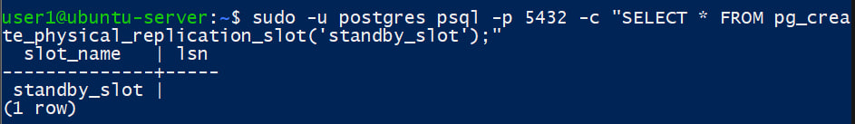
состояние слота до подключения standby
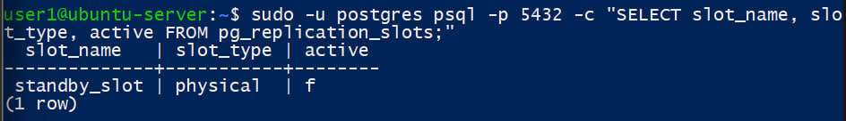

С помощью pg_basebackup создана базовая копия primary для развёртывания физической standby-реплики. Копирование завершено успешно — 100%.
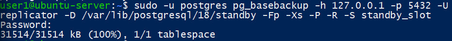
Для второго экземпляра был установлен отдельный порт:
port = 5433
Также был проверен созданный standby.signal:
/var/lib/postgresql/18/standby/standby.signal
Наличие этого файла указывает PostgreSQL на необходимость запуска экземпляра в режиме standby.
Standby-инстанс PostgreSQL успешно запущен на порту 5433
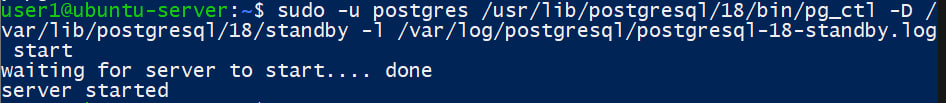

1. До promote: экземпляр localhost:5432 является primary, поскольку pg_is_in_recovery() возвращает false
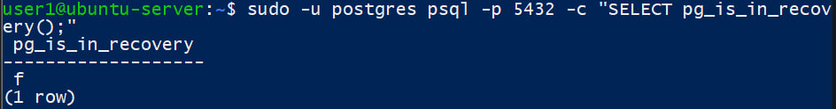
До promote: экземпляр localhost:5433 является standby-репликой, поскольку pg_is_in_recovery() возвращает true
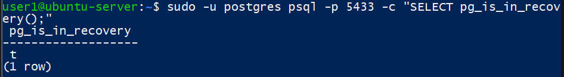

2. На primary localhost:5432 представление pg_stat_replication показывает подключённую standby-реплику. Состояние streaming подтверждает передачу WAL, режим репликации — async
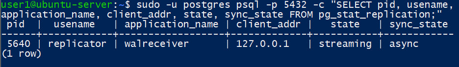

3. На primary localhost:5432 создана тестовая таблица replication_test и добавлена одна строка
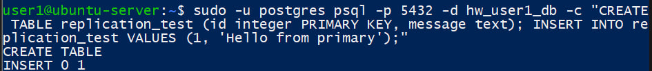
На standby localhost:5433 выполнен SELECT из таблицы replication_test. Строка Hello from primary, созданная на primary, доступна на реплике, что подтверждает работу физической streaming replication
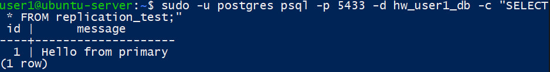

4. slot_name = standby_slot — имя replication slot, который использует наша replica. 
slot_type = physical означает физическую репликацию. 
active = t означает, что standby сейчас подключена и активно использует этот слот. 
До запуска standby у нас было active = f, поэтому разница хорошо демонстрируется.
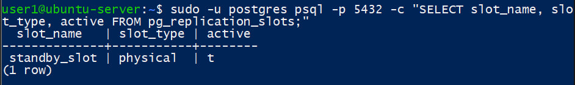

---

1. Выполнен promote standby-инстанса PostgreSQL на порту 5433. Реплика преобразована в самостоятельный primary
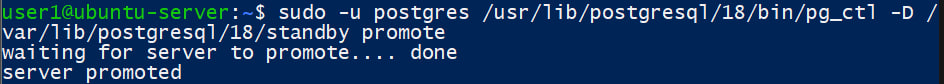
После выполнения promote бывшая standby на localhost:5433 возвращает pg_is_in_recovery() = false, следовательно, она стала самостоятельным primary
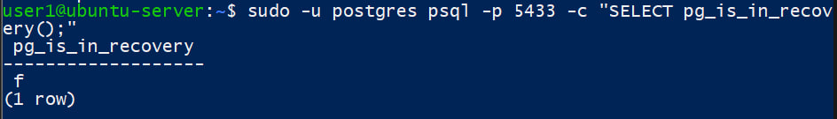

2. После promote бывшая replica начинает самостоятельно принимать изменения и формирует собственную ветку WAL, поэтому её состояние может разойтись со старым primary. Старый primary нельзя просто включить обратно с прежним томом как часть той же репликационной схемы: сначала его необходимо синхронизировать с новым primary, например пересоздать как standby из новой базовой копии или применить подходящую процедуру pg_rewind.

---

1. После promote логический backup выполнялся с нового primary:
localhost:5433
База: hw_user1_db
Для хранения резервных копий создан каталог:
/var/backups/postgresql
Владельцем является системный пользователь postgres:
drwxr-xr-x 2 postgres postgres ... /var/backups/postgresql

Был создан исполняемый скрипт:
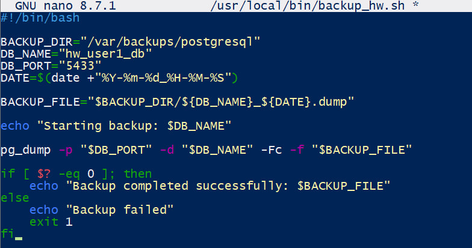

Скрипт backup_hw.sh успешно выполнил логический backup базы hw_user1_db с помощью pg_dump в формате custom
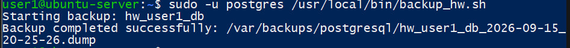

Корректность логического backup проверена командой pg_restore -l. Архив имеет формат CUSTOM и содержит таблицы books, replication_test и их данные
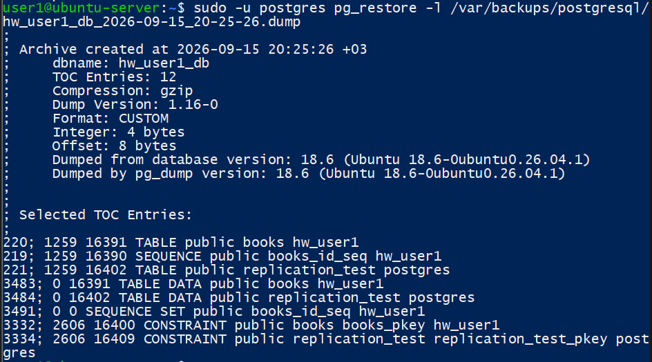

Для проверки автоматического запуска скрипта через заданный промежуток времени использовался systemd-run
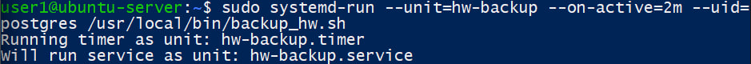

Состояние таймера до и после его срабатывания
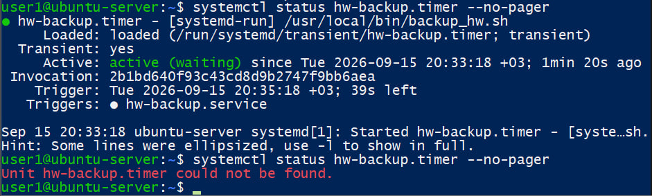

После срабатывания таймера содержимое каталога было проверено. Первый файл был создан при ручной проверке скрипта в 20:25, а второй появился автоматически после срабатывания таймера примерно в 20:35
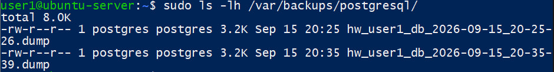