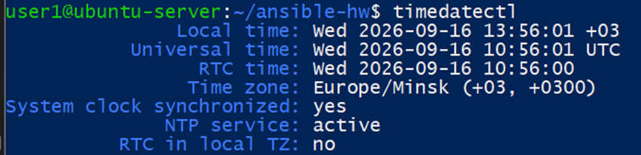
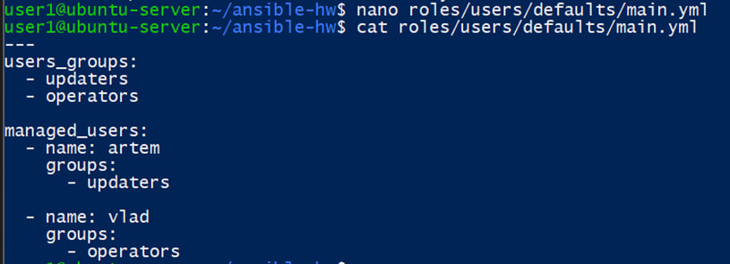
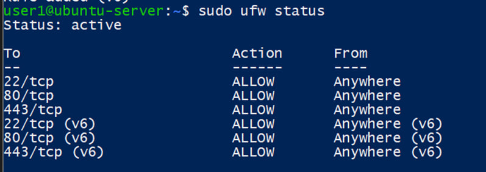
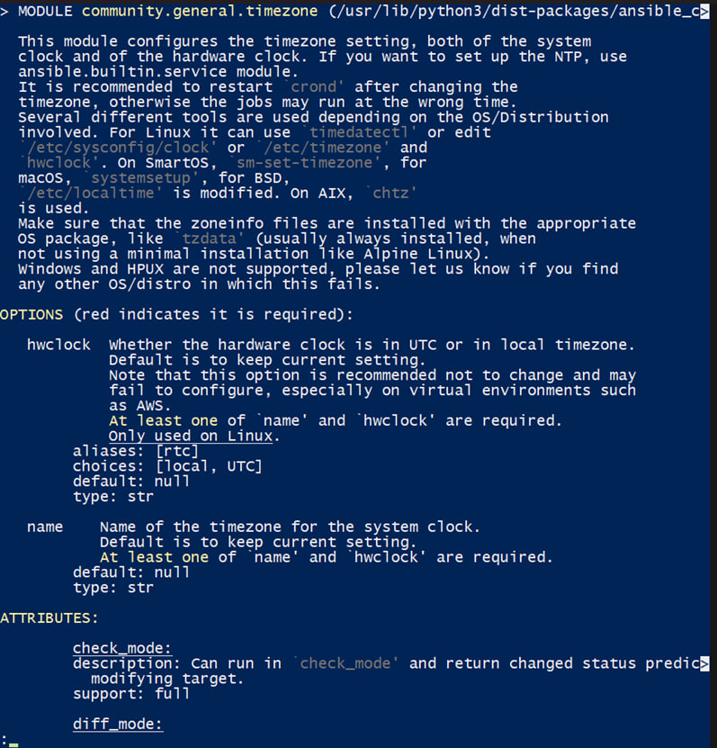
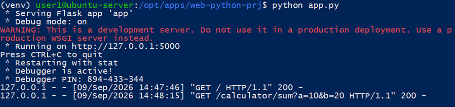
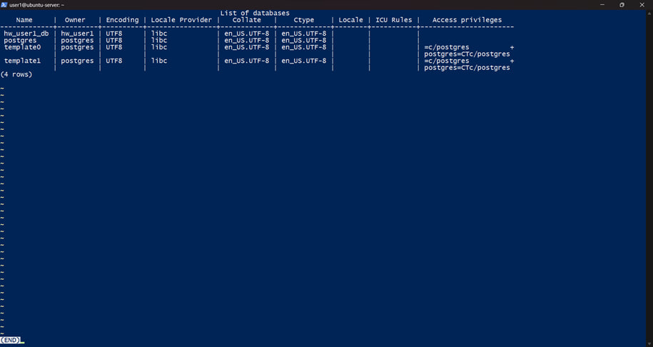
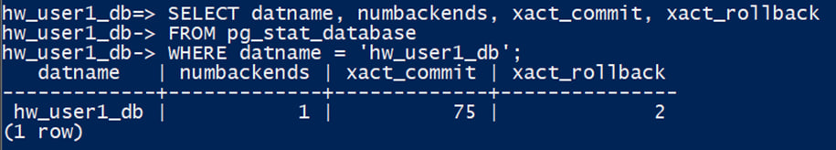
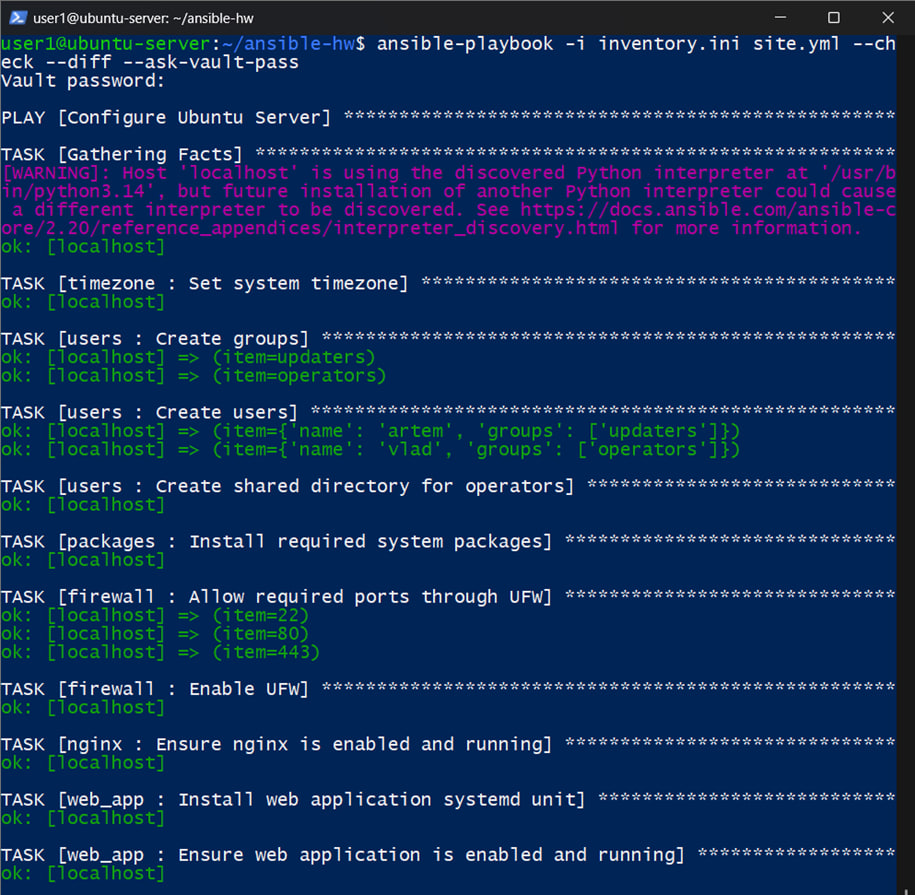
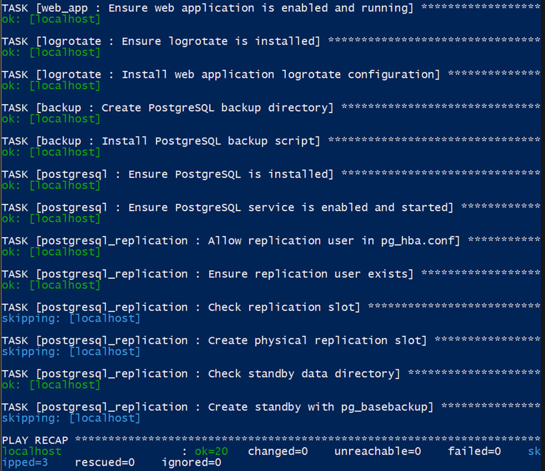
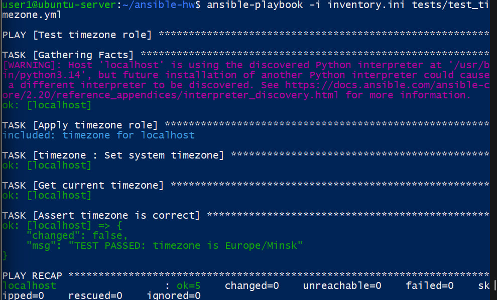

##  Создайте роли для настройки по всем предыдущим занятиям, от настройки времени до установки и настройки системы управления базами данных (в том числе репликации). В чем разница запуска скрипта и роли.

## Напишите тесты хотя бы к одной из ролей.

Решение: 

## Роли Ansible 
Ansible-проект создан в каталоге /home/user1/ansible-hw. Для поиска ролей используется локальный каталог ./roles. Главный playbook site.yml последовательно подключает роли, каждая из которых отвечает за отдельную часть конфигурации.
В проекте созданы роли: timezone, users, packages, firewall, nginx, web_app, logrotate, backup, postgresql и postgresql_replication. Для ролей, которым нужны изменяемые параметры, значения вынесены в defaults/main.yml; конфигурационные файлы формируются из templates, а перезапуск сервисов выполняется через handlers.

# Роль timezone
Роль timezone устанавливает требуемый системный часовой пояс. Значение вынесено в переменную timezone_name, что позволяет менять часовой пояс без редактирования основной задачи.

---
timezone_name: "Europe/Minsk"

- name: Set system timezone
  community.general.timezone:
    name: "{{ timezone_name }}"

Проверка системного времени и часового пояса после настройки Ansible

# Роль users
Роль users создаёт группы updaters и operators, обеспечивает наличие пользователей artem и vlad и назначает им необходимые дополнительные группы. Параметр append: true используется для сохранения уже существующего членства пользователей в других группах. Также роль управляет общим каталогом /srv/shared.

users_groups:
  - updaters
  - operators

managed_users:
  - name: artem
    groups: [updaters]
  - name: vlad
    groups: [operators]

Для /srv/shared задаются владелец root, группа operators и режим 2775. Старший разряд 2 включает setgid, поэтому новые объекты внутри каталога наследуют группу operators.

Параметры пользователей и групп в роли users

# Роль packages, firewall и nginx
Роль packages устанавливает набор пакетов, необходимый для выполненных лабораторных работ: nginx, PostgreSQL, Python, модуль venv, psycopg, acl, ufw и logrotate. Модуль apt применяется с state: present, поэтому уже установленные пакеты повторно не переустанавливаются.
Роль firewall разрешает входящие TCP-соединения на порты 22, 80 и 443 и включает UFW. Эти порты соответствуют SSH, HTTP и HTTPS. Роль nginx обеспечивает включение сервиса nginx в автозагрузку и его запущенное состояние.

Проверка правил межсетевого экрана UFW

Проверка работы веб-сервера nginx из браузера

# Роль web_app
Для Flask-приложения создана роль web_app. Она устанавливает systemd unit из Jinja2-шаблона, включает сервис web-python в автозагрузку и контролирует его состояние. В шаблон вынесены пользователь запуска, рабочий каталог, путь к Python из виртуального окружения и точка входа приложения.
[Unit]
Description=Web Python Flask Application
After=network.target

[Service]
Type=simple
User={{ web_app_user }}
WorkingDirectory={{ web_app_dir }}
ExecStart={{ web_app_python }} {{ web_app_entrypoint }}
Restart=on-failure

[Install]
WantedBy=multi-user.target

Работа Flask-приложения на локальном порту 5000

# Роль logrotate и backup
Роль logrotate устанавливает пакет logrotate и размещает конфигурацию ротации журнала веб-приложения. Для /var/log/web-python.log настроена ежедневная ротация, хранение семи архивов, сжатие и copytruncate.

/var/log/web-python.log {
    daily
    rotate 7
    compress
    missingok
    notifempty
    copytruncate
    su root syslog
}

Роль backup создаёт каталог /var/backups/postgresql с владельцем postgres и устанавливает скрипт /usr/local/bin/backup_hw.sh. Скрипт формирует логическую резервную копию базы hw_user1_db в формате pg_dump -Fc. Порт базы вынесен в переменную роли, поэтому конфигурацию можно изменить без переписывания шаблона.

# Роль postgresql
Роль postgresql обеспечивает наличие пакета PostgreSQL и контролирует запуск и автозагрузку сервиса. В предыдущих работах была создана база hw_user1_db и таблица books; в данной работе Ansible используется прежде всего для управления состоянием СУБД и подготовкой инфраструктуры репликации.

Проверка наличия базы данных hw_user1_db в PostgreSQL

# Роль postgresql_replication
Для физической репликации создана отдельная роль postgresql_replication. В defaults определены версия PostgreSQL, порты primary и standby, каталоги данных, имя пользователя репликации, имя физического replication slot и адрес подключения. Роль добавляет разрешение в pg_hba.conf, обеспечивает наличие роли replicator с атрибутом REPLICATION, проверяет replication slot и при необходимости создаёт его.
Перед выполнением pg_basebackup роль проверяет наличие PG_VERSION в каталоге standby. Если каталог уже содержит кластер, повторное копирование не запускается. Это защищает существующие данные от перезаписи и обеспечивает идемпотентное повторное применение роли.

- name: Check standby data directory
  ansible.builtin.stat:
    path: "{{ standby_data_dir }}/PG_VERSION"
  register: standby_data

- name: Create standby with pg_basebackup
  ansible.builtin.command:
    argv:
      - "/usr/lib/postgresql/{{ postgresql_version }}/bin/pg_basebackup"
      - -h
      - "{{ replication_host }}"
      - -p
      - "{{ primary_port | string }}"
      - -U
      - "{{ replication_user }}"
      - -D
      - "{{ standby_data_dir }}"
      - -R
      - -S
      - "{{ replication_slot }}"
  when: not standby_data.stat.exists

Проверка состояния физической репликации PostgreSQL

# Проверка идемпотентности всего проекта
Финальная проверка выполнена командой ansible-playbook с параметрами --check и --diff. В Check Mode Ansible проходит по конфигурации без внесения изменений и показывает, потребовалось бы изменить систему или нет.

# В чем разница запуска скрипта и роли.
Bash-скрипт при каждом запуске выполняет прописанные в нём команды, поэтому необходимые проверки часто приходится добавлять вручную. Ansible-роль описывает, какое состояние системы должно быть в итоге, и не делает лишних изменений, если всё уже настроено. Также роли удобнее разделять, настраивать и повторно использовать.

## Тестирование роли timezone

Для выполнения требования о тестировании создан отдельный playbook tests/test_timezone.yml. Тест сначала применяет роль timezone, затем независимо получает фактический часовой пояс командой timedatectl и проверяет результат модулем ansible.builtin.assert. При несовпадении ожидаемого и фактического значения тест завершается ошибкой

---
- name: Test timezone role
  hosts: servers
  become: true

  tasks:
    - name: Apply timezone role
      ansible.builtin.include_role:
        name: timezone

    - name: Get current timezone
      ansible.builtin.command:
        argv:
          - timedatectl
          - show
          - --property=Timezone
          - --value
      register: timezone_result
      changed_when: false

    - name: Assert timezone is correct
      ansible.builtin.assert:
        that:
          - timezone_result.stdout == "Europe/Minsk"
        success_msg: "TEST PASSED: timezone is Europe/Minsk"
        fail_msg: "TEST FAILED: timezone is not Europe/Minsk"

При выполнении теста получено сообщение «TEST PASSED: timezone is Europe/Minsk», итоговый результат — failed=0.

