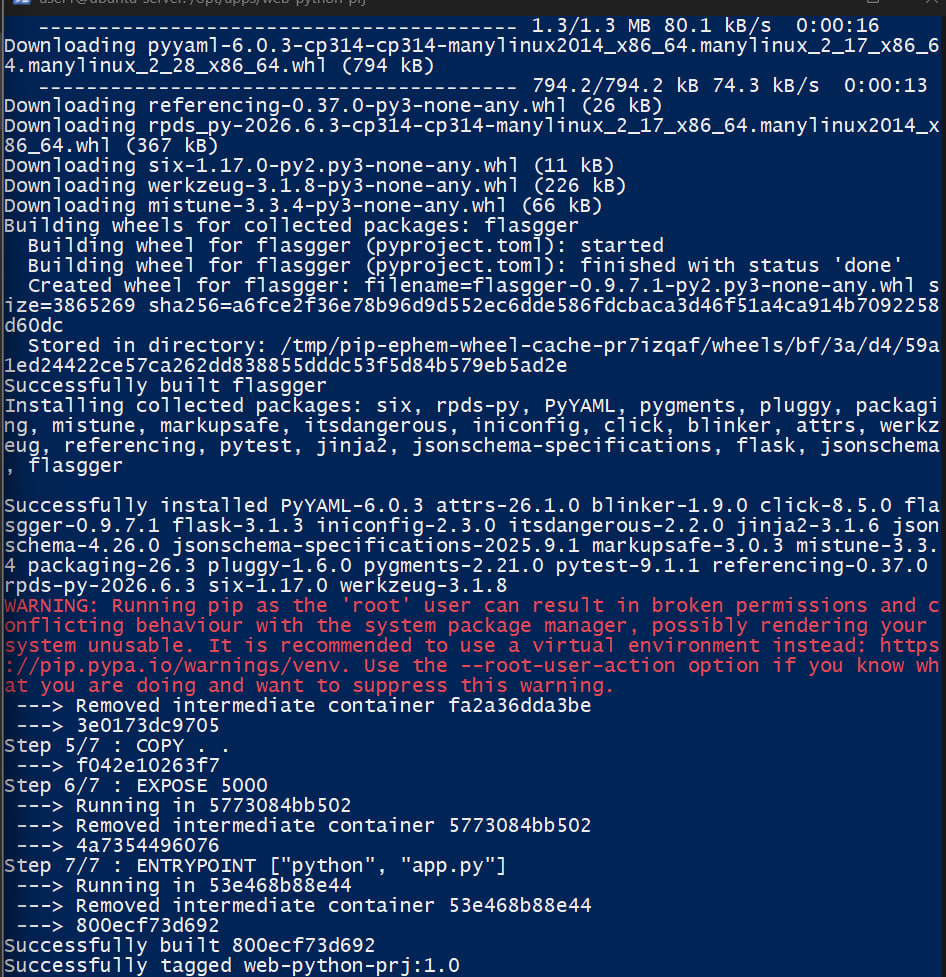
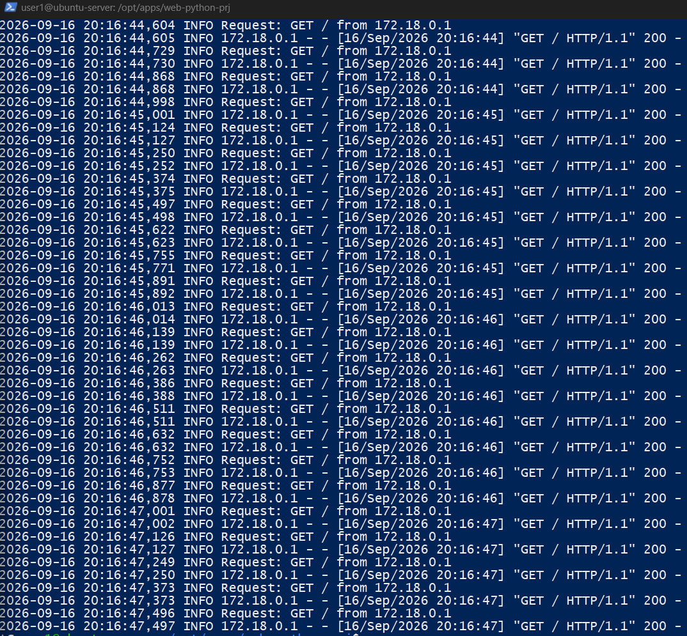
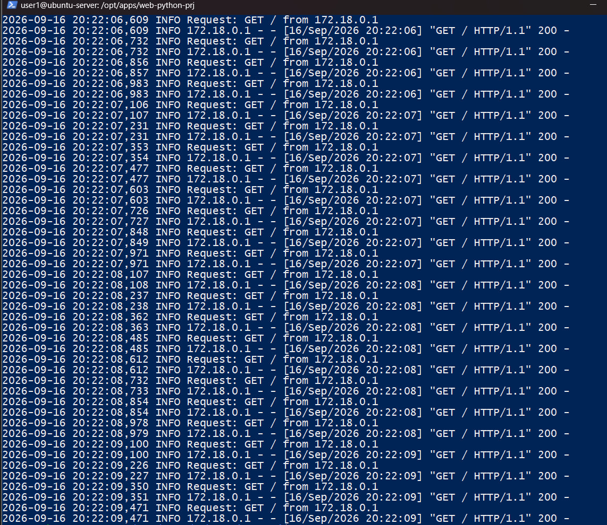
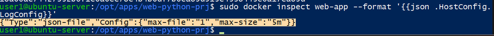
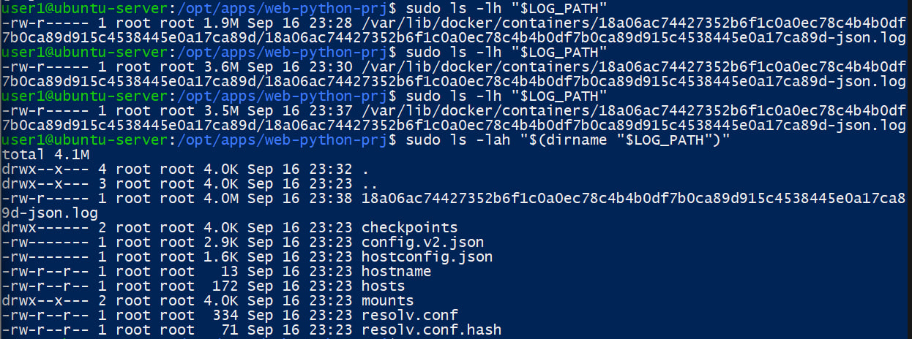
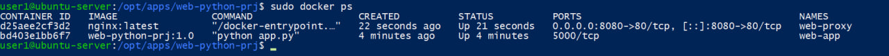

1. Создайте образ из Dockerfile для приложения для которого Вы делали systemd юнит файл. Пока не обращайте внимание на оптимизацию образа. Например для приложения на go
FROM golang:1.23-bookworm
WORKDIR /src
ENV GOTOOLCHAIN=auto
COPY go.mod go.sum ./
RUN go mod download
ARG USER
COPY . .
RUN CGO_ENABLED=0 go build -trimpath -ldflags="-s -w" -o /web-go-prg .
ENTRYPOINT ["/web-go-prg"]
2. Запустите получившийся образ не в сети по умолчанию, сделайте новую сеть и в ней запустите контейнер, сделалайте проброс портов для того, что бы вы могли обращаться к контейнеру. Напишите скрипт для симуляции нагрузки на контейнер. Посмотрите логи контейнера в реальном времени выводите последние 20 строк и логи за последние 5 минут. Ограничьте хранение логов контейнера 5 мегабайтами и 1 файлом. Проверьте ротацию файлов.
3. Запустите контейнер с nginx пробросьте каталог с конфигурационными файлами для него. В конфигурационном файле настройте проксирование от nginx к Вашему приложению (необходимо выключить проброс портов из пункта 2) по имени контейнера. Производите отладку конфигурационного файла пересоздавая или перезапуская контейнер прокси.
4. Запустите скрипт для нагрузки и посмотрите потребление контейнрами ресурсов.

Решение:
1. В качестве приложения использован ранее подключённый к серверу Flask-проект /opt/apps/web-python-prj. Для контейнеризации был создан Dockerfile на базе python:3.14-slim. Зависимости устанавливаются из requirements.txt, после чего приложение запускается командой python app.py.

FROM python:3.14-slim
WORKDIR /app
COPY requirements.txt .
RUN pip install --no-cache-dir -r requirements.txt
COPY . .
EXPOSE 5000
ENTRYPOINT ["python", "app.py"]

Для исключения лишних файлов из контекста сборки использован .dockerignore (venv, .git, __pycache__, *.pyc, .pytest_cache). Образ собран с тегом web-python-prj:1.0.

2. Создана отдельная пользовательская bridge-сеть web-net. На первом этапе контейнер приложения запускался в этой сети с публикацией порта 5000:5000, чтобы проверить прямую доступность приложения.

sudo docker network create web-net

sudo docker run -d --name web-app --network web-net -p 5000:5000 web-python-prj:1.0

Для имитации нагрузки создан Bash-скрипт, который циклически выполняет HTTP-запросы к приложению.

#!/bin/bash
URL="http://localhost:5000"
echo "Запуск нагрузки на $URL"
while true; do
    curl -s "$URL" > /dev/null
    sleep 0.1
done

Логирование Flask было направлено в стандартный поток контейнера, благодаря чему Docker может собирать сообщения приложения. В реальном времени логи просматривались командой docker logs -f.

Просмотр логов контейнера web-app в реальном времени во время нагрузки

Также проверены требуемые режимы просмотра: последние 20 строк и сообщения за последние 5 минут.
sudo docker logs --tail 20 web-app
sudo docker logs --since 5m web-app

Контейнер приложения был пересоздан с параметрами драйвера json-file: максимальный размер лог-файла 5 МБ и максимальное количество файлов 1.

sudo docker run -d \
  --name web-app \
  --network web-net \
  -p 5000:5000 \
  --log-opt max-size=5m \
  --log-opt max-file=1 \
  web-python-prj:1.0

Проверка параметров max-size=5m и max-file=1

Проверка ротации Docker-логов: при ограничении max-size=5m и max-file=1 в каталоге контейнера сохраняется один текущий лог-файл

3. После проверки прямого доступа контейнер web-app был пересоздан без публикации порта 5000. Порт остался доступен только внутри Docker-сети web-net.

sudo docker run -d \
  --name web-app \
  --network web-net \
  --log-opt max-size=5m \
  --log-opt max-file=1 \
  web-python-prj:1.0

Для nginx создан каталог /home/user1/docker-nginx/conf.d и файл default.conf. Каталог подключён в контейнер как bind mount только для чтения.

server {
    listen 80;
    server_name _;

    location / {
        proxy_pass http://web-app:5000;
        proxy_set_header Host $host;
        proxy_set_header X-Real-IP $remote_addr;
        proxy_set_header X-Forwarded-For $proxy_add_x_forwarded_for;
    }
}

sudo docker run -d \
  --name web-proxy \
  --network web-net \
  -p 8080:80 \
  -v /home/user1/docker-nginx/conf.d:/etc/nginx/conf.d:ro \
  nginx:latest

Порт 8080 выбран на хосте, поскольку порт 80 уже использовался ранее настроенным nginx. Оба контейнера подключены к web-net. Приложение не имеет прямого опубликованного порта.

Контейнеры web-proxy и web-app: наружу опубликован только nginx на порту 8080

Конфигурация nginx была проверена командой nginx -t. Docker DNS пользовательской сети разрешает имя web-app во внутренний адрес контейнера, поэтому в proxy_pass используется имя контейнера, а не фиксированный IP.

sudo docker exec web-proxy nginx -t

sudo docker exec web-proxy getent hosts web-app

После проверки конфигурации контейнер web-proxy был перезапущен командой docker restart web-proxy. Повторный запрос curl http://localhost:8080 успешно вернул главную страницу Flask-приложения.

4. После отключения прямого порта Flask нагрузочный скрипт был изменён: URL заменён на http://localhost:8080. Таким образом, каждый запрос проходит через nginx к web-app.

URL="http://localhost:8080"

sudo docker stats web-app web-proxy

Потребление CPU, памяти и сетевых ресурсов контейнерами во время нагрузки
