# Итоговая домашняя работа по Docker
**Цель:** собрать один связный мини-проект, в котором вы осознанно применяете всё пройденное по модулю: образы и контекст сборки, **multi-stage** Dockerfile, тома и сети, наблюдаемость (логи, инспекция, ресурсы), **Docker Compose** как манифест стека на одном хосте.
---
## Условия и ограничения
1. **Стек:** минимум **три сервиса** — **веб/API-приложение** (ваш выбор стека), **СУБД** (например PostgreSQL или Redis + то, что нужно вашему приложению), **обратный прокси** (nginx). С хоста наружу публикуется **только прокси** (один порт, например `8080:80`). К приложению и БД с хоста «напрямую» порты **не** пробрасывать.
2. **Сборка приложения:** образ приложения — **multi-stage** Dockerfile: отдельная стадия сборки и минимальный runtime; в финальном образе **нет** компилятора/исходников (если только вы явно не обоснуете dev-профиль ниже).
3. **Файлы проекта:** в корне — **`compose.yaml`** (или `docker-compose.yml`), **`.env.example`**, **`.gitignore`** (в т.ч. `.env`), **`.dockerignore`** для контекста сборки приложения. Секреты в git **не** коммитить.
4. **Networks:** минимум **две пользовательские bridge-сети** Compose — условно «фронт» (прокси ↔ приложение) и «бэкенд» (приложение ↔ БД). Прокси **не** должен быть подключён к сети, где висит только БД (идея из практики 11.3.4).
5. **Volumes:** данные БД — **именованный том** Compose; при необходимости конфиг nginx — bind-mount с хоста **или** конфиг в образе прокси — на ваш выбор, но поведение должно быть воспроизводимо после `compose down` / `up`.
6. **Logging:** для **всех** сервисов задайте драйвер **`json-file`** с ротацией (**`max-size`**, **`max-file`**) на уровне **`logging`** в Compose.
7. **healthcheck:** у приложения и БД объявите **`healthcheck`** в Compose (или в Dockerfile там, где уместно); **`depends_on`** с **`condition: service_healthy`** там, где это нужно для корректного старта.
---
# теория (кратко, в отчёте)
Ответьте письменно **в пределах 1 страницы**:
1. Чем **образ** отличается от **контейнера** и как это связано со слоями.
2. Зачем в Compose **именованный том** для БД и чем он принципиально отличается от bind-mount для каталога с кодом при разработке.
3. Зачем две bridge-сети между прокси, приложением и БД — одним абзацем с точки зрения **изоляции**, не «магии Docker».
---
# Практика
## образ приложения и сборка
1. Напишите **multi-stage** `Dockerfile` для приложения; финальный этап — непривилегированный пользователь (**`USER`**), корректный **`ENTRYPOINT`/`CMD`** в exec-форме.
2. Добавьте **`.dockerignore`**, чтобы в контекст не попадали мусор, секреты и большие артефакты.
3. Зафиксируйте в отчёте **две** успешные сборки:
- обычная: `docker compose build` (или `docker build` с указанием контекста);
- принудительная без кэша: `docker compose build --no-cache` **или** `docker build --no-cache …`.
4. Укажите **размер** финального образа приложения (`docker images`) и кратко — что даёт multi-stage по сравнению с одностадийным образом на базе SDK.
---
## Docker Compose как единый стек
1. Опишите сервисы в **`compose.yaml`**: **`build`**/`image`**, **`environment`**, **`env_file`**, сети, тома, порты **только у прокси**, **`restart`** по желанию.
2. Поднимите стек: `docker compose up -d`, покажите `docker compose ps`.
3. Продемонстрируйте **перемонтирование только одного сервиса** после правки кода или конфига: `docker compose up -d --build <service>`.
---
## наблюдаемость и эксплуатация
Выполните и приложите к отчёту вывод команд (можно обрезать длинное, но ключевые поля видны):
2. Инспекция: `docker inspect` для контейнера приложения — найдите и прокомментируйте **IP в нужной сети**, маунты томов, лимиты логов (если заданы).
3. Ресурсы под нагрузкой: либо `docker stats`, либо **`docker compose top`**; добавьте короткий **скрипт** или команду (`curl`, `ab`, `hey`, `k6` — неважно), симулирующую запросы к опубликованному порту прокси.
4. Убедитесь, что **ротация логов** задана в манифесте и видна в `docker inspect` (секция `LogConfig`).
---
## тома и персистентность
1. Создайте запись в БД через приложение или `compose exec` в клиент БД.
2. Выполните **`docker compose down`** (без `-v`), затем снова **`up`**: данные на месте.
3. Выполните **`docker compose down -v`** и объясните одним абзацем, что произошло и когда так делать **нельзя** на проде.
---
## Формат сдачи
1. **Отчёт** (Markdown или PDF): части A–E по пунктам, команды и выводы для части D, скриншот опционален; бонус F — отдельным разделом.
2. В начале отчёта — **инструкция запуска** в три–пять строк: клонирование, `cp .env.example .env`, правка переменных, `docker compose up -d`, URL для проверки.
**Критерии проверки (кратко):** стек поднимается «с нуля» по вашей инструкции; наружу только прокси; multi-stage и непривилегированный пользователь в приложении; именованный том для БД; две сети и корректная маршрутизация; healthchecks и осмысленный `depends_on`; логи с ротацией; отчёт показывает понимание томов, сетей и различия образ/контейнер.

Решение:

git clone <URL_РЕПОЗИТОРИЯ>
cd web-python-prj
cp .env.example .env
nano .env
sudo docker compose up -d

URL для проверки: http://localhost:8080/health и http://localhost:8080/db-health.

# Теория
1. Docker-образ - неизменяемый шаблон для создания контейнеров. Он состоит из переиспользуемых read-only слоёв. Контейнер - экземпляр образа во время выполнения; поверх слоёв образа он получает собственный writable-слой. Несколько контейнеров могут использовать одни и те же слои образа, сохраняя независимое состояние выполнения.

2. Именованный том управляется Docker и живёт независимо от контейнера, поэтому подходит для постоянных данных PostgreSQL. Bind mount связывает конкретный путь хоста с контейнером и удобен, когда файл должен редактироваться на хосте. В проекте PostgreSQL использует nименованный том, а конфигурация nginx подключена read-only bind mount.

3. Сеть frontend связывает proxy и app, а backend - app и db. Proxy не подключён к сети БД, PostgreSQL не подключён к frontend. Такое разделение ограничивает сетевую доступность сервисов и уменьшает поверхность атаки; приложение является единственным сервисом, подключённым к обеим сетям.

# Практика
## образ приложения и сборка
1. Создан Dockerfile с этапами builder и runtime. В builder устанавливаются зависимости и исходный код приложения компилируется в Python bytecode. В runtime переносятся виртуальное окружение и .pyc-файлы. Создан пользователь appuser с UID 10001, указан USER appuser, а запуск задан в exec-форме ENTRYPOINT ["python", "app.pyc"].

FROM python:3.14-slim AS builder
...
RUN python -m compileall -b app.py controllers ...
FROM python:3.14-slim AS runtime
RUN useradd --create-home --uid 10001 appuser
...
USER appuser
ENTRYPOINT ["python", "app.pyc"]

Проверка содержимого runtime-образа: в /app находятся .pyc-файлы приложения
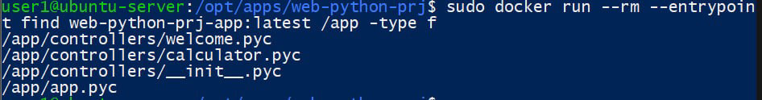

Проверка запуска приложения от непривилегированного пользователя appuser
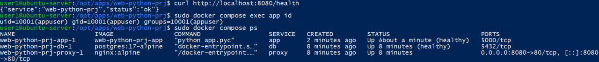

2. Файл .dockerignore исключает .git, реальный .env, venv, __pycache__, *.pyc, pytest-кэш, тесты, логи и служебные файлы. Шаблон .env.example явно разрешён. Дополнительно .env добавлен в .gitignore.

Содержимое .dockerignore
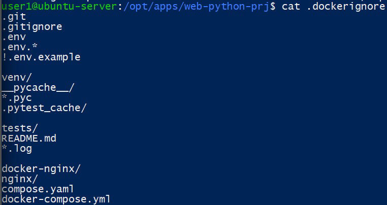

Проверка git check-ignore: реальный .env игнорируется Git
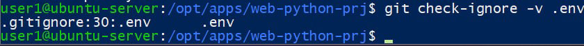

3. Обе требуемые сборки выполнены успешно. При обычной сборке Docker мог использовать кэш слоёв; при --no-cache стадии сборки были выполнены принудительно заново.

sudo docker compose build
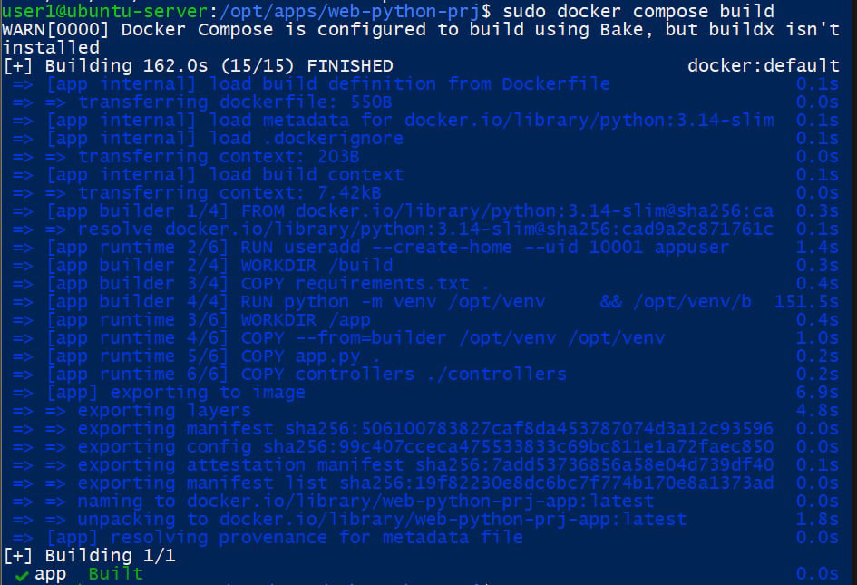

sudo docker compose build --no-cache
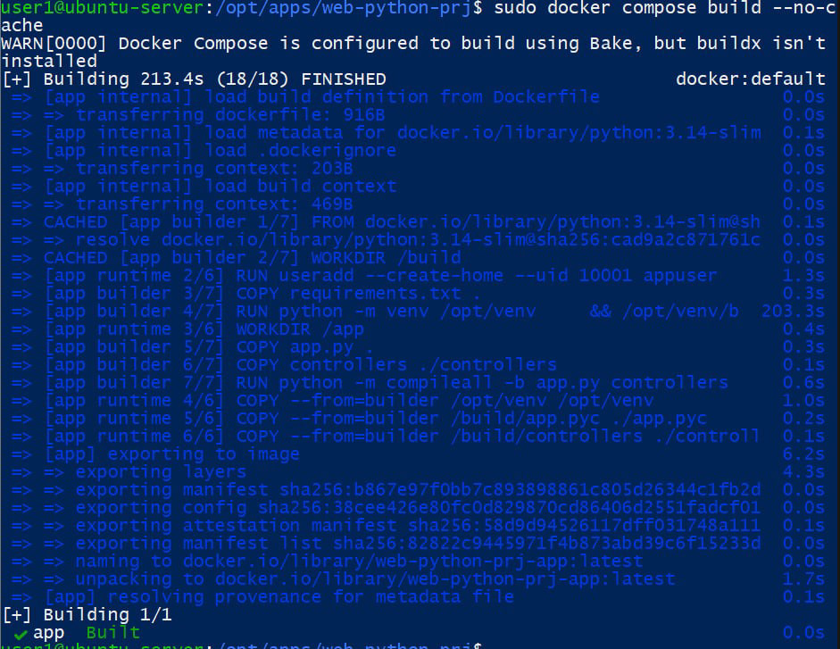

4. Команда docker images показала 291 MB disk usage и 68.4 MB content size для web-python-prj-app:latest. Multi-stage разделяет build-time и runtime: промежуточные артефакты и исходные .py приложения не переносятся в финальный этап. Это уменьшает количество ненужного содержимого и поверхность атаки по сравнению с образом, где сборка и запуск выполняются в одном окружении.
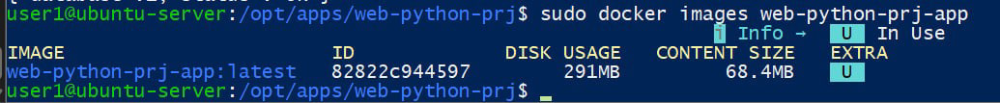

---

## Docker Compose как единый стек
1. В compose.yaml описаны три сервиса: db, app и proxy. Сервис app собирается локально через build из Dockerfile; db использует image postgres:17-alpine; proxy - image nginx:alpine.
Для app и db используются env_file: .env и environment. Созданы две пользовательские bridge-сети: frontend и backend. Proxy подключён только к frontend, db - только к backend, app - к обеим сетям. PostgreSQL использует named volume postgres_data, а nginx - read-only bind mount конфигурации. Наружу опубликован только proxy на порту 8080:80; app и db host-порты не публикуют. Параметр restart не использовался, так как по заданию он необязателен. Дополнительно у db и app настроены healthcheck, а зависимости используют condition: service_healthy.

docker compose ps: app и db доступны только внутри Docker-сетей, наружу опубликован только proxy

Две пользовательские bridge-сети проекта
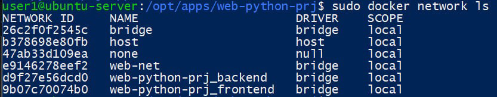

Состав frontend: proxy и app
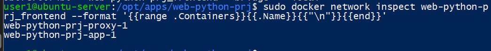

Состав backend: app и db
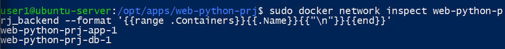

Named volume PostgreSQL
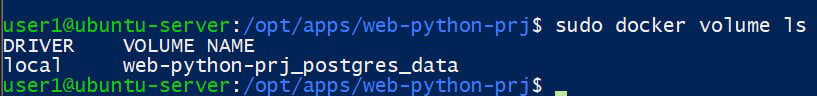

При запуске db и app проходят healthcheck, после чего запускается proxy
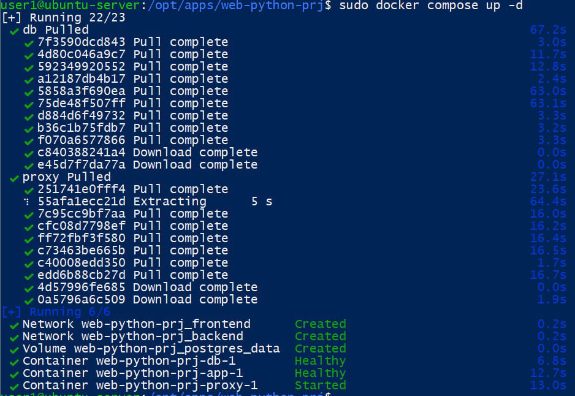

Проверка цепочки proxy -> app -> PostgreSQL через /db-health
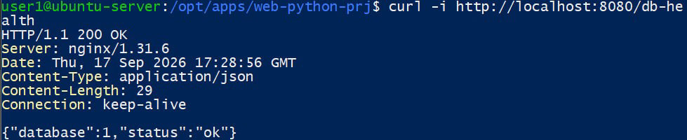

2. Стек успешно поднят в фоновом режиме. При запуске Compose создал frontend, backend и named volume PostgreSQL. В docker compose ps сервисы app и db имеют статус healthy, proxy запущен, а опубликованный host-порт присутствует только у proxy.

docker compose up -d: создание сетей, volume и запуск сервисов

docker compose ps после запуска
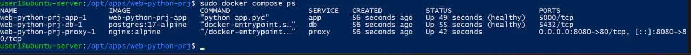

3. После изменения ответа /health выполнена выборочная пересборка только сервиса app командой sudo docker compose up -d --build app. PostgreSQL не пересобирался, proxy также не требовал пересборки. После запуска проверен новый ответ /health и пользователь контейнера appuser.

Выборочная пересборка и повторный запуск только app
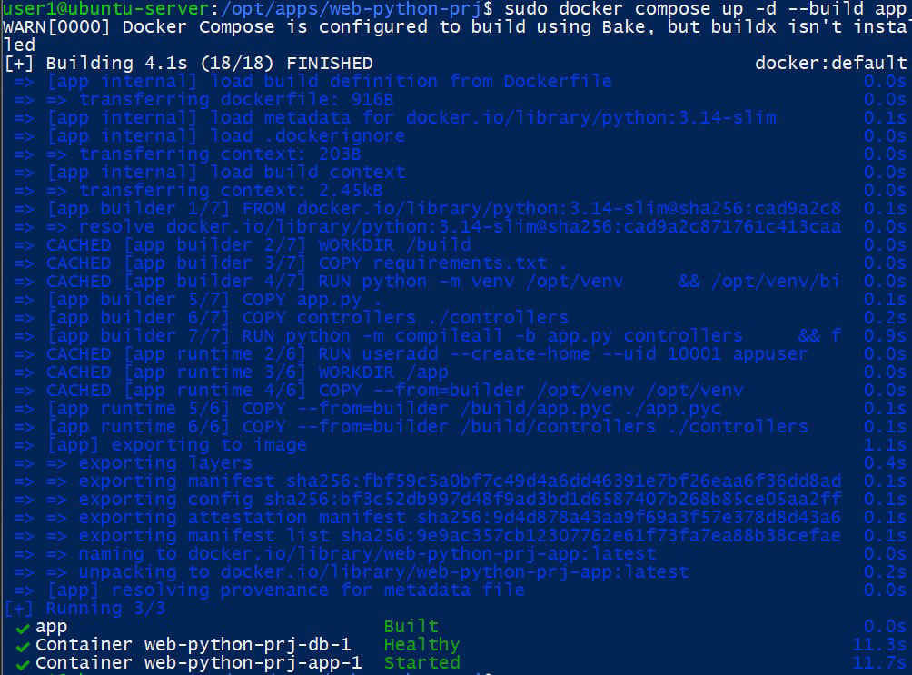

Проверка обновлённого /health, non-root пользователя и состояния Compose

---

## наблюдаемость и эксплуатация
1. Команда docker compose logs --tail=20 показала запуск nginx, регулярные успешные ответы приложения на /health и готовность PostgreSQL принимать соединения. Логи приложения направляются в stdout/stderr и доступны через Docker.
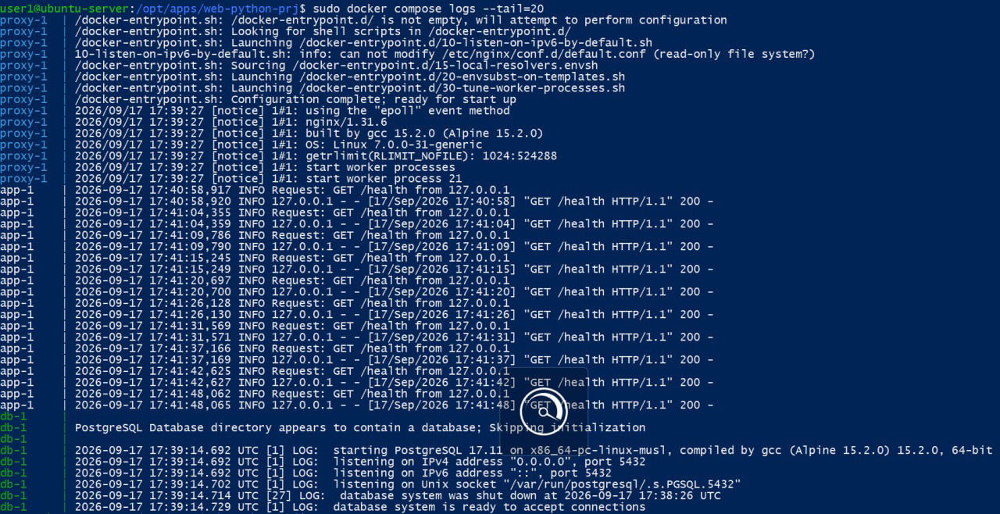

2. App подключён к двум сетям и имеет отдельный IP в каждой: backend 172.19.0.3 и frontend 172.20.0.2 на момент проверки. IP динамические, поэтому сервисы взаимодействуют по DNS-именам Compose. У app нет mounts: код находится в образе. Для сравнения, db имеет named volume, а proxy - read-only bind mount.

IP приложения в frontend и backend по docker inspect
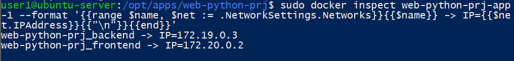

Mounts приложения: пустой список
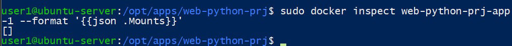

Named volume контейнера PostgreSQL
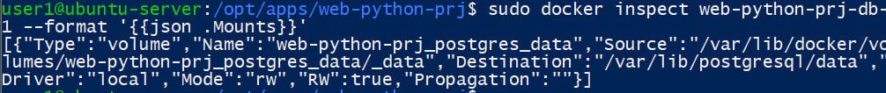

Read-only bind mount конфигурации nginx.
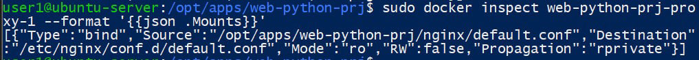

Для app также проверен LogConfig
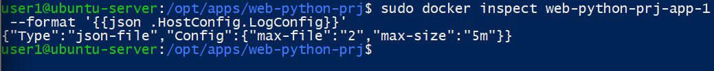

3. Создан load.sh, который отправляет 100 HTTP-запросов к http://localhost:8080/health. После выполнения снят моментальный docker stats --no-stream, показывающий CPU, память, Network I/O, Block I/O и PIDs для трёх сервисов.

#!/bin/bash
URL="http://localhost:8080/health"
REQUESTS=100
for i in $(seq 1 "$REQUESTS"); do
 curl -s -o /dev/null "$URL"
done

100 запросов к опубликованному порту proxy и docker stats после нагрузки
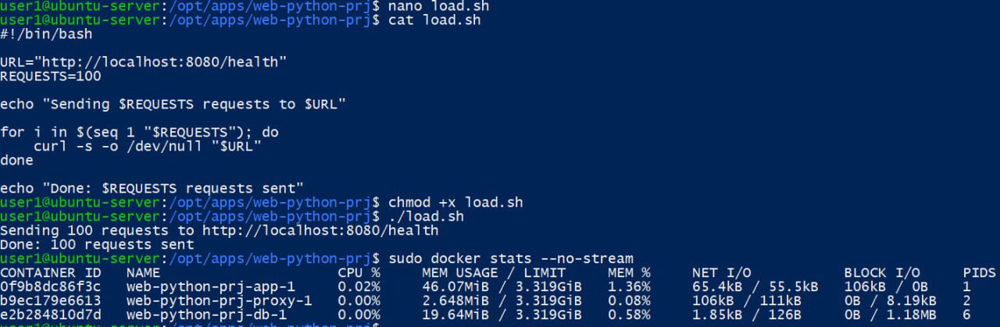

4. Для всех сервисов в compose.yaml указан driver json-file с max-size "5m" и max-file "2". docker inspect приложения подтвердил применение этих параметров.

---

##
1. Через compose exec в PostgreSQL создана таблица persistence_test и запись id=1, message="data survives restart".
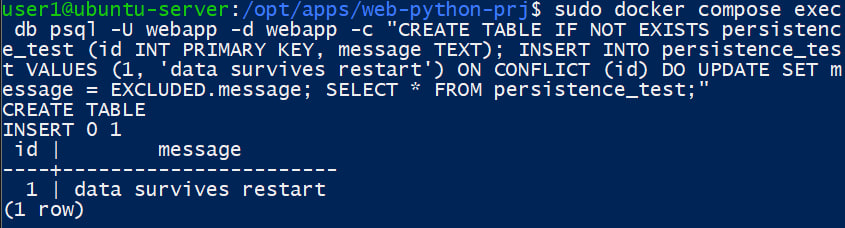

2. После обычного docker compose down контейнеры и сети были удалены, но named volume остался. После docker compose up -d запрос SELECT * FROM persistence_test снова вернул строку "data survives restart". Это подтверждает независимость named volume от жизненного цикла контейнера.
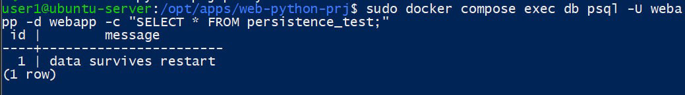

3. Команда docker compose down -v удалила контейнеры, сети и named volume web-python-prj_postgres_data. После следующего up Docker создал новый пустой volume, поэтому таблица persistence_test отсутствовала. На production down -v нельзя выполнять без осознанной необходимости и актуальной резервной копии: удаление named volume может привести к необратимой потере рабочих данных БД.

docker compose down -v: named volume PostgreSQL удалён
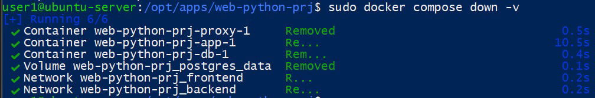

Чистый запуск: сети и новый volume созданы заново
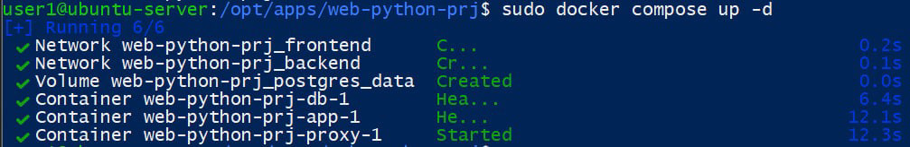

После удаления volume старая таблица persistence_test отсутствует
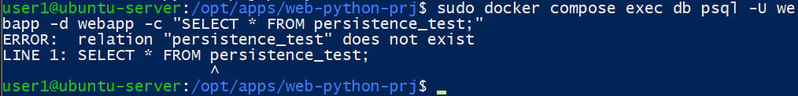

Финальная проверка после чистого запуска: /db-health возвращает HTTP 200
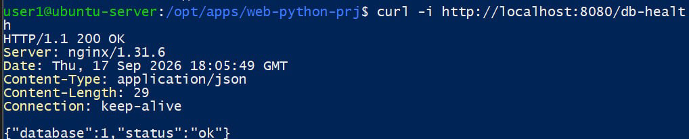