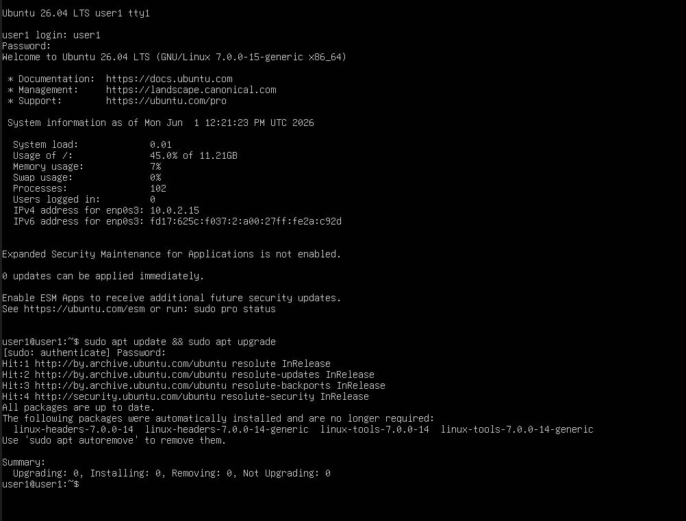
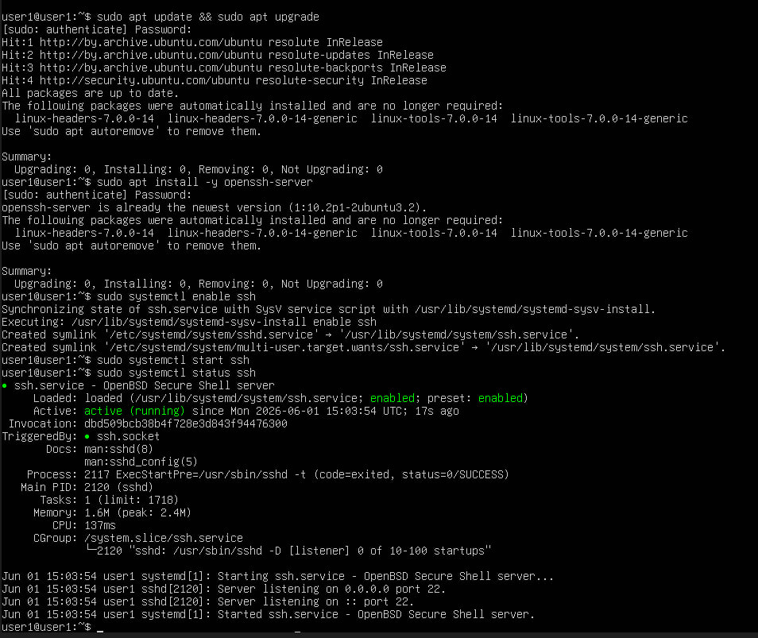
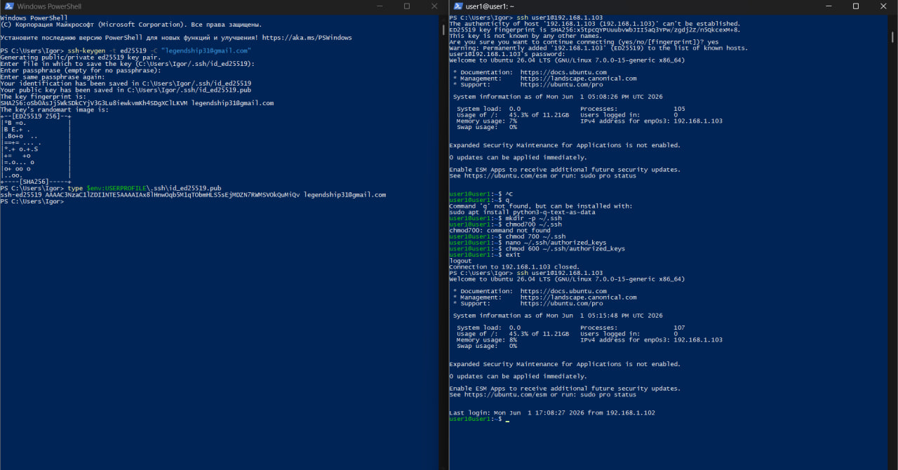
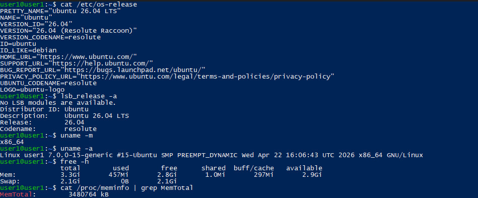
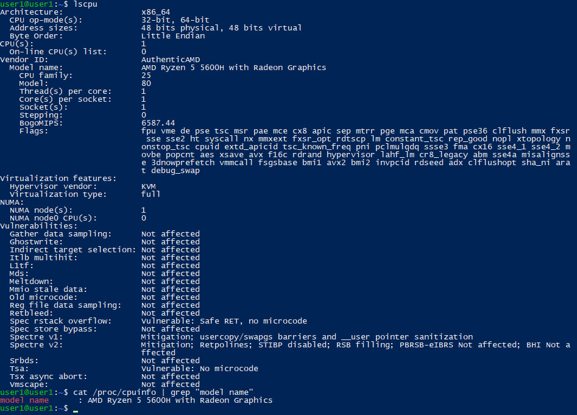

Условие:
1. Создать в virualbox (или другом гипервизоре) виртуальную машину с примонтированным образом ubuntu (серверную) 
2. Установить операционную систему 
3. Обновите предустановленные пакеты sudo apt update && sudo apt upgrade 
4. НАстроить удаленный доступ по ssh ssh Проверьте что установлен необходимый пакет и запустите сервис (по умолчанию должен предустанавливаться) sudo apt install -y openssh-server sudo systemctl enable ssh sudo systemctl start ssh 
5. Сгенерируйте пару ключей ssh-keygen -t ed25519 -C "your_email@example.com" Скопируйте ключ на удаленный сервер (попробуйте найти куда можно скопировать самостоятельно ключ что бы он был принят системой) ssh-copy-id user@server_ip 
6. Выполните команды, что они выводят, как можно использовать вывод упомянутых команды :
6. Собрать информацию о системе
```bash
cat /etc/os-release
lsb_release -a
uname -m
uname -a
free -h
cat /proc/meminfo | grep MemTotal
lscpu
cat /proc/cpuinfo | grep "model name"
```

Решение
1. Создал в virualbox  виртуальную машину с примонтированным образом ubuntu (серверную) 
2. Установил операционную систему 
3. 
4. 
5. 
6. 
```bash
cat /etc/os-release (как я понимаю подробная информация о системе)
lsb_release -a  (информация о системе, но в более кратком виде)
uname -m  (архитектура системы)
uname -a (полная информация о сборке системы)
free -h (информация о памяти)
cat /proc/meminfo | grep MemTotal (объём RAM)
lscpu (показывает все подробную информацию о процессоре)
cat /proc/cpuinfo | grep "model name" (название процессора)
```