# ДЗ по ci/cd.
1. Необходимо описать процесс, подлежащий автоматизации. Какой гитфлоу и инструмент будете использовать.
2. Реализуйте п1 на выбранной платформе, обязательно должны быть шаги по build lint test deploy.
3. при использовании мультистэйджинг сборки покажите как можно проводить все шаги только при помощи команды build (подсказка, необходимо использовать target).
4. Обеспечьте сохранение артефактов линтинга и тестирования, подготовьте отчет по проверкам и отправьте в канал (например тг) для информирования о прошедшем тестировании. (стэйдж notify)
6. Сделайте простейший вариант деплоймента через docker compose файл, который вы будете запускать
7. Продумайте очистку ваших агентов или раннеров от артефактов сборки.
# Формат отчета
отчет предоставить в виде .md файла с фото запускуа и пояснения изображений, а также репозитория с кодом реализации процесса автоматизации.

# Отчёт по ДЗ: CI/CD
## 1. Описание автоматизируемого процесса
Цель работы — автоматизировать проверку, сборку и развёртывание Python/Flask-приложения.
Для реализации CI/CD используется **GitHub Actions**.
Исходный код приложения и реализация CI/CD находятся в отдельном репозитории:
`https://github.com/gogeezy/web-python-prj`

В процессе автоматизации реализованы следующие этапы:
1. **Build** — сборка runtime Docker-образа.
2. **Lint** — статическая проверка Python-кода с помощью Ruff.
3. **Test** — запуск автоматических тестов с помощью Pytest.
4. **Deploy** — развёртывание приложения через Docker Compose.
5. **Notify** — отправка результатов CI/CD и отчётов в Telegram.
6. **Cleanup** — очистка Docker-ресурсов runner.

Используемый Git flow:
`main -> feature/hw32-cicd -> Pull Request -> main`

Ветка `main` содержит стабильную версию проекта. Реализация CI/CD выполнялась в отдельной ветке `feature/hw32-cicd`.
После завершения разработки feature-ветка была отправлена в GitHub. Затем был создан Pull Request в `main`. Перед слиянием GitHub Actions выполнил автоматические проверки. После успешного прохождения проверок Pull Request был объединён с основной веткой.

история Git
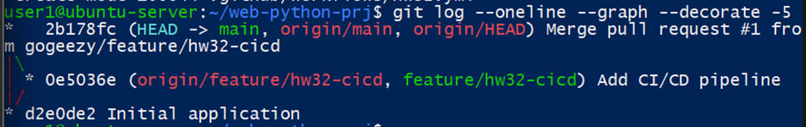
история Git показывает реализацию CI/CD отдельным коммитом в ветке `feature/hw32-cicd` и последующее слияние Pull Request №1 с `main`.

проверки Pull Request
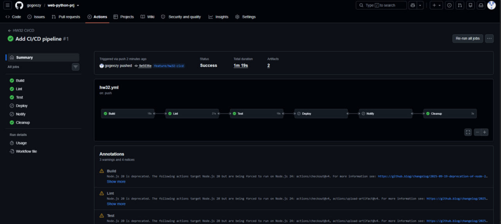
перед слиянием изменений все обязательные CI-проверки успешно пройдены, конфликты с основной веткой отсутствуют.

слияние Pull Request
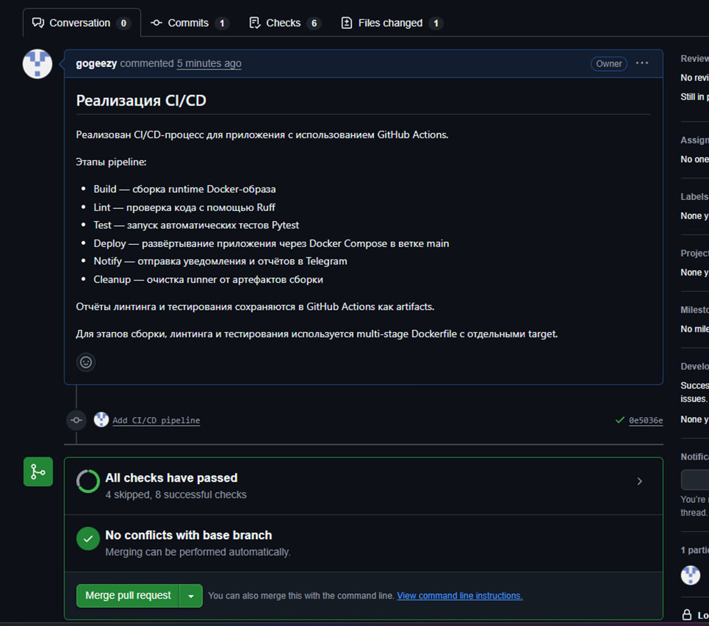
после успешного прохождения проверок Pull Request был объединён с основной веткой `main`.

## 2. Реализация CI/CD: Build, Lint, Test, Deploy
CI/CD реализован с помощью GitHub Actions.
Workflow находится в файле:
`.github/workflows/hw32.yml`

Pipeline запускается:
- при push в `main`;
- при push в `feature/**`;
- при создании или обновлении Pull Request в `main`.

Основная последовательность:
`Build -> Lint -> Test -> Deploy -> Notify -> Cleanup`
Обязательные стадии задания реализованы следующим образом:
- **Build** — выполняется сборка финального runtime Docker-образа;
- **Lint** — исходный Python-код проверяется Ruff;
- **Test** — Pytest выполняет автоматические тесты;
- **Deploy** — приложение разворачивается с помощью Docker Compose.

Для feature-ветки выполняются Build, Lint и Test. Deploy и Notify выполняются после попадания изменений в основную ветку `main`.

CI для feature-ветки
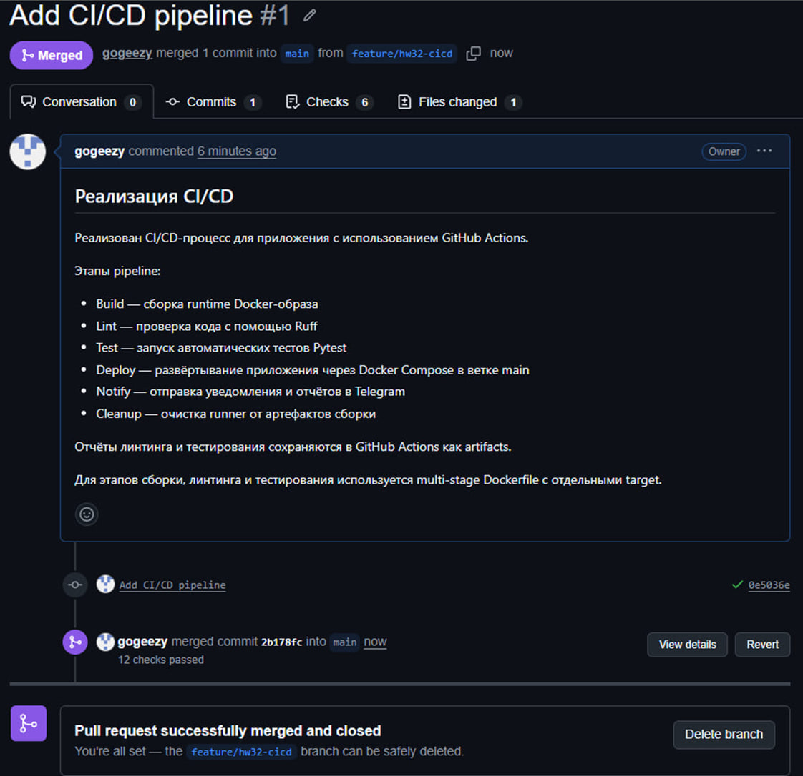
в feature-ветке успешно выполнены Build, Lint и Test. Deploy и Notify пропущены, поскольку эти стадии настроены для `main`.

полный CI/CD для main
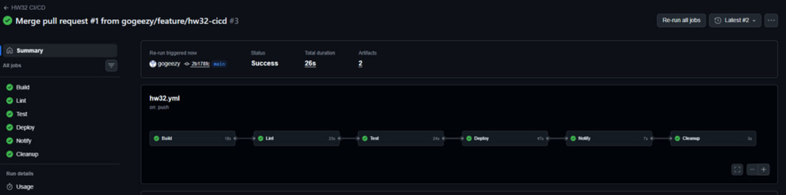
после слияния изменений в `main` полный CI/CD-процесс успешно выполнил все стадии. GitHub Actions также сохранил два артефакта с результатами проверок.

## 3. Multi-stage сборка и использование target
Для выполнения различных этапов используется один multi-stage Dockerfile.
В Dockerfile определены стадии:
- `base`;
- `lint`;
- `test`;
- `builder`;
- `runtime`.
Необходимая стадия выбирается параметром `--target`, поэтому линтинг, тестирование и финальная сборка могут выполняться командой `docker build`.

### Lint
```bash
docker build --target lint -t hw32-lint .
```

target lint
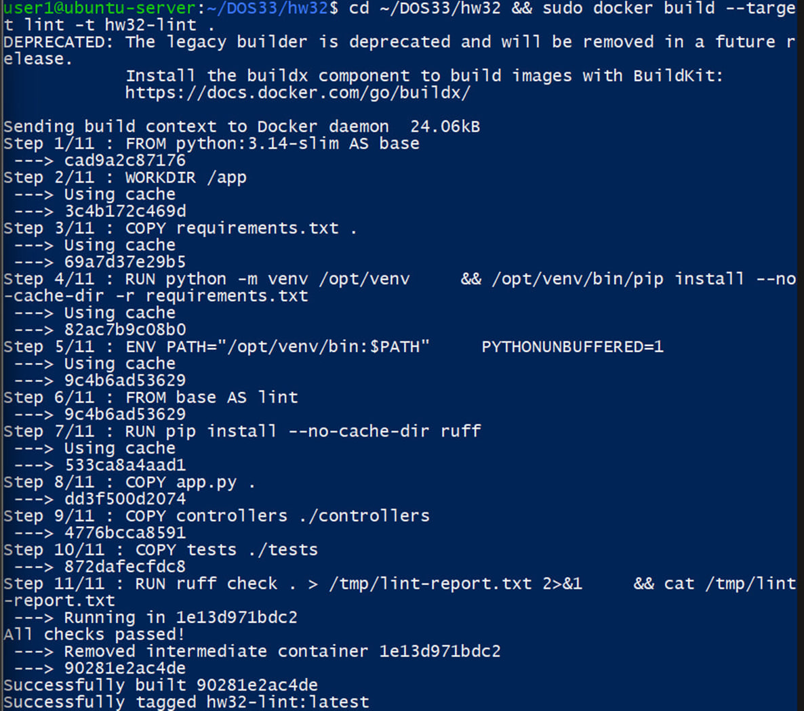
Ruff успешно проверил исходный код. Стадия lint выполнена непосредственно через target multi-stage Dockerfile.

### Test
```bash
docker build --target test -t hw32-test .
```

target test
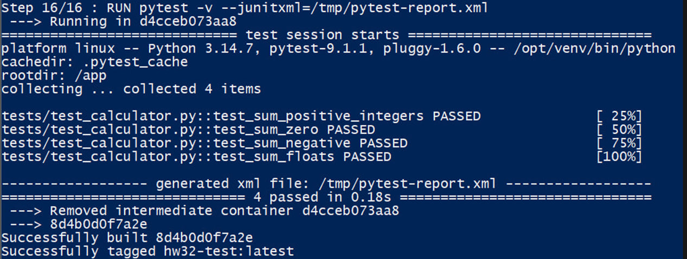
Pytest выполнил четыре автоматических теста. Все тесты успешно пройдены. Дополнительно сформирован JUnit-отчёт `pytest-report.xml`.

### Runtime
```bash
docker build --target runtime -t hw32-app:latest .
```
target runtime
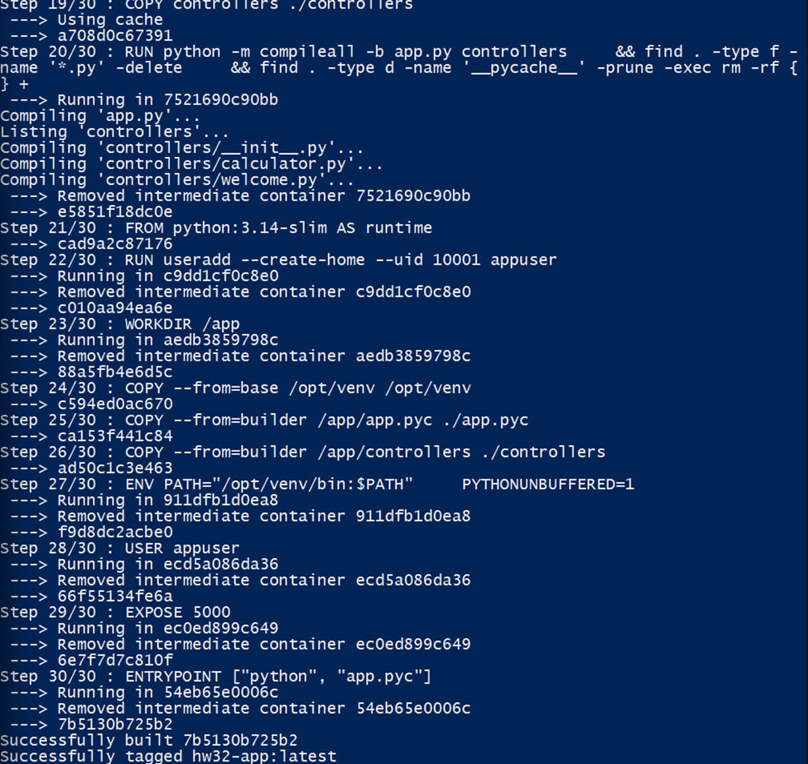
финальный runtime-образ успешно собран. Исходный Python-код компилируется на builder-этапе, а финальный контейнер запускается от непривилегированного пользователя `appuser`.

Таким образом, lint, test и финальная сборка выполняются средствами одного multi-stage Dockerfile через `docker build --target`.

## 4. Артефакты линтинга и тестирования, стадия Notify
После выполнения проверок формируются два отчёта:
- `lint-report.txt` — результат Ruff;
- `pytest-report.xml` — JUnit-отчёт Pytest.
GitHub Actions сохраняет эти файлы как artifacts.
Результат тестирования:
- tests: 4;
- failures: 0;
- errors: 0;
- skipped: 0.

артефакты проверок
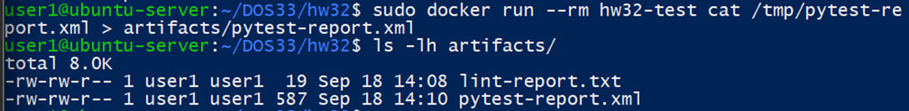
результаты линтинга и тестирования сохранены в отдельных файлах. В CI эти отчёты также загружаются GitHub Actions как artifacts.

### Notify
Для информирования о результате pipeline реализована стадия `Notify`.

В Telegram отправляются:
- название репозитория;
- SHA коммита;
- результат Lint;
- результат Test;
- результат Deploy;
- файл `lint-report.txt`;
- файл `pytest-report.xml`.

Для безопасного хранения данных используются GitHub Actions Secrets:
- `TELEGRAM_BOT_TOKEN`;
- `TELEGRAM_CHAT_ID`.

уведомление Telegram
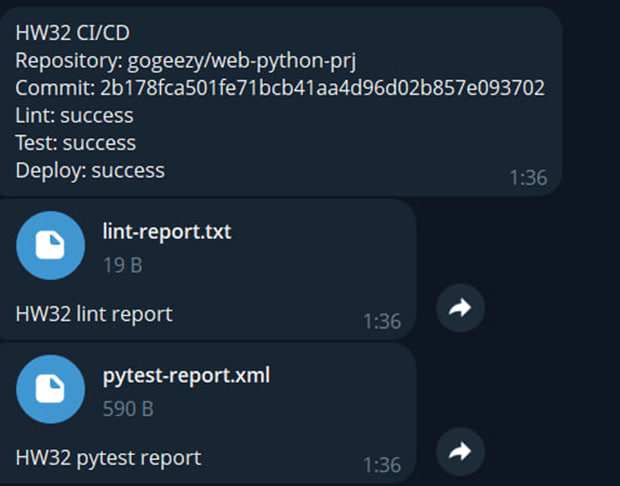
стадия Notify успешно отправила в Telegram итоговые статусы CI/CD и два сформированных отчёта.

## 6. Deploy через Docker Compose
Для простого развёртывания используется файл `compose.yaml`.

Docker Compose запускает три сервиса:
- `db` — PostgreSQL;
- `app` — Flask-приложение;
- `proxy` — nginx reverse proxy.

Сервисы разделены на сети `frontend` и `backend`.
Наружу опубликован только nginx:
`8080:80`

Для PostgreSQL и приложения настроены healthcheck.

Развёртывание выполняется командой:
```bash
docker compose up -d --build
```

Состояние контейнеров проверяется командой:
```bash
docker compose ps
```

Работоспособность приложения проверяется HTTP-запросом:
```bash
curl -i http://localhost:8080/health
```

В GitHub Actions используется автоматическая проверка:
```bash
curl --fail --retry 10 --retry-delay 3 http://localhost:8080/health
```

Запуск сервисов Docker Compose
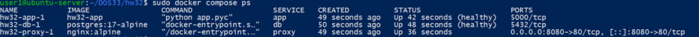
На скриншоте показано состояние сервисов после развёртывания.
Сервисы приложения и базы данных успешно прошли healthcheck

Проверка приложения после Deploy
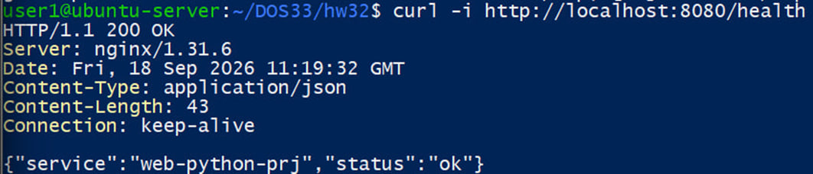
HTTP-запрос через nginx на порт 8080 успешно обработан.
Приложение вернуло HTTP 200 OK и статус работоспособности сервиса.

## 7. Очистка runner
В workflow предусмотрена стадия **Cleanup**, выполняемая с условием `always()`.
В ней используются команды:
```bash
docker container prune -f
docker image prune -f
docker builder prune -f
```

После проверки тестового deployment также выполняется:
```bash
docker compose down -v
```

Это удаляет контейнеры, сети и volume, созданные для тестового развёртывания.
GitHub-hosted runners являются временными: каждый job выполняется в отдельной среде runner, которая после завершения job удаляется инфраструктурой GitHub Actions.
Таким образом, очистка продумана на нескольких уровнях:
- ресурсы тестового deployment удаляются через `docker compose down -v`;
- стадия Cleanup выполняет Docker prune в рамках своего runner;
- временная среда GitHub-hosted runner удаляется после завершения job.

Успешное выполнение стадии `Cleanup`
