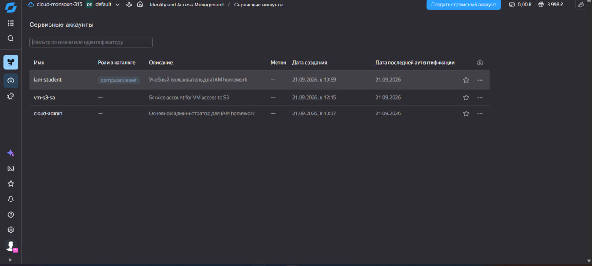
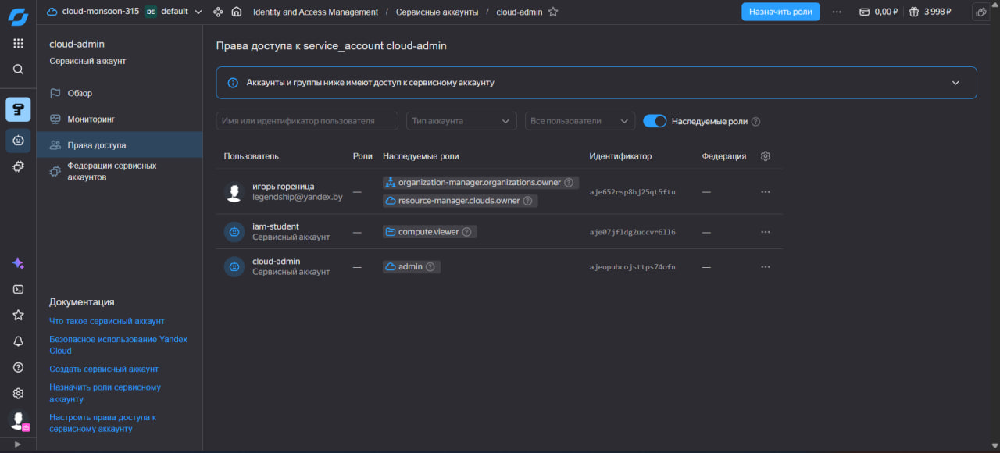
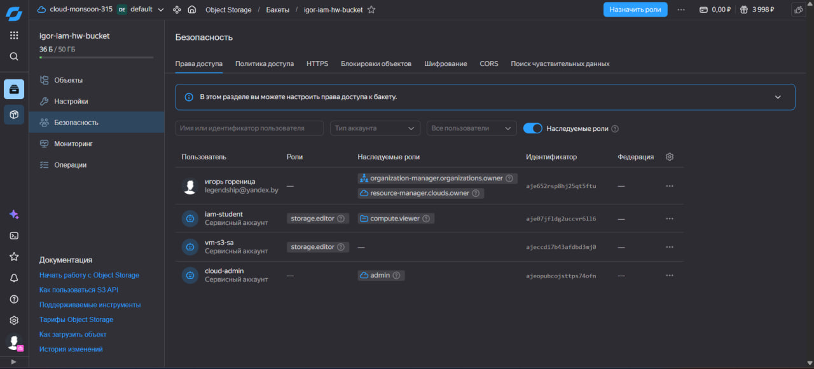
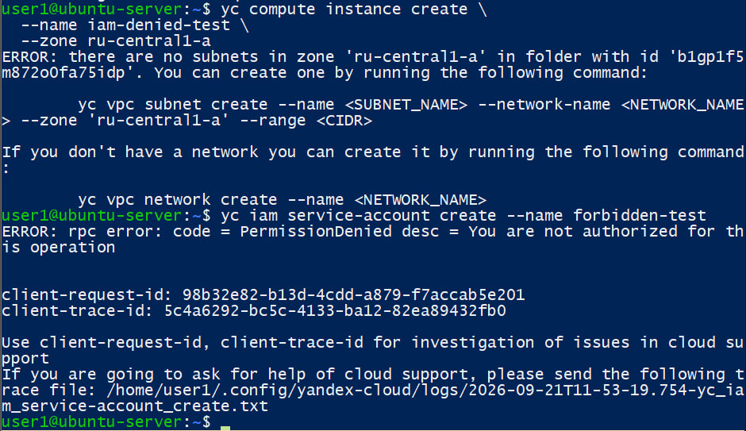
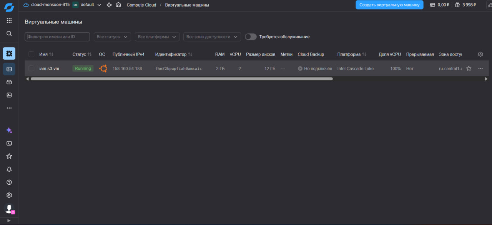
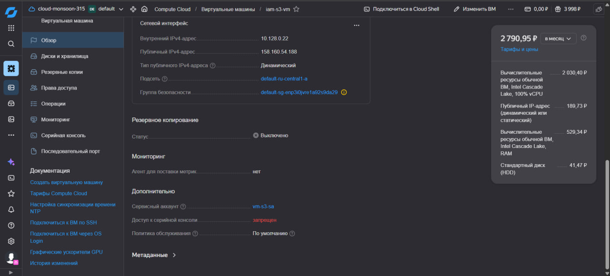
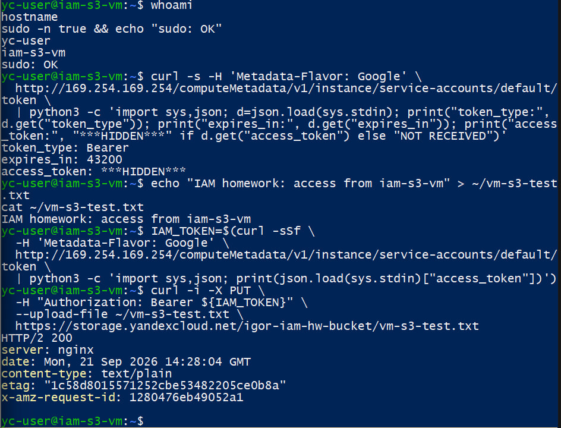
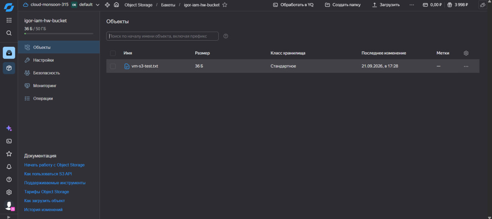
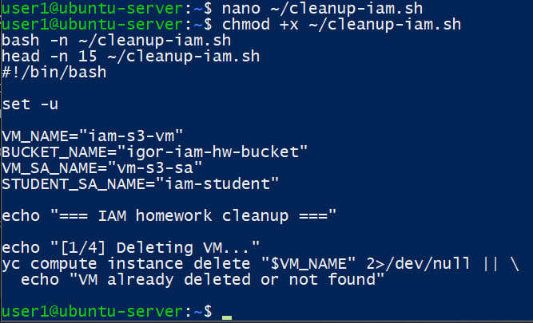

# iam
1. Создайте основного администратора облака и вспомогательного пользователя для текущего задания.
2. Найте админу облака права на управление облаком. Далее работайте под ним.
3. Наделить пользователя правми на использование конкретного бакета и просмотр списка ec2 (yc2).
4. Проверьте что пользователь для занятия может просматривать ec2 и бакеты, попробуйте создать виртуальную машину и разберите тест ошибки.
5. Создайте ec2 и дайте ей возможность работать с s3. Проверьте работу.
6. Напишите скрипт очистки созданных сущностей или на bash with cli или на python

# IAM

## 1. Создайте основного администратора облака и вспомогательного пользователя для текущего задания
Для выполнения задания в Yandex Cloud созданы сервисные аккаунты:
- `cloud-admin` — основной администратор;
- `iam-student` — пользователь с ограниченными правами;
- `vm-s3-sa` — сервисный аккаунт для виртуальной машины.


## 2. Наделить администратора облака правами на управление облаком. Далее работать под ним
Сервисному аккаунту `cloud-admin` назначена роль `admin` на уровне облака. Дальнейшие административные действия выполнялись от его имени.
Для `iam-student` назначена роль `compute.viewer`.

Для работы через CLI использовался отдельный профиль:
```bash
yc config profile create cloud-admin
yc config set service-account-key ~/authorized_key.json
yc config set folder-id b1gp1f5m872o0fa75idp
yc config profile activate cloud-admin
```

## 3. Наделить пользователя правами на использование конкретного бакета и просмотр списка EC2 (YC Compute Cloud)
Для задания создан бакет:
igor-iam-hw-bucket

Пользователю `iam-student` назначены:
- `compute.viewer` — просмотр ресурсов Compute Cloud;
- `storage.editor` — чтение и запись объектов конкретного бакета `igor-iam-hw-bucket`.
Также роль `storage.editor` на этот бакет назначена сервисному аккаунту `vm-s3-sa`, который далее будет использоваться виртуальной машиной.

Таким образом, `iam-student` имеет доступ к необходимым ресурсам, но не обладает административными правами.

## 4. Проверить, что пользователь для занятия может просматривать EC2 и бакеты, попробовать создать виртуальную машину и разобрать текст ошибки
Переключаем CLI на профиль ограниченного пользователя:
```bash
yc config profile activate iam-student
```
Проверяем возможность просмотра виртуальных машин:
```bash
yc compute instance list
```

Команда выполняется успешно, так как пользователю назначена роль `compute.viewer`.

Проверяем доступ к бакету:

```bash
yc storage bucket get igor-iam-hw-bucket
```

Информация о бакете также успешно возвращается.

При попытке создания виртуальной машины возникла ошибка, связанная с отсутствием доступной подсети для указанной зоны. Данная ошибка относится к сетевой конфигурации, поэтому для отдельной проверки именно ограничения IAM была выполнена административная операция:

```bash
yc iam service-account create --name forbidden-test
```

Получена ошибка:
rpc error: code = PermissionDenied desc = You are not authorized for this operation



Ошибка `PermissionDenied` при выполнении IAM-операции подтверждает, что `iam-student` может работать только в пределах назначенных ему ролей и не имеет административных IAM-прав.

## 5. Создать EC2 (виртуальную машину) и дать ей возможность работать с S3. Проверить работу
Создан отдельный сервисный аккаунт для виртуальной машины:

```bash
yc iam service-account create \
  --name vm-s3-sa \
  --description "Service account for VM access to S3"
```

Для `vm-s3-sa` назначена роль `storage.editor` на бакет `igor-iam-hw-bucket`.

Виртуальная машина создана командой:

```bash
yc compute instance create \
  --name iam-s3-vm \
  --hostname iam-s3-vm \
  --zone ru-central1-a \
  --cores 2 \
  --memory 2GB \
  --create-boot-disk image-family=ubuntu-2404-lts,image-folder-id=standard-images,size=12GB \
  --network-interface subnet-name=default-ru-central1-a,nat-ip-version=ipv4 \
  --service-account-name vm-s3-sa \
  --ssh-key ~/.ssh/id_ed25519.pub
```

В Compute Cloud создана и запущена виртуальная машина `iam-s3-vm`.


К виртуальной машине привязан сервисный аккаунт:
vm-s3-sa

Таким образом, статические ключи доступа к Object Storage непосредственно на виртуальной машине не требуются.

### Проверка работы VM с S3
Подключаемся к виртуальной машине:
```bash
ssh -i ~/.ssh/id_ed25519 yc-user@158.160.54.188
```

Проверяем пользователя и hostname:
```bash
whoami
hostname
sudo -n true && echo "sudo: OK"
```

Через сервис метаданных VM получаем IAM-токен привязанного сервисного аккаунта:
```bash
curl -s -H 'Metadata-Flavor: Google' \
  http://169.254.169.254/computeMetadata/v1/instance/service-accounts/default/token \
  | python3 -c 'import sys,json; d=json.load(sys.stdin); print("token_type:", d.get("token_type")); print("expires_in:", d.get("expires_in")); print("access_token:", "***HIDDEN***" if d.get("access_token") else "NOT RECEIVED")'
```

Создаём тестовый файл:
```bash
echo "IAM homework: access from iam-s3-vm" > ~/vm-s3-test.txt
```

Получаем IAM-токен и загружаем файл непосредственно с VM в Object Storage:
```bash
IAM_TOKEN=$(curl -sSf \
  -H 'Metadata-Flavor: Google' \
  http://169.254.169.254/computeMetadata/v1/instance/service-accounts/default/token \
  | python3 -c 'import sys,json; print(json.load(sys.stdin)["access_token"])')

curl -i -X PUT \
  -H "Authorization: Bearer ${IAM_TOKEN}" \
  --upload-file ~/vm-s3-test.txt \
  https://storage.yandexcloud.net/igor-iam-hw-bucket/vm-s3-test.txt
```

Результаты команд:

Ответ `HTTP/2 200` подтверждает успешную запись объекта в Object Storage от имени сервисного аккаунта виртуальной машины.

После этого проверяем содержимое бакета через веб-интерфейс Yandex Cloud.

В бакете `igor-iam-hw-bucket` появился файл:
vm-s3-test.txt

## 6. Написать скрипт очистки созданных сущностей на Bash with CLI или Python
Дл автоматического удаления ресурсов создан Bash-скрипт `cleanup-iam.sh`:


Скрипт удаляет:
1. виртуальную машину `iam-s3-vm`;
2. тестовый объект `vm-s3-test.txt`;
3. бакет `igor-iam-hw-bucket`;
4. сервисный аккаунт `vm-s3-sa`;
5. учебный сервисный аккаунт `iam-student`.

`cloud-admin` намеренно не удаляется скриптом, так как от его имени выполняются административные операции очистки.
