1. Создать vpc, 1 public subnet, 1 private subnet.
2. В public subnet создать vm установить там runner и зарегистрировать его в gitlab, github, jenkins (кто что использует).
3. Настроить доставку артефакта на s3, отдельным джобом деплой на ec2 в private subnet.
4. Показать что ваше приложение работает, curl на api вашего адреса.

Решение:

**Облачная платформа:** Yandex Cloud  
**CI/CD:** GitHub Actions  
**Репозиторий:** `gogeezy/web-python-prj`

## 1. Создать VPC, 1 public subnet, 1 private subnet
В Yandex Cloud была создана отдельная виртуальная сеть:
- VPC: `hw-vpc`
- публичная подсеть: `hw-public-subnet`
- CIDR публичной подсети: `10.10.1.0/24`
- приватная подсеть: `hw-private-subnet`
- CIDR приватной подсети: `10.10.2.0/24`
- зона доступности: `ru-central1-a`

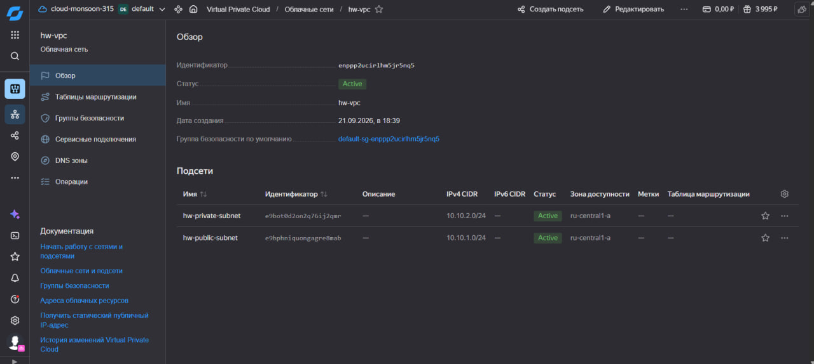
В результате в одной VPC были подготовлены две подсети: публичная для CI/CD runner и приватная для виртуальной машины с приложением.

## 2. В public subnet создать VM, установить runner и зарегистрировать его в GitHub
В публичной подсети `hw-public-subnet` была создана виртуальная машина:
- имя: `runner-vm`
- ОС: Ubuntu 24.04
- внутренний IP: `10.10.1.33`
- публичный IP: динамический
- пользователь: `yc-user`

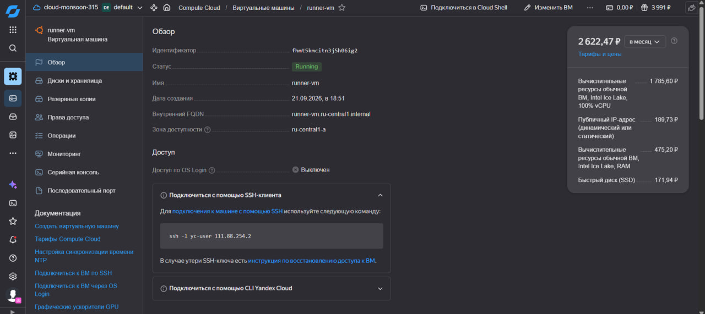
После подключения к VM была проверена сетевая конфигурация и установлены необходимые инструменты.

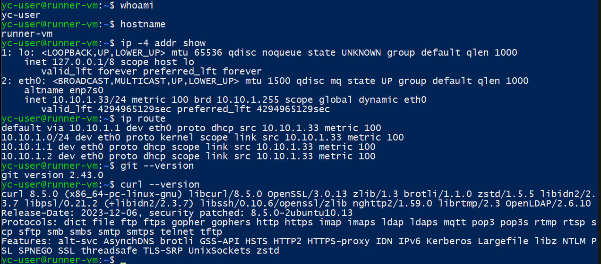
На `runner-vm` был установлен GitHub Actions Self-hosted Runner версии `2.337.0`.

Runner был зарегистрирован для репозитория:
`gogeezy/web-python-prj`

Для автоматического запуска runner используется systemd-сервис:
actions.runner.gogeezy-web-python-prj.runner-vm.service

После регистрации GitHub отображает `runner-vm` в состоянии `Idle`, что подтверждает готовность runner принимать задания GitHub Actions.
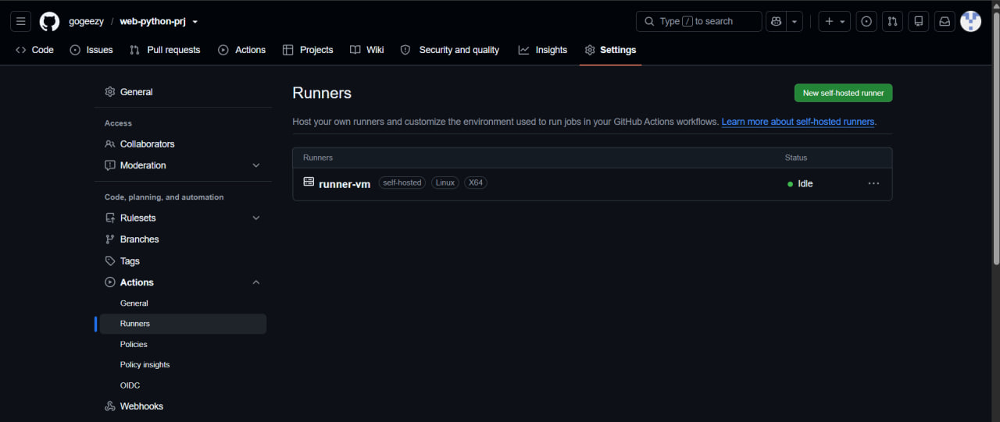

## 3. Настроить доставку артефакта на S3, отдельным job выполнить deploy на VM в private subnet

### Object Storage

Для хранения CI/CD-артефактов был создан приватный бакет Yandex Object Storage:
hw-artifacts-gogeezy

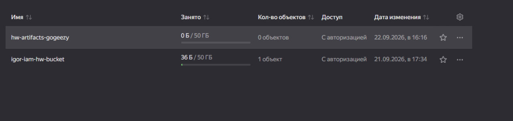
Для доступа runner к Object Storage создан отдельный сервисный аккаунт `runner-s3-sa`.

Сервисному аккаунту назначена роль:
storage.editor
для бакета `hw-artifacts-gogeezy`.
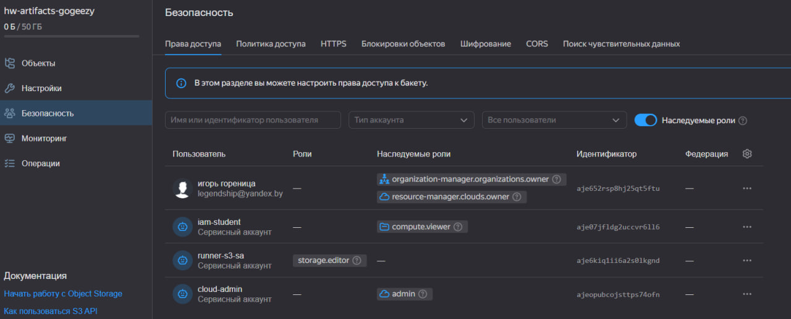

Доступ к Object Storage осуществляется с `runner-vm` с помощью IAM-токена, получаемого через metadata service виртуальной машины.

Перед настройкой pipeline была выполнена тестовая загрузка файла в бакет.
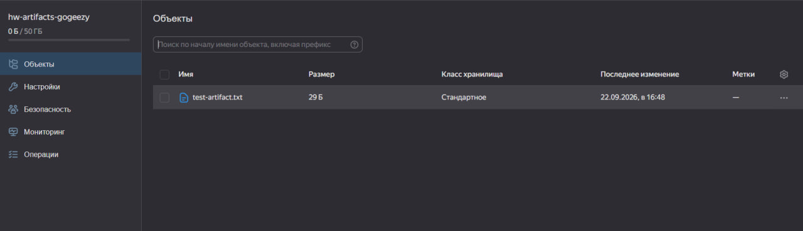

### Приватная VM
В подсети `hw-private-subnet` создана отдельная виртуальная машина:
- имя: `app-vm`
- ОС: Ubuntu 24.04
- внутренний IP: `10.10.2.5`
- публичный IP: отсутствует
- пользователь: `yc-user`

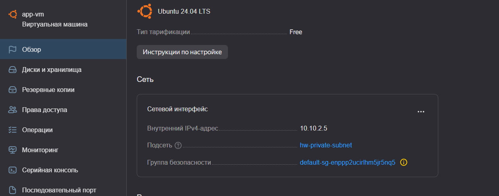
Таким образом, `app-vm` не доступна напрямую из Интернета.
Для доступа приватной VM к внешним ресурсам был настроен NAT Gateway и таблица маршрутизации с маршрутом:
0.0.0.0/0 -> NAT Gateway

На `app-vm` был установлен Docker.
Для автоматического деплоя было настроено SSH-подключение с `runner-vm` к `app-vm` по внутреннему адресу `10.10.2.5`.
Проверка подключения:
```bash
hostname
hostname -I
docker --version
```
Результат:
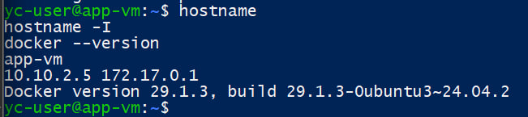

### GitHub Actions Pipeline
В репозитории создан workflow:
.github/workflows/hw35.yml

Pipeline состоит из двух отдельных jobs.

Первый job:
Build and upload artifact to S3

выполняет:
1. получение исходного кода;
2. сборку Docker-образа;
3. упаковку образа в `tar.gz`;
4. получение IAM-токена;
5. загрузку артефакта в Yandex Object Storage.

Второй job:
Deploy to private app-vm

запускается после успешного выполнения первого job и выполняет:
1. скачивание артефакта из Object Storage;
2. передачу артефакта на `app-vm` по SSH;
3. загрузку Docker-образа;
4. удаление предыдущего контейнера при его наличии;
5. запуск новой версии приложения;
6. проверку доступности API.

Связь между jobs задаётся зависимостью:

```yaml
needs: build-artifact
```

В результате workflow успешно выполнил оба этапа.
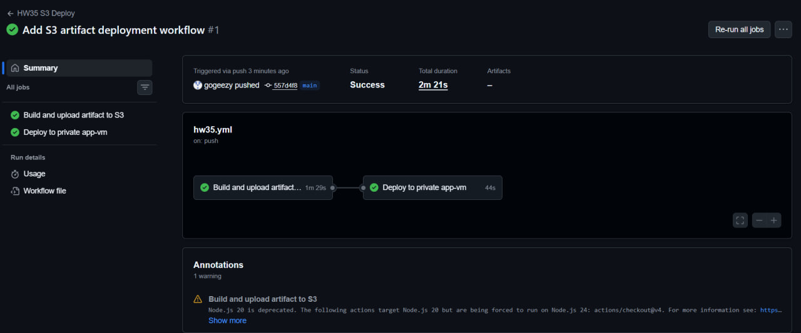

Сформированный Docker-образ был сохранён в Object Storage в виде файла:
web-python-prj-557d4f87a909b2fc429a9ff1083fb08e6d44ef56.tar.gz
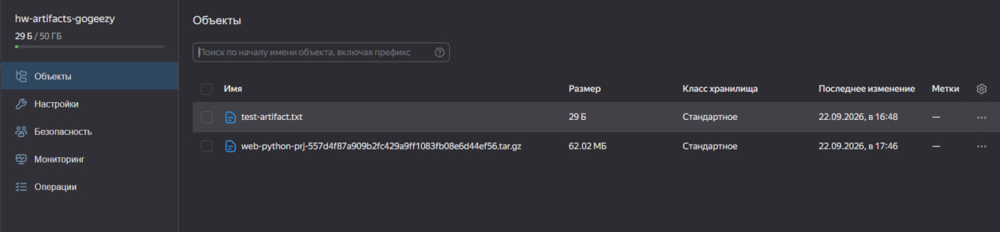

## 4. Показать, что приложение работает, curl на API адреса

После выполнения deploy job приложение было автоматически запущено в Docker-контейнере на приватной виртуальной машине `app-vm`.

С `runner-vm` выполнена проверка API:
```bash
curl -i http://10.10.2.5:5000/health
```
Также была проверена работа Docker-контейнера на `app-vm`:
```bash
ssh -i ~/.ssh/app_deploy yc-user@10.10.2.5 \
'docker ps --filter name=web-python-prj'
```

Результат:
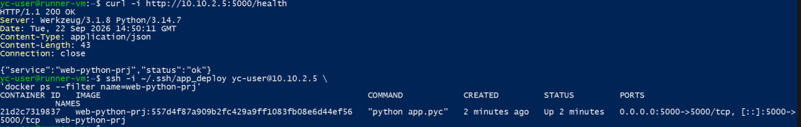
Получение `HTTP 200` и ответа `"status":"ok"` подтверждает успешную автоматическую доставку и запуск приложения на VM в приватной подсети.

