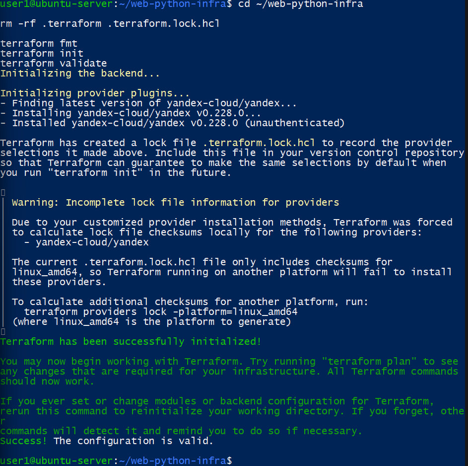
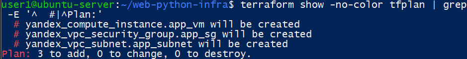
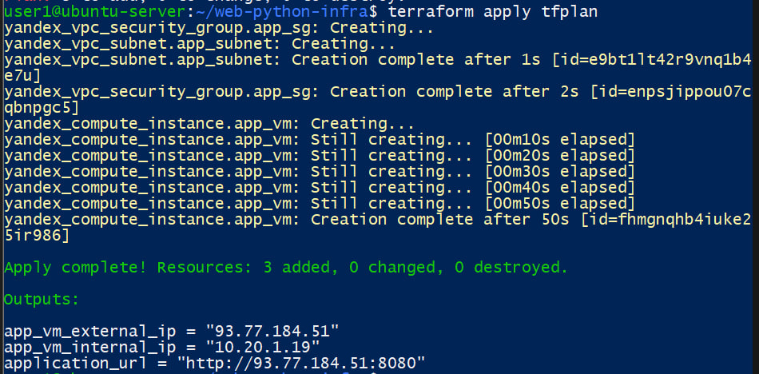
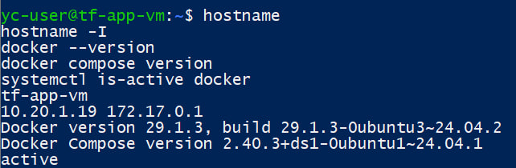
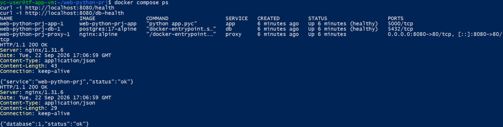
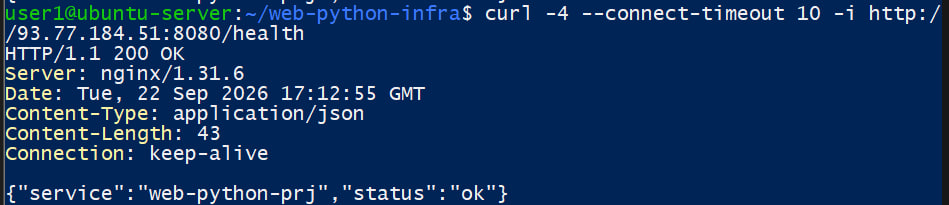
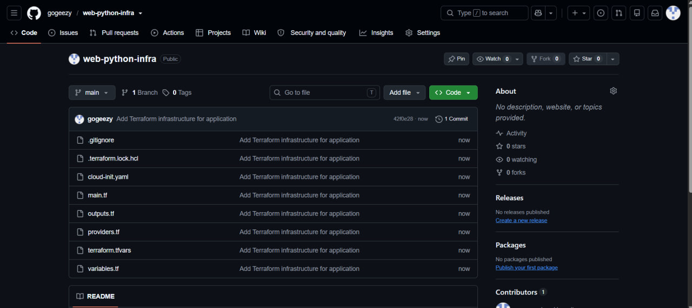
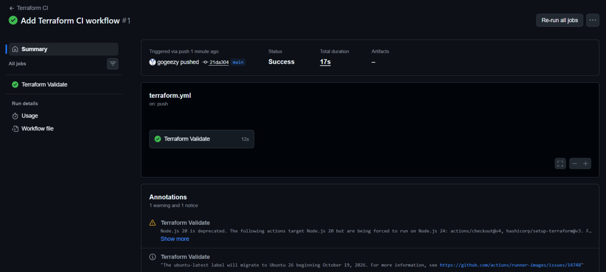

1. Опишите инфраструктуру для Вашего приложения (которое собирали в CI/CD) в терраформ (можно использовать один инстанс и приложение разворачивать в docker-compose для экономии)
2. Напишите CI для terraform репозитория
3. Продумайте взаимосвязь между репозитория с кодом приложения и терраформа. Как сделать так, что бы при деплое приложения мы были уверены что наша инфраструктура готова.

Отчёт:

## 1. Описание инфраструктуры приложения в Terraform

Для управления инфраструктурой используется Terraform и провайдер Yandex Cloud.

В конфигурации описаны:

- существующая VPC `hw-vpc`;
- отдельная подсеть `tf-app-subnet`;
- группа безопасности `tf-app-sg`;
- виртуальная машина `tf-app-vm`;
- публичный и внутренний IP-адреса VM;
- установка Docker и Docker Compose через `cloud-init`.

Terraform успешно инициализирован, провайдер Yandex Cloud установлен, конфигурация проходит `terraform validate`.



Terraform plan показывает создание трёх новых ресурсов: подсети, группы безопасности и виртуальной машины. Существующая VPC используется как data source и не изменяется.



После применения плана Terraform успешно создал инфраструктуру. Виртуальная машина получила внутренний IP `10.20.1.19` и публичный IP `93.77.184.51`.



С помощью `cloud-init` на VM автоматически установлены Docker и Docker Compose. Сервис Docker находится в состоянии `active`.



Приложение развёрнуто на VM с помощью Docker Compose. Запущены контейнеры Flask-приложения, PostgreSQL и nginx. Контейнеры приложения и базы данных проходят healthcheck.

Проверка API внутри VM:

- `/health` — HTTP 200;
- `/db-health` — HTTP 200.



Приложение также доступно извне через публичный адрес VM. Endpoint `/health` возвращает HTTP 200 и статус `ok`.



Terraform-код хранится в отдельном GitHub-репозитории `web-python-infra`.



## 2. CI для Terraform-репозитория

Для репозитория `web-python-infra` настроен GitHub Actions workflow `Terraform CI`.

При push и pull request выполняются следующие проверки:

1. checkout Terraform-кода;
2. установка Terraform;
3. настройка зеркала провайдеров Yandex Cloud;
4. `terraform fmt -check`;
5. `terraform init`;
6. `terraform validate`.

Таким образом, изменения Terraform-кода автоматически проверяются до их применения к инфраструктуре.

Workflow успешно выполняется в GitHub Actions.



## 3. Взаимосвязь репозиториев приложения и Terraform

Используются два отдельных репозитория:

- `web-python-infra` — описание и проверка инфраструктуры;
- `web-python-prj` — исходный код приложения и pipeline его сборки и деплоя.

Перед выполнением деплоя приложения необходимо убедиться, что инфраструктура уже создана и доступна.

Для этого в CI/CD приложения добавлен отдельный job `Check Terraform infrastructure`.

Pipeline выполняется в следующем порядке:

```text
Build and upload artifact to S3
              |
              v
Check Terraform infrastructure
              |
              v
Deploy to private app-vm
```