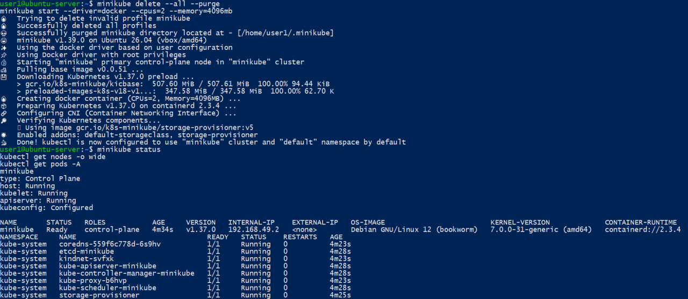

1. Установите minikube
2. Создайте при помощи манифестов сущности Pod, ReplicaSet, Deployments, Service, Job, CronJob
3. Попробуйте написать для приложения, которое собирали ранее Deployment

Решение:
## 1. Установка и запуск Minikube
Для выполнения задания был установлен Minikube и создан локальный Kubernetes-кластер.
В качестве драйвера для Minikube используется Docker.

Кластер был запущен командой:
```bash
minikube start --driver=docker --cpus=2 --memory=4096mb
```

После запуска состояние кластера было проверено командами:
```bash
minikube status
kubectl get nodes -o wide
kubectl get pods -A
```
Результат:


## 2. Создание сущностей Kubernetes при помощи манифестов

Для работы с манифестами был создан отдельный каталог:
```bash
mkdir -p ~/k8s-hw
cd ~/k8s-hw
```

### Pod
Был создан манифест `pod.yaml`:
```yaml
apiVersion: v1
kind: Pod
metadata:
  name: hw-pod
  labels:
    app: hw-pod
spec:
  containers:
    - name: nginx
      image: nginx:alpine
      ports:
        - containerPort: 80
```

Манифест применён командой:
```bash
kubectl apply -f pod.yaml
```

В результате был создан отдельный Pod `hw-pod`.

### ReplicaSet
Для создания нескольких одинаковых реплик был подготовлен манифест `replicaset.yaml`:
```yaml
apiVersion: apps/v1
kind: ReplicaSet
metadata:
  name: hw-replicaset
spec:
  replicas: 2
  selector:
    matchLabels:
      app: hw-rs
  template:
    metadata:
      labels:
        app: hw-rs
    spec:
      containers:
        - name: nginx
          image: nginx:alpine
          ports:
            - containerPort: 80
```

Манифест применён командой:
```bash
kubectl apply -f replicaset.yaml
```

ReplicaSet поддерживает две работающие реплики Pod.

### Deployment
Был создан манифест `deployment.yaml`:
```yaml
apiVersion: apps/v1
kind: Deployment
metadata:
  name: hw-deployment
spec:
  replicas: 2
  selector:
    matchLabels:
      app: hw-deploy
  template:
    metadata:
      labels:
        app: hw-deploy
    spec:
      containers:
        - name: nginx
          image: nginx:alpine
          ports:
            - containerPort: 80
```

Манифест применён:
```bash
kubectl apply -f deployment.yaml
```

Deployment запускает и поддерживает две реплики приложения.

### Service
Для доступа к Pod'ам Deployment был создан объект Service.
Содержимое `service.yaml`:
```yaml
apiVersion: v1
kind: Service
metadata:
  name: hw-service
spec:
  selector:
    app: hw-deploy
  ports:
    - port: 80
      targetPort: 80
  type: NodePort
```

Service создан командо:
```bash
kubectl apply -f service.yaml
```

Используется тип `NodePort`.

### Job
Для выполнения одноразовой задачи был создан `Job`.
Содержимое `job.yaml`:
```yaml
apiVersion: batch/v1
kind: Job
metadata:
  name: hw-job
spec:
  template:
    spec:
      restartPolicy: Never
      containers:
        - name: job
          image: busybox:1.36
          command: ["sh", "-c", "echo 'Job completed successfully'"]
  backoffLimit: 2
```

Job создан командой:
```bash
kubectl apply -f job.yaml
```

После выполнения Job перешёл в состояние `Complete`.

### CronJob
Для периодического выполнения задачи был создан `CronJob`.
Содержимое `cronjob.yaml`:
```yaml
apiVersion: batch/v1
kind: CronJob
metadata:
  name: hw-cronjob
spec:
  schedule: "*/2 * * * *"
  jobTemplate:
    spec:
      template:
        spec:
          restartPolicy: Never
          containers:
            - name: cronjob
              image: busybox:1.36
              command: ["sh", "-c", "date; echo 'CronJob executed'"]
```

CronJob запускается каждые две минуты:
*/2 * * * *

Манифест применён командой:
```bash
kubectl apply -f cronjob.yaml
```

Для проверки созданных сущностей использовались команды:

```bash
kubectl get pod
kubectl get replicaset
kubectl get deployment
kubectl get service
kubectl get job
kubectl get cronjob
```

В результате все требуемые сущности Kubernetes были успешно созданы. Pod'ы находятся в состоянии `Running`, а выполненные Job — в состоянии `Complete`.


## 3. Deployment для приложения web-python-prj
В качестве собственного приложения использовался ранее разработанный проект `web-python-prj`.
Проект содержит `Dockerfile`, поэтому Docker-образ приложения был собран непосредственно внутри Minikube:
```bash
cd ~/web-python-prj
minikube image build -t web-python-prj:k8s .
```

Наличие собранного образа было проверено командой:
```bash
minikube image ls | grep web-python-prj
```

В Minikube был доступен образ:
docker.io/library/web-python-prj:k8s

### Манифест приложения
Для приложения был создан файл `web-python-deployment.yaml`, содержащий Deployment и Service:
```yaml
apiVersion: apps/v1
kind: Deployment
metadata:
  name: web-python-prj
spec:
  replicas: 2
  selector:
    matchLabels:
      app: web-python-prj
  template:
    metadata:
      labels:
        app: web-python-prj
    spec:
      containers:
        - name: web-python-prj
          image: web-python-prj:k8s
          imagePullPolicy: Never
          ports:
            - containerPort: 5000
          readinessProbe:
            httpGet:
              path: /health
              port: 5000
            initialDelaySeconds: 5
            periodSeconds: 5
          livenessProbe:
            httpGet:
              path: /health
              port: 5000
            initialDelaySeconds: 10
            periodSeconds: 10
---
apiVersion: v1
kind: Service
metadata:
  name: web-python-service
spec:
  selector:
    app: web-python-prj
  ports:
    - port: 5000
      targetPort: 5000
  type: NodePort
```

Deployment настроен на запуск двух реплик приложения:
```yaml
replicas: 2
```

Для контейнера также настроены две Kubernetes-пробы:
- `readinessProbe` — проверка готовности приложения принимать запросы;
- `livenessProbe` — проверка работоспособности приложения.

Обе проверки используют endpoint приложения:
/health

Манифест был применён командой:
```bash
kubectl apply -f web-python-deployment.yaml
```

Успешное развертывание проверено:
```bash
kubectl rollout status deployment/web-python-prj
```

Результат:
deployment "web-python-prj" successfully rolled out


Состояние реплик было проверено командами:
```bash
kubectl get deployment web-python-prj
kubectl get pods -l app=web-python-prj
kubectl get service web-python-service
```

Deployment имеет две готовые реплики:
READY   UP-TO-DATE   AVAILABLE
2/2     2            2

Оба Pod'а приложения находятся в состоянии `Running`.

### Проверка работы приложения

Для локального доступа к Service был выполнен проброс порта:
```bash
kubectl port-forward service/web-python-service 8080:5000
```

После этого endpoint `/health` был проверен при помощи `curl`:
```bash
curl -i http://127.0.0.1:8080/health
```

Приложение вернуло успешный HTTP-ответ:
HTTP/1.1 200 OK
Content-Type: application/json
{"service":"web-python-prj","status":"ok"}


