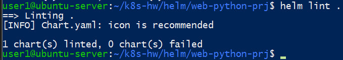
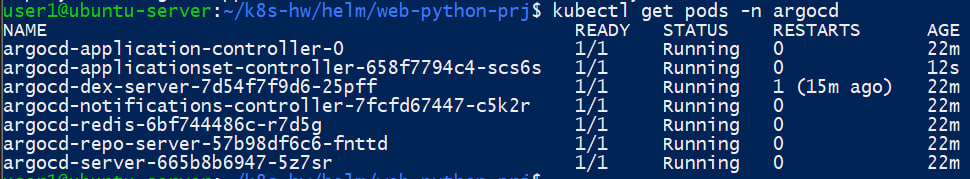
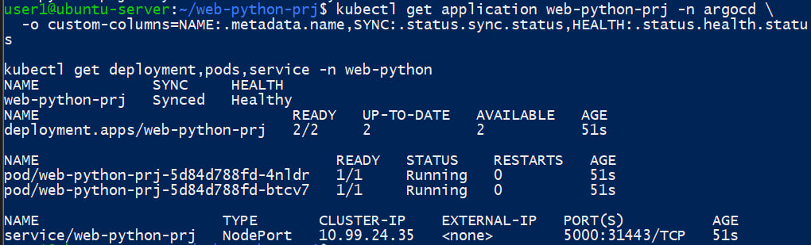
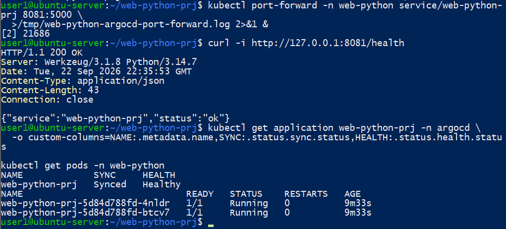

1. Напишите helm манифест для вашего приложения
2. Установите Ваше приложение через аргосд (можете просто через helm если не получается через argocd)
3. Проверьте работу приложения


Репозиторий приложения:
`https://github.com/gogeezy/web-python-prj`

## 1. Создание Helm Chart для приложения

Для приложения `web-python-prj` был создан Helm Chart.

Структура Chart:

```text
helm/web-python-prj/
├── .helmignore
├── Chart.yaml
├── values.yaml
└── templates/
    ├── _helpers.tpl
    ├── deployment.yaml
    └── service.yaml
```

В `values.yaml` были определены основные параметры приложения:

- количество реплик — 2;
- Docker-образ — `web-python-prj:k8s`;
- `imagePullPolicy` — `Never`;
- порт приложения — `5000`;
- тип Service — `NodePort`;
- readiness probe — `/health`;
- liveness probe — `/health`.

Основные параметры:
```yaml
replicaCount: 2

image:
  repository: web-python-prj
  tag: k8s
  pullPolicy: Never

service:
  type: NodePort
  port: 5000

containerPort: 5000
```

Корректность Helm Chart была проверена командой:
```bash
helm lint .
```

Результат:
1 chart(s) linted, 0 chart(s) failed


Также была выполнена проверка генерируемых Kubernetes-манифестов:
```bash
helm template web-python-prj .
```

Helm успешно сформировал Deployment и Service для приложения.



## 2. Установка Argo CD
Для GitOps-развёртывания приложения был установлен Argo CD.
Создан namespace:
```bash
kubectl create namespace argocd
```

Argo CD был установлен в Kubernetes-кластер.

После установки была выполнена проверка состояния его компонентов:
```bash
kubectl get pods -n argocd
```

В результате все основные компоненты Argo CD были успешно запущены:
argocd-application-controller
argocd-applicationset-controller
argocd-dex-server
argocd-notifications-controller
argocd-redis
argocd-repo-server
argocd-server

Все Pod находились в состоянии `Running`.



## 3. Публикация Helm Chart в GitHub
Helm Chart был добавлен в репозиторий приложения:
web-python-prj/helm/web-python-prj


Изменения были сохранены в Git:
```bash
git add helm/web-python-prj
git commit -m "Add Helm chart for Argo CD deployment"
git push origin main
```
Таким образом, Argo CD может получать описание приложения непосредственно из GitHub-репозитория.

## 4. Создание приложения в Argo CD
Для установки приложения через Argo CD был создан ресурс `Application`.
Использовался следующий манифест:
```yaml
apiVersion: argoproj.io/v1alpha1
kind: Application
metadata:
  name: web-python-prj
  namespace: argocd
spec:
  project: default

  source:
    repoURL: https://github.com/gogeezy/web-python-prj.git
    targetRevision: main
    path: helm/web-python-prj
    helm:
      valueFiles:
        - values.yaml

  destination:
    server: https://kubernetes.default.svc
    namespace: web-python

  syncPolicy:
    automated:
      prune: true
      selfHeal: true
    syncOptions:
      - CreateNamespace=true
```

Манифест был применён командой:
```bash
kubectl apply -f ~/k8s-hw/argocd-application.yaml
```

Argo CD получил Helm Chart из GitHub и автоматически развернул приложение в namespace `web-python`.

Статус приложения был проверен командой:
```bash
kubectl get application web-python-prj -n argocd \
  -o custom-columns=NAME:.metadata.name,SYNC:.status.sync.status,HEALTH:.status.health.status
```

Результат:
NAME             SYNC     HEALTH
web-python-prj   Synced   Healthy


Также была выполнена проверка Kubernetes-ресурсов:
```bash
kubectl get deployment,pods,service -n web-python
```

Deployment успешно запустил две реплики приложения:
deployment.apps/web-python-prj   2/2


Оба Pod находились в состоянии `Running`.


## 5. Проверка работы приложения
Для локального доступа к Service был настроен `port-forward`:
```bash
kubectl port-forward -n web-python \
  service/web-python-prj 8081:5000
```

После этого endpoint `/health` был проверен командой:
```bash
curl -i http://127.0.0.1:8081/health
```

Приложение успешно вернуло:
HTTP/1.1 200 OK
Content-Type: application/json
{"service":"web-python-prj","status":"ok"}


Дополнительно было проверено состояние приложения в Argo CD и состояние Pod:
```bash
kubectl get application web-python-prj -n argocd \
  -o custom-columns=NAME:.metadata.name,SYNC:.status.sync.status,HEALTH:.status.health.status

kubectl get pods -n web-python
```

Argo CD отображает приложение как:
Synced   Healthy


Обе реплики приложения находятся в состоянии `Running`.



