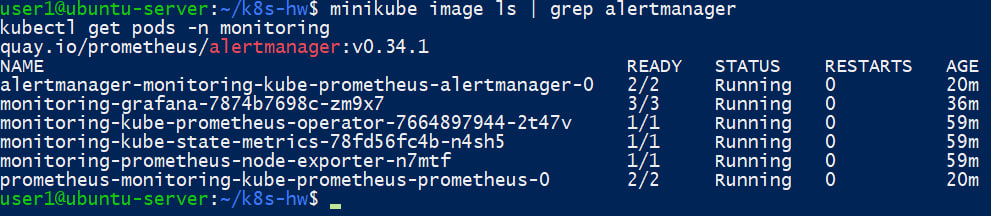
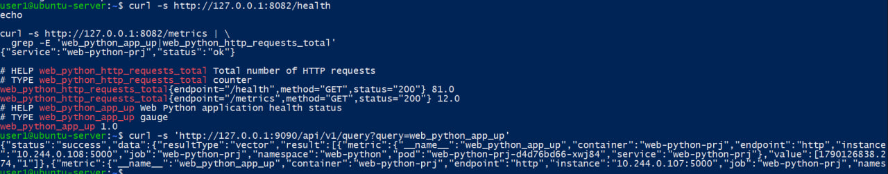
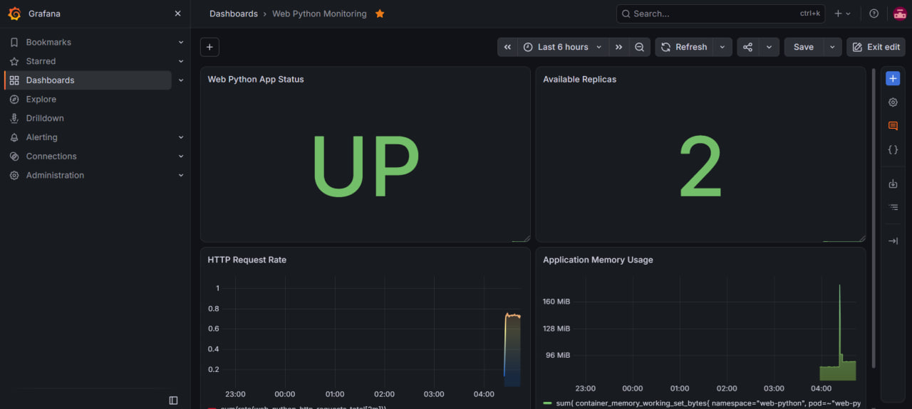
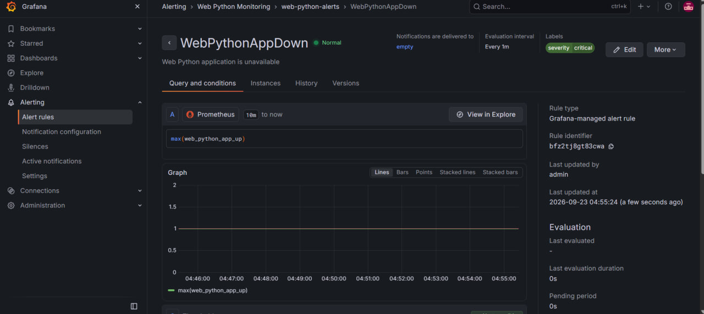
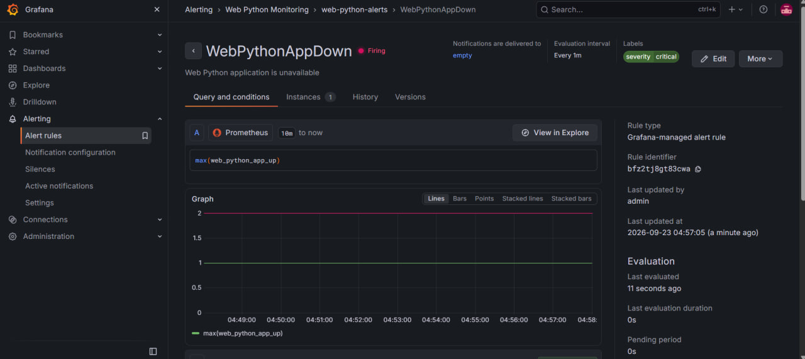
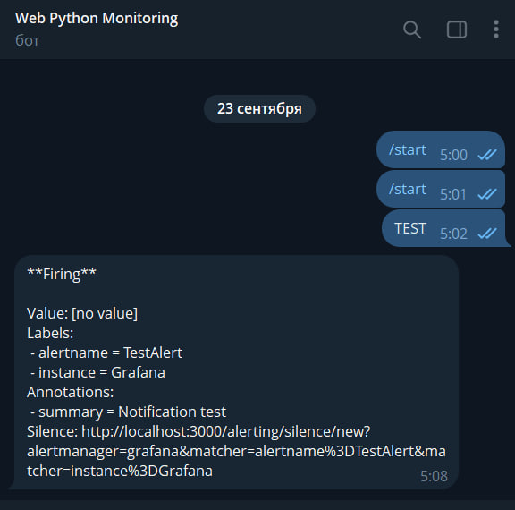
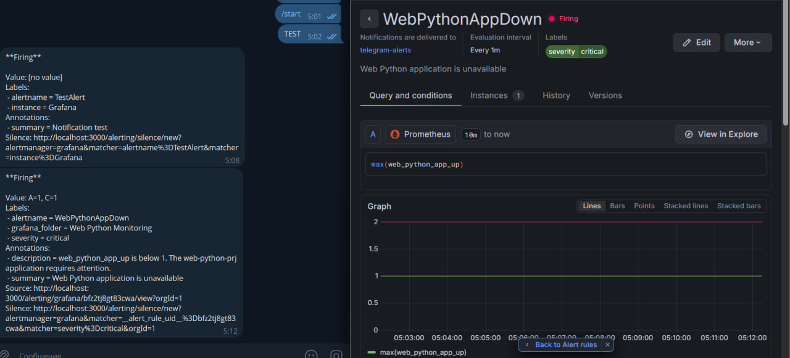

1. Разверните прометеус и графана в кластере (можно снаружи)
2. Настройте мониторинг кластера и Вашего приложения (Проверьте что приложение отдает свое состояние)
3. Настройте свои dashboard, alerts в графана.  Дополнительно настройте оповещение при срабатывании alerts

## 1. Развертывание Prometheus и Grafana
Для мониторинга Kubernetes-кластера был использован стек kube-prometheus-stack, включающий Prometheus, Grafana и компоненты для сбора метрик Kubernetes.

После установки была выполнена проверка состояния компонентов:
```bash
kubectl get pods -n monitoring
```
Все основные компоненты мониторинга успешно запущены в Kubernetes-кластере.



Результат: Prometheus и Grafana успешно развернуты в кластере Minikube.

## 2. Настройка мониторинга приложения
В приложение web-python-prj была добавлена поддержка Prometheus-метрик.

Для проверки состояния приложение предоставляет endpoint:
/health
Также для Prometheus используется endpoint:

/metrics

Проверка выполнялась командами:
```bash
curl -s http://127.0.0.1:8082/health
echo

curl -s http://127.0.0.1:8082/metrics | \
  grep -E 'web_python_app_up|web_python_http_requests_total'
```
Получен ответ приложения:
{"service":"web-python-prj","status":"ok"}

В /metrics присутствуют собственные метрики:
web_python_http_requests_total
web_python_app_up 1.0

Метрика web_python_app_up используется для определения состояния приложения:
- 1 (приложение работает);
- 0 (приложение недоступно).



## 3. Проверка сбора метрик Prometheus

Для приложения был настроен сбор метрик Prometheus.

Наличие метрики проверено через Prometheus API:
```bash
curl -s \
  'http://127.0.0.1:9090/api/v1/query?query=web_python_app_up'
```

Prometheus вернул метрику для двух экземпляров приложения:
web_python_app_up = 1

В результатах присутствуют namespace web-python, service web-python-prj и два Pod'а приложения.

Это подтверждает, что Prometheus успешно получает метрики приложения из Kubernetes.


## 4. Создание собственного Grafana Dashboard
В Grafana был создан собственный dashboard:
Web Python Monitoring

На dashboard настроены следующие панели:
- Web Python App Status — текущее состояние - приложения;
- Available Replicas — количество доступных реплик;
- HTTP Request Rate — интенсивность HTTP-запросов;
- Application Memory Usage — использование памяти приложением.

Для панели состояния используется PromQL:
max(web_python_app_up)

Для значения метрики настроено отображение:
1 → UP
0 → DOWN

Количество доступных реплик определяется запросом:
kube_deployment_status_replicas_available{
  namespace="web-python",
  deployment="web-python-prj"
}

На момент проверки dashboard показывает:
Web Python App Status: UP
Available Replicas: 2

Также отображаются графики HTTP Request Rate и потребления памяти.



## 5. Настройка Alert в Grafana
Для контроля доступности приложения создан Grafana-managed alert:
WebPythonAppDown

В качестве источника используется Prometheus и запрос:
max(web_python_app_up)

Рабочее условие alert:
IS BELOW 1

Таким образом, если состояние приложения становится меньше 1, Grafana переводит alert в состояние Firing.

Для правила также добавлена метка:
severity = critical

и описание:
Web Python application is unavailable

При штатной работе приложения правило находится в состоянии:
Normal



## 6. Проверка срабатывания Alert
Для проверки механизма оповещения условие alert было временно изменено таким образом, чтобы правило гарантированно сработало.

После очередной проверки Grafana перевела:
WebPythonAppDown

в состояние:
Firing

На странице alert отображались запрос max(web_python_app_up), метка severity=critical и состояние Firing.



После проверки рабочее условие было возвращено к:
IS BELOW 1

После следующей оценки Grafana снова показала:
WebPythonAppDown — Normal

## 7. Настройка Telegram-уведомлений
В Grafana был создан Contact Point:
telegram-alerts

В качестве интеграции выбран Telegram.

Для интеграции были настроены:
BOT API Token
Chat ID

После настройки была выполнена тестовая отправка сообщения.

Telegram-бот успешно получил уведомление от Grafana:
Firing
alertname = TestAlert
instance = Grafana
summary = Notification test

Это подтвердило работоспособность интеграции Grafana с Telegram.

После этого Contact Point telegram-alerts был подключен к правилу WebPythonAppDown.



## 8. Проверка реального уведомления Alert
После подключения telegram-alerts было повторно проверено срабатывание правила WebPythonAppDown.

Grafana перевела alert в состояние:
Firing

и автоматически отправила сообщение Telegram-боту.

В Telegram было получено уведомление:
Firing



Таким образом была проверена полная цепочка мониторинга:

web-python-prj
       ↓
    /metrics
       ↓
   Prometheus
       ↓
     Grafana
       ↓
WebPythonAppDown
       ↓
telegram-alerts
       ↓
    Telegram