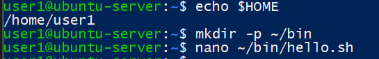
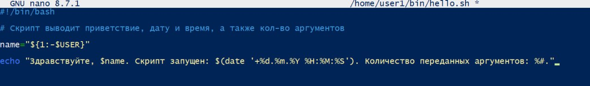
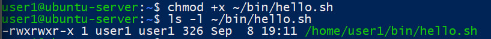
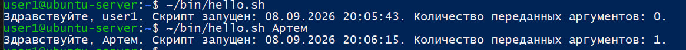
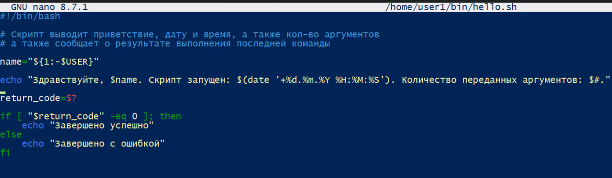
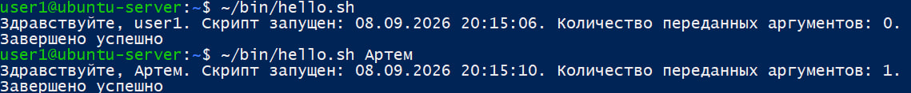
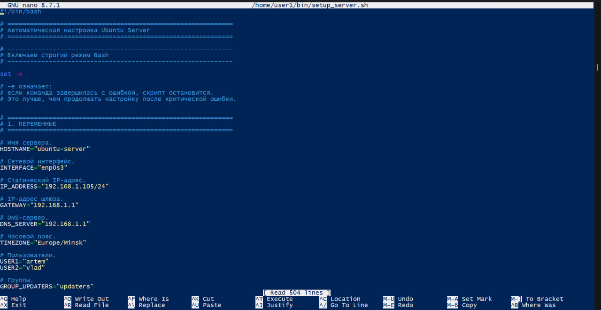

Условие:
1. Напишите скрипт ~/bin/hello.sh, который:
* принимает один аргумент (имя пользователя);
* если аргумент не передан — использует значение по умолчанию (например, текущего пользователя из $USER);
* выводит приветствие вида: Здравствуйте, <имя>. Скрипт запущен: <дата и время>. Количество переданных аргументов: N.
* в начале скрипта укажите shebang и комментарий с описанием назначения скрипта.
2. Сделайте скрипт исполняемым и запустите его: без аргументов, с одним аргументом. Приложите вывод.
3. Добавьте в скрипт проверку кода возврата последней команды ($?) после вывода и выведите сообщение «Завершено успешно» или «Завершено с ошибкой» в зависимости от значения.
4. Напишите скрипт настройки виртуальной машины из предыдущего задания
5. **Пояснение:** закрепить использование $1, ${1:-значение}, $#, $?, shebang, chmod +x

Решение:
1. 

2. 

3. 

4. 
#!/bin/bash

# ============================================================
# Автоматическая настройка Ubuntu Server
# ============================================================

# ------------------------------------------------------------
# Включаем строгий режим Bash
# ------------------------------------------------------------

set -e

# -e означает:
# если команда завершилась с ошибкой, скрипт остановится.
# Это лучше, чем продолжать настройку после критической ошибки.

# ============================================================
# 1. ПЕРЕМЕННЫЕ
# ============================================================

# Имя сервера.
HOSTNAME="ubuntu-server"

# Сетевой интерфейс.
INTERFACE="enp0s3"

# Статический IP-адрес.
IP_ADDRESS="192.168.1.105/24"

# IP-адрес шлюза.
GATEWAY="192.168.1.1"

# DNS-сервер.
DNS_SERVER="192.168.1.1"

# Часовой пояс.
TIMEZONE="Europe/Minsk"

# Пользователи.
USER1="artem"
USER2="vlad"

# Группы.
GROUP_UPDATERS="updaters"
GROUP_OPERATORS="operators"

# Общий каталог.
SHARED_DIR="/srv/shared"

# Публичный SSH-ключ, используемый на нашей VM.
SSH_PUBLIC_KEY="ssh-ed25519 AAAAC3NzaC1lZDI1NTE5AAAAIAx8lHnwOqb5M1qTObmHLS5sEjMDZN7RWMSVOkQuMiQv legendship31@gmail.com"

# ============================================================
# 2. ПРОВЕРКА ПРАВ
# ============================================================

# Проверяем, запущен ли скрипт от root.
if [ "$EUID" -ne 0 ]; then

    echo "Ошибка: скрипт необходимо запускать через sudo."

    echo "Пример:"
    echo "sudo ./setup_server.sh"

    exit 1
fi

# ============================================================
# 3. ВЫВОД НАЧАЛА РАБОТЫ
# ============================================================

echo "=========================================="
echo "Начинается настройка Ubuntu Server"
echo "=========================================="
echo ""

# ============================================================
# 4. ОБНОВЛЕНИЕ СИСТЕМЫ
# ============================================================

echo "[1/10] Обновление списка пакетов..."

apt update

echo "[2/10] Установка доступных обновлений..."

apt upgrade -y

# ============================================================
# 5. HOSTNAME
# ============================================================

echo "[3/10] Настройка hostname..."

# Проверяем текущее имя компьютера.
CURRENT_HOSTNAME=$(hostnamectl --static)

# Если hostname отличается от нужного,
# изменяем его.
if [ "$CURRENT_HOSTNAME" != "$HOSTNAME" ]; then

    hostnamectl set-hostname "$HOSTNAME"

    echo "Hostname изменён на $HOSTNAME"

else

    echo "Hostname уже установлен: $HOSTNAME"

fi

# ============================================================
# 6. ЧАСОВОЙ ПОЯС
# ============================================================

echo "[4/10] Настройка часового пояса..."

# Получаем текущий часовой пояс.
CURRENT_TIMEZONE=$(timedatectl show --property=Timezone --value)

# Меняем его только если он отличается.
if [ "$CURRENT_TIMEZONE" != "$TIMEZONE" ]; then

    timedatectl set-timezone "$TIMEZONE"

    echo "Часовой пояс изменён."

else

    echo "Часовой пояс уже настроен."

fi

# ============================================================
# 7. NTP
# ============================================================

echo "Настройка NTP..."

# Создаём каталог конфигурации systemd-timesyncd,
# если его ещё нет.
mkdir -p /etc/systemd/timesyncd.conf.d

# Создаём отдельный файл конфигурации NTP.
cat > /etc/systemd/timesyncd.conf.d/ntp.conf <<EOF
[Time]
NTP=0.pool.ntp.org 1.pool.ntp.org
EOF

# Перезапускаем службу синхронизации времени.
systemctl restart systemd-timesyncd

# ============================================================
# 8. NETPLAN
# ============================================================

echo "[5/10] Настройка сети..."

# Создаём отдельный файл Netplan.
#
# ВАЖНО:
# этот блок рассчитан именно на нашу VM,
# где интерфейс называется enp0s3.
cat > /etc/netplan/01-static.yaml <<EOF
network:
  version: 2

  ethernets:
    $INTERFACE:

      dhcp4: false
      dhcp6: false

      addresses:
        - $IP_ADDRESS

      routes:
        - to: default
          via: $GATEWAY

      nameservers:
        addresses:
          - $DNS_SERVER
EOF

# Ограничиваем права доступа к конфигурации.
chmod 600 /etc/netplan/01-static.yaml

# Проверяем, что Netplan может сгенерировать конфигурацию.
netplan generate

# Применяем сетевую конфигурацию.
netplan apply

# ============================================================
# 9. SSH
# ============================================================

echo "[6/10] Настройка SSH..."

# Устанавливаем OpenSSH Server,
# если он ещё не установлен.
apt install -y openssh-server

# Добавляем SSH в автозапуск.
systemctl enable ssh

# Запускаем SSH.
systemctl start ssh

# ============================================================
# 10. ГРУППЫ
# ============================================================

echo "[7/10] Создание групп..."

# Проверяем существование группы updaters.
# Если её нет — создаём.
if ! getent group "$GROUP_UPDATERS" > /dev/null; then

    groupadd "$GROUP_UPDATERS"

    echo "Создана группа $GROUP_UPDATERS"

else

    echo "Группа $GROUP_UPDATERS уже существует"

fi

# То же самое для operators.
if ! getent group "$GROUP_OPERATORS" > /dev/null; then

    groupadd "$GROUP_OPERATORS"

    echo "Создана группа $GROUP_OPERATORS"

else

    echo "Группа $GROUP_OPERATORS уже существует"

fi

# ============================================================
# 11. ПОЛЬЗОВАТЕЛИ
# ============================================================

echo "Создание пользователей..."

# Проверяем существование artem.
if ! id "$USER1" > /dev/null 2>&1; then

    # Создаём пользователя с домашним каталогом.
    useradd -m -s /bin/bash "$USER1"

    # Просим администратора установить пароль.
    passwd "$USER1"

else

    echo "Пользователь $USER1 уже существует"

fi

# Проверяем существование vlad.
if ! id "$USER2" > /dev/null 2>&1; then

    useradd -m -s /bin/bash "$USER2"

    passwd "$USER2"

else

    echo "Пользователь $USER2 уже существует"

fi

# ============================================================
# 12. ДОБАВЛЕНИЕ В ГРУППЫ
# ============================================================

# Добавляем artem в updaters.
usermod -aG "$GROUP_UPDATERS" "$USER1"

# Добавляем artem в operators.
usermod -aG "$GROUP_OPERATORS" "$USER1"

# Добавляем vlad в operators.
usermod -aG "$GROUP_OPERATORS" "$USER2"

# ============================================================
# 13. SUDOERS
# ============================================================

echo "[8/10] Настройка sudoers..."

# Создаём отдельный файл sudoers для группы updaters.
cat > /etc/sudoers.d/lab-updaters <<EOF
%$GROUP_UPDATERS ALL=(root) /usr/bin/apt update, /usr/bin/apt upgrade
EOF

# Создаём отдельный файл для vlad.
cat > /etc/sudoers.d/lab-vlad <<EOF
$USER2 ALL=(root) /usr/bin/systemctl status *
EOF

# Правильные права для файлов sudoers.
chmod 440 /etc/sudoers.d/lab-updaters
chmod 440 /etc/sudoers.d/lab-vlad

# Проверяем синтаксис.
visudo -cf /etc/sudoers.d/lab-updaters
visudo -cf /etc/sudoers.d/lab-vlad

# ============================================================
# 14. SSH-КЛЮЧИ
# ============================================================

#echo "Настройка SSH-ключей..."

#echo ""
#echo "Введите содержимое вашего публичного SSH-ключа."
#echo "Например:"
#echo "ssh-ed25519 AAAA... user@computer"
# echo ""

#read -r SSH_PUBLIC_KEY

## Проверяем, что ключ не пустой.
#if [ -z "$SSH_PUBLIC_KEY" ]; then

 #   echo "Ошибка: SSH-ключ не был указан."

  #  exit 1

#fi

# Настраиваем SSH для каждого пользователя.
for USER in "$USER1" "$USER2"; do

    # Домашний каталог пользователя.
    HOME_DIR="/home/$USER"

    # Создаём .ssh.
    mkdir -p "$HOME_DIR/.ssh"

    # Записываем публичный ключ.
    echo "$SSH_PUBLIC_KEY" > "$HOME_DIR/.ssh/authorized_keys"

    # Назначаем владельцем пользователя.
    chown -R "$USER:$USER" "$HOME_DIR/.ssh"

    # Правильные права.
    chmod 700 "$HOME_DIR/.ssh"
    chmod 600 "$HOME_DIR/.ssh/authorized_keys"

done

# ============================================================
# 15. ЗАПРЕТ SSH ПО ПАРОЛЮ
# ============================================================

echo "Запрет SSH-аутентификации по паролю..."

# Создаём отдельный файл с локальными настройками.
cat > /etc/ssh/sshd_config.d/99-lab.conf <<EOF
PubkeyAuthentication yes
PasswordAuthentication no
KbdInteractiveAuthentication no
EOF

# Проверяем конфигурацию SSH.
sshd -t

# Перезапускаем SSH.
systemctl restart ssh

# ============================================================
# 16. ОБЩИЙ КАТАЛОГ
# ============================================================

echo "[9/10] Настройка общего каталога..."

# Создаём каталог, если его ещё нет.
mkdir -p "$SHARED_DIR"

# Назначаем группу operators.
chown root:"$GROUP_OPERATORS" "$SHARED_DIR"

# 2 = setgid
# 775 = права владельца, группы и остальных.
chmod 2775 "$SHARED_DIR"

# ============================================================
# 17. NGINX
# ============================================================

echo "[10/10] Установка nginx..."

# Устанавливаем nginx.
apt install -y nginx

# Добавляем nginx в автозапуск.
systemctl enable nginx

# Запускаем nginx.
systemctl start nginx

# ============================================================
# 18. FIREWALL
# ============================================================

echo "Настройка UFW..."

# Устанавливаем UFW.
apt install -y ufw

# Разрешаем SSH ДО включения firewall.
ufw allow 22/tcp

# Разрешаем HTTP.
ufw allow 80/tcp

# Запрещаем входящие соединения по умолчанию.
ufw default deny incoming

# Разрешаем исходящие соединения.
ufw default allow outgoing

# Включаем firewall без дополнительного вопроса.
ufw --force enable

# ============================================================
# 19. ФИНАЛЬНАЯ ПРОВЕРКА
# ============================================================

echo ""
echo "=========================================="
echo "НАСТРОЙКА ЗАВЕРШЕНА"
echo "=========================================="

echo ""
echo "Hostname:"
hostnamectl --static

echo ""
echo "IP-адрес:"
ip -4 addr show "$INTERFACE"

echo ""
echo "Маршрут:"
ip route

echo ""
echo "SSH:"
systemctl is-active ssh

echo ""
echo "Nginx:"
systemctl is-active nginx

echo ""
echo "UFW:"
ufw status

echo ""
echo "Группы artem:"
groups "$USER1"

echo ""
echo "Группы vlad:"
groups "$USER2"

echo ""
echo "Общий каталог:"
ls -ld "$SHARED_DIR"

echo ""
echo "=========================================="
echo "Все основные настройки выполнены."
echo "=========================================="

5. `$1` - получение первого аргумента
`${1:-значение}` - значение по умолчанию, если аргумент не задан
`$#` - количество аргументов
`$?` - код возврата последней команды
`shebang` - `#!/bin/bash` в начале
`chmod +x` - сделать файл исполняемым
