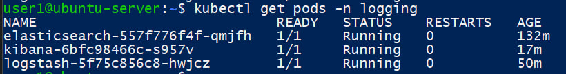
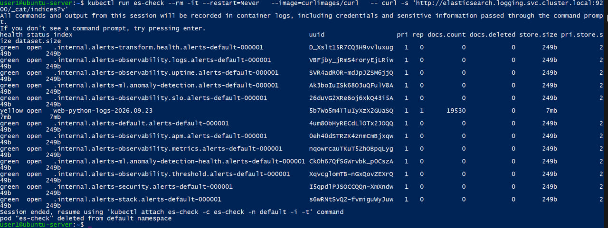
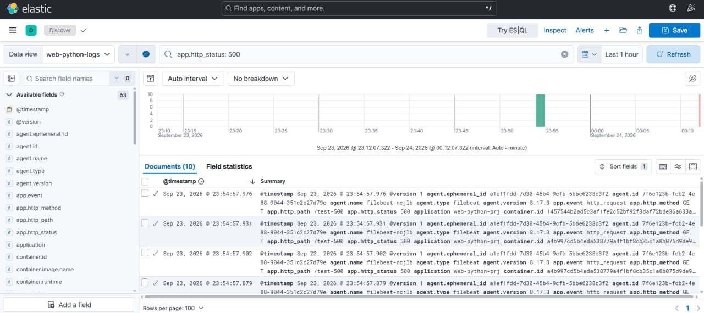
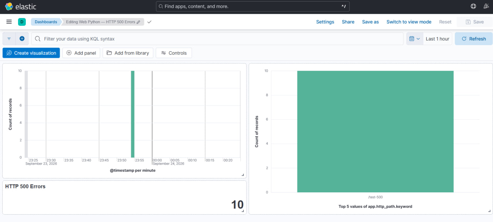

1. Разверните elk
2. Настройте отправку логов своего приложения в elk
3. Настройте свои dashboard согласно своих логов на 500ые ошибки

## 1. Развёртывание ELK

Для централизованного сбора и анализа логов в Kubernetes был создан namespace `logging` и развёрнуты следующие компоненты:
- **Elasticsearch 8.17.3** — хранение и поиск логов;
- **Logstash 8.17.3** — обработка событий;
- **Kibana 8.17.3** — просмотр логов и построение визуализаций;
- **Filebeat 8.17.3** — сбор логов контейнеров приложения.

Состояние компонентов было проверено командой:
```bash
kubectl get pods -n logging
```

Все основные компоненты ELK перешли в состояние Running.



## 2. Настройка отправки логов приложения
Для доставки логов использована следующая схема:
web-python-prj
      |
      | stdout/stderr
      v
   Filebeat
      |
      v
   Logstash
      |
      v
Elasticsearch
      |
      v
    Kibana

Filebeat развёрнут в Kubernetes как DaemonSet. Он считывает контейнерные логи приложения из каталога /var/log/containers/.

Для выбора логов приложения используется путь:
paths:
  - /var/log/containers/*_web-python_*.log

Также включена обработка символьных ссылок:
prospector.scanner.symlinks: true

Filebeat передаёт собранные события в Logstash на порт 5044.

Logstash, в свою очередь, отправляет обработанные события в Elasticsearch в индекс:
web-python-logs-%{+YYYY.MM.dd}

После запуска системы в Elasticsearch был создан индекс:
web-python-logs-2026.09.23



## 3. Структурированное логирование приложения
Для удобного анализа HTTP-запросов приложение было дополнено структурированным JSON-логированием.

Для каждого HTTP-запроса формируется событие следующего вида:
{
  "event": "http_request",
  "http_method": "GET",
  "http_path": "/health",
  "http_status": 200
}

Для проверки обработки HTTP 500 ошибок в приложение также был добавлен тестовый endpoint:
/test-500

Endpoint возвращает HTTP-код 500.

После изменения приложения был собран новый Docker-образ:
```bash
minikube image build -t web-python-prj:elk .
```

Deployment приложения был обновлён:
```bash
kubectl set image deployment/web-python-prj \
  -n web-python \
  web-python-prj=web-python-prj:elk
```

При обращении к /test-500 приложение формирует структурированный лог:
{
  "event": "http_request",
  "http_method": "GET",
  "http_path": "/test-500",
  "http_status": 500
}

Для проверки было сгенерировано 10 запросов, возвращающих HTTP 500.

## 4. Обработка JSON в Logstash
В Logstash был настроен JSON-фильтр, разбирающий структурированные сообщения приложения.

Использована следующая конфигурация:
json {
  source => "message"
  target => "app"
  skip_on_invalid_json => true
}

После обработки Logstash в Elasticsearch появились отдельные поля:
app.event
app.http_method
app.http_path
app.http_status

Проверка Elasticsearch показала наличие 10 документов со значением:
app.http_status = 500

Таким образом, цепочка передачи логов работает следующим образом:
Приложение
    |
    v
stdout/stderr
    |
    v
Filebeat
    |
    v
Logstash
    |
    v
Elasticsearch
    |
    v
Kibana

## 5. Настройка Kibana
Для работы с индексами приложения в Kibana был создан Data View:
Name: web-python-logs
Index pattern: web-python-logs-*
Timestamp field: @timestamp

После создания Data View в разделе Discover была выполнена фильтрация HTTP 500 ошибок с помощью KQL:
app.http_status: 500

В результате Kibana отобразила 10 соответствующих событий.

В документах доступны структурированные поля:
app.event
app.http_method
app.http_path
app.http_status



## 6. Создание Dashboard для HTTP 500 ошибок
В Kibana был создан dashboard:
Web Python — HTTP 500 Errors

Для анализа HTTP 500 ошибок настроены три визуализации:
количество HTTP 500 ошибок;
динамика возникновения HTTP 500 ошибок во времени;
распределение HTTP 500 ошибок по endpoint приложения.

Для визуализаций используется фильтр:
app.http_status: 500

Панель HTTP 500 Errors показывает общее количество зарегистрированных ошибок: 10

График по времени позволяет определить момент возникновения ошибок.

Дополнительная визуализация показывает распределение ошибок по полю:
app.http_path.keyword

В тестовом случае HTTP 500 ошибки относятся к endpoint:
/test-500

