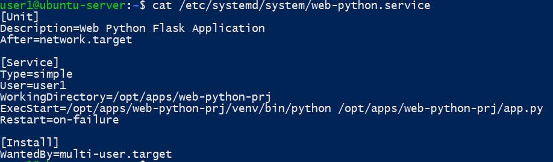
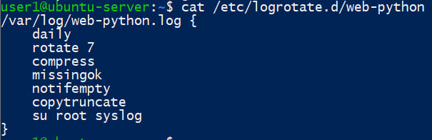

Выберите приложение которое будете "мучить на продолжении курса", можно два. Одно на компилируемом языке программирования, друшое - интерпритируемом. Просмотрите, что бы приложение писало логи в файл. 
1. Сделайте для него unit-файл и запустите его в виде демона. 
2. Проверьте пишуться ли логи в файл, просмотрите есть ли логи в journalctl 
3. Настройте ротацию логов через logrotate 
4. Исследуйте прооцесс вашего приложения, от кого запущен какие параметры. Измените приоритет его выполнения. 
Материалы для сдачи: 
1. Файл со ссылками на проект(ы) 
2. unit-файл 
3. Файлы конфигурация для logrotate 

Материалы для сдачи:
1. https://github.com/AntonLip/web-python-prj
2. unit-файл 

Description= - описание сервиса.
After=network.target - запускать после базовой инициализации сети.
Type=simple - основной процесс сервиса запускается напрямую.
User=user1 - приложение будет работать от пользователя user1.
WorkingDirectory= - рабочая директория приложения.
ExecStart= - команда запуска.
Restart=on-failure - если приложение аварийно завершится, systemd попробует его перезапустить.
WantedBy=multi-user.target - позволяет включить автозапуск при обычной загрузке системы.
3. Файлы конфигурация для logrotate

daily - проверять ротацию ежедневно
rotate 7 - хранить 7 старых логов
compress - сжимать старые логи
missingok - не ругаться, если файла нет
notifempty - не ротировать пустой файл
copytruncate - скопировать лог и обнулить текущий файл
su root syslog - от какого пользователя и группы выполнять ротацию лога (в данном случае пользак root группы syslog)